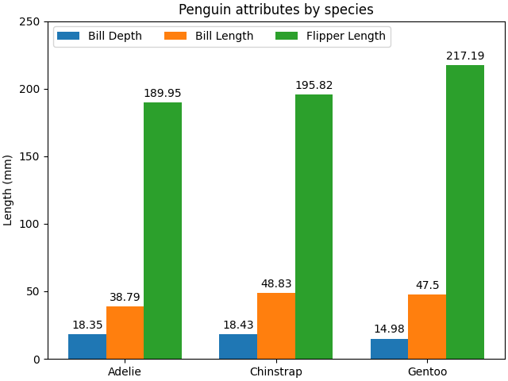
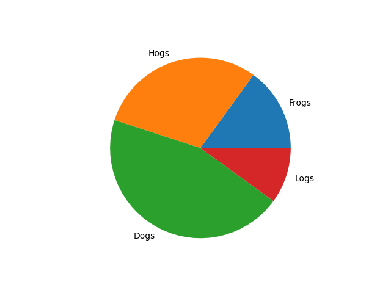

# 📈 Desata el Poder de la Visualización: Gráficos con Python y Matplotlib  

Transforma datos en historias visuales impactantes. Convierte números en gráficos elegantes y descubre patrones ocultos con **Matplotlib**, la herramienta favorita de los *data storytellers*.  

---

## 🚀 **Primeros Pasos: Instalación y Configuración** 

### ¡Instala Matplotlib en 1 Línea!  

<div style="background: #1E1E1E; padding: 10px; border-radius: 8px; width: fit-content; font-family: monospace; color: white;">  
  <div style="display: flex; gap: 6px; padding: 5px;">  
    <span style="width: 12px; height: 12px; background: #FF5F57; border-radius: 50%; display: inline-block;"></span>  
    <span style="width: 12px; height: 12px; background: #FFBD2E; border-radius: 50%; display: inline-block;"></span>  
    <span style="width: 12px; height: 12px; background: #27C93F; border-radius: 50%; display: inline-block;"></span>  
  </div>  
  <hr style="border: 1px solid black; background: none; margin:0; padding:0;  height: 0px; ">  

```bash  
pip install matplotlib  
```  

</div>  
<br> 

### Importa el Módulo Clave 

<div style="background: #1E1E1E; padding: 10px; border-radius: 8px; width: fit-content; font-family: monospace; color: white;">  
  <div style="display: flex; gap: 6px; padding: 5px;">  
    <span style="width: 12px; height: 12px; background: #FF5F57; border-radius: 50%; display: inline-block;"></span>  
    <span style="width: 12px; height: 12px; background: #FFBD2E; border-radius: 50%; display: inline-block;"></span>  
    <span style="width: 12px; height: 12px; background: #27C93F; border-radius: 50%; display: inline-block;"></span>  
  </div>  
  <hr style="border: 1px solid black; background: none; margin:0; padding:0;  height: 0px; ">  

```python  
import matplotlib.pyplot as plt  # Alias estándar para ahorrar tecleo  
```  


</div>  
<br> 
---

## 📊 **Gráfico de Barras: Compara con Estilo**  

**Perfecto para**: Mostrar diferencias entre categorías (ej: ventas por región).  

<div style="background: #1E1E1E; padding: 10px; border-radius: 8px; width: fit-content; font-family: monospace; color: white;">  
  <div style="display: flex; gap: 6px; padding: 5px;">  
    <span style="width: 12px; height: 12px; background: #FF5F57; border-radius: 50%; display: inline-block;"></span>  
    <span style="width: 12px; height: 12px; background: #FFBD2E; border-radius: 50%; display: inline-block;"></span>  
    <span style="width: 12px; height: 12px; background: #27C93F; border-radius: 50%; display: inline-block;"></span>  
  </div>  
  <hr style="border: 1px solid black; background: none; margin:0; padding:0;  height: 0px; ">  

```python  
def crear_grafico_barras(categorias, valores):  
    fig, ax = plt.subplots()  
    ax.bar(categorias, valores)  
    plt.show()  

# Ejemplo de uso  
paises = ['Colombia', 'Argentina', 'México']  
poblacion = [50, 45, 130]  
crear_grafico_barras(paises, poblacion)  
```  

</div>  
<br> 

  

---

## 🥧 **Gráfico Circular: Partes de un Todo**  

**Ideal para**: Visualizar proporciones (ej: distribución de gastos).  

<div style="background: #1E1E1E; padding: 10px; border-radius: 8px; width: fit-content; font-family: monospace; color: white;">  
  <div style="display: flex; gap: 6px; padding: 5px;">  
    <span style="width: 12px; height: 12px; background: #FF5F57; border-radius: 50%; display: inline-block;"></span>  
    <span style="width: 12px; height: 12px; background: #FFBD2E; border-radius: 50%; display: inline-block;"></span>  
    <span style="width: 12px; height: 12px; background: #27C93F; border-radius: 50%; display: inline-block;"></span>  
  </div>  
  <hr style="border: 1px solid black; background: none; margin:0; padding:0;  height: 0px; ">  

```python  
def crear_grafico_circular(etiquetas, valores):  
    fig, ax = plt.subplots()  
    ax.pie(valores, labels=etiquetas)  
    ax.axis('equal')  # ¡Sin esto tu círculo parecerá un huevo!  
    plt.show()  

# Ejemplo de uso  
gastos = ['Alimentación', 'Transporte', 'Ocio']  
montos = [300, 150, 100]  
crear_grafico_circular(gastos, montos)  
```  

</div>  
<br> 

  

---

## 🚨 **Errores Comunes (y Cómo Evitarlos)** 

1. **Olvidar los `labels` en pie charts**: 

    <div style="background: #1E1E1E; padding: 10px; border-radius: 8px; width: fit-content; font-family: monospace; color: white;">  
    <div style="display: flex; gap: 6px; padding: 5px;">  
        <span style="width: 12px; height: 12px; background: #FF5F57; border-radius: 50%; display: inline-block;"></span>  
        <span style="width: 12px; height: 12px; background: #FFBD2E; border-radius: 50%; display: inline-block;"></span>  
        <span style="width: 12px; height: 12px; background: #27C93F; border-radius: 50%; display: inline-block;"></span>  
    </div>  
    <hr style="border: 1px solid black; background: none; margin:0; padding:0;  height: 0px; ">  

    ```python  
    # ❌ Incorrecto  
    ax.pie(valores)  

    # ✅ Correcto  
    ax.pie(valores, labels=etiquetas)  
    ```  

    </div>  
    <br> 

2. **Ignorar `plt.subplots()`**:  

   - Siempre inicia con `fig, ax = plt.subplots()` para controlar ejes y figuras.  

3. **Gráficos deformados**:  

   - Usa `ax.axis('equal')` en pie charts para mantener la forma circular.  

---

## 🔥 **Lleva Tus Gráficos al Siguiente Nivel**  

### Personaliza como un Pro:  

<div style="background: #1E1E1E; padding: 10px; border-radius: 8px; width: fit-content; font-family: monospace; color: white;">  
  <div style="display: flex; gap: 6px; padding: 5px;">  
    <span style="width: 12px; height: 12px; background: #FF5F57; border-radius: 50%; display: inline-block;"></span>  
    <span style="width: 12px; height: 12px; background: #FFBD2E; border-radius: 50%; display: inline-block;"></span>  
    <span style="width: 12px; height: 12px; background: #27C93F; border-radius: 50%; display: inline-block;"></span>  
  </div>  
  <hr style="border: 1px solid black; background: none; margin:0; padding:0;  height: 0px; ">  

```python  
ax.bar(  
    categorias,  
    valores,  
    color=['#FF6B6B', '#4ECDC4', '#45B7D1'],  # Colores personalizados  
    edgecolor='black',  # Bordes definidos  
    width=0.5  # Ancho de barras  
)  
plt.title('Población por País', fontsize=14, fontweight='bold')  
plt.xlabel('Países')  
plt.ylabel('Millones de Habitantes')  
```  

</div>  
<br> 

### Tip Avanzado:  

Usa **subgráficos** para dashboards profesionales:  

<div style="background: #1E1E1E; padding: 10px; border-radius: 8px; width: fit-content; font-family: monospace; color: white;">  
  <div style="display: flex; gap: 6px; padding: 5px;">  
    <span style="width: 12px; height: 12px; background: #FF5F57; border-radius: 50%; display: inline-block;"></span>  
    <span style="width: 12px; height: 12px; background: #FFBD2E; border-radius: 50%; display: inline-block;"></span>  
    <span style="width: 12px; height: 12px; background: #27C93F; border-radius: 50%; display: inline-block;"></span>  
  </div>  
  <hr style="border: 1px solid black; background: none; margin:0; padding:0;  height: 0px; ">  

```python  
fig, (ax1, ax2) = plt.subplots(1, 2)  # 1 fila, 2 columnas  
ax1.bar(...)  
ax2.pie(...)  
plt.tight_layout()  # Ajusta el espaciado  
```  

</div>  
<br> 

---

## 🌟 **Reto de la Semana**  
1. Descarga un dataset de [Kaggle](https://www.kaggle.com/).  
2. Crea un gráfico de barras que muestre los 10 países con mayor PIB.  
3. Genera un pie chart con la distribución de idiomas más hablados.  
4. Comparte tus resultados en redes con el hashtag #VisualizaciónConPython.  

---

**¡Conviértete en un artista de datos!** Experimenta, personaliza y descubre cómo Matplotlib puede hacer que tus análisis brillen. 🎨🐍  

> *“Los gráficos son el puente entre los datos brutos y las decisiones inteligentes.”*