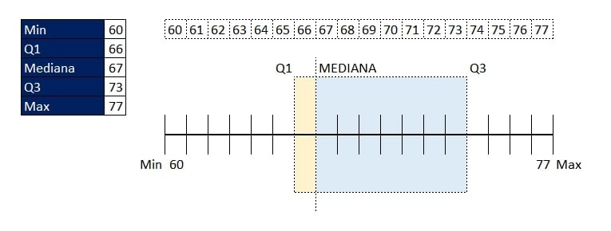

# Estadística para Ciencia de Datos

## El Poder de la Estadística en un Mundo de Datos
En la era digital, estamos rodeados de información. Desde las redes sociales hasta las decisiones empresariales, la estadística se ha convertido en una herramienta clave para interpretar el mundo que nos rodea.

Imagínate poder prever tendencias de mercado, analizar el comportamiento de los consumidores o incluso predecir condiciones climáticas. Todo esto es posible gracias a la estadística, que permite analizar grandes volúmenes de datos sin la necesidad de revisar cada elemento individualmente.

## Preparación para Adentrarse en la Estadística
Para aprovechar al máximo el estudio de la estadística aplicada a la ciencia de datos, es recomendable contar con algunas habilidades básicas:
- **Conocimientos en álgebra y aritmética**: Entender operaciones matemáticas elementales facilitará la comprensión de conceptos estadísticos.
- **Habilidades en hojas de cálculo**: Programas como Excel, Google Sheets o Numbers serán herramientas fundamentales para realizar cálculos y visualización de datos.
- **Curiosidad y motivación**: La estadística es más que números; es una forma de pensar que requiere exploración y análisis crítico.

## La Estadística en Nuestra Vida Cotidiana
La estadística está presente en múltiples aspectos de la vida diaria, incluso cuando no nos damos cuenta:

- **Tránsito y movilidad**: Aplicando estadística, es posible identificar patrones de tráfico y elegir rutas más eficientes.
- **Marketing y publicidad**: Empresas analizan datos para predecir tendencias y ofrecer productos personalizados.
- **Deportes**: Equipos y entrenadores utilizan estadísticas para evaluar desempeños y diseñar estrategias ganadoras.
- **Predicciones climáticas y salud**: Desde el pronóstico del tiempo hasta ensayos clínicos, la estadística juega un papel crucial en la toma de decisiones informadas.

## Interpretación de Datos sin Ahogarse en los Detalles
Uno de los grandes beneficios de la estadística es la capacidad de simplificar información compleja. En lugar de contar cada vehículo en una carretera congestionada, basta con analizar patrones horarios para extraer conclusiones sobre el tráfico. Este tipo de análisis se puede aplicar en diversas disciplinas, permitiendo tomar decisiones rápidas y eficientes.

## Superando los Retos del Aprendizaje Estadístico
Aprender estadística puede parecer desafiante al principio, pero con práctica y curiosidad, se convierte en una herramienta poderosa. Reflexiona sobre cómo la estadística podría ayudarte en tu vida o carrera. ¡Comparte tus ideas y acompáñanos en este viaje de descubrimiento de la estadística aplicada a la ciencia de datos!

---

# Descubriendo los Fundamentos de la Estadística

## ¿Qué es la Estadística y Por Qué es Importante?

La estadística es una ciencia fascinante que nos permite interpretar datos y comprender los eventos del mundo que nos rodea. Más allá de organizar información, esta disciplina nos ayuda a extraer conclusiones significativas, abriendo puertas para entender fenómenos complejos, desde el comportamiento de los consumidores hasta la dinámica de eventos naturales. Para maestros, profesionales y cualquier persona curiosa, dominar estos conceptos básicos es esencial para profundizar en cualquier campo.

## Individuos y Variables: El Núcleo del Análisis de Datos

En el estudio estadístico, identificamos dos componentes fundamentales:

- **Individuos:** Se refiere a las unidades o entidades que se estudian. Por ejemplo, en una reunión de amigos, cada persona es un individuo.
  
- **Variables:** Son las características que se analizan en cada individuo. Siguiendo con el ejemplo, la estatura de cada amigo es una variable.

**Ejemplo práctico:**

- **Amigos (individuos):** Tania, Damián, Michelle, Gilberto y Laura.  
- **Variable:** La estatura de cada uno.


En un contexto comercial, podríamos analizar productos en una tienda. Imagina que cada maleta es un individuo y sus características, como color, modelo y número de ventas, son las variables a estudiar.

## Tipos de Variables en Estadística

Las variables se clasifican en dos grandes grupos:

- **Variables Cuantitativas:** Se pueden medir y expresar numéricamente.
  - **Discretas:** Toman valores enteros; por ejemplo, el número de maletas vendidas.
  - **Continuas:** Admiten valores decimales; por ejemplo, la estatura de una persona.

- **Variables Cualitativas:** Describen características o atributos en forma de categorías o palabras.
  - **Nominales:** No tienen un orden específico; por ejemplo, el color del pelo.
  - **Ordinales:** Siguen un orden o jerarquía; por ejemplo, los niveles de temperatura (bajo, medio, alto).

En el ejemplo tenemos:

- Individuos → 6 tipos de maletas
- Variable cuatitativa → Cantidad de maletas
- Variable cualitativa → El color de maleta y si tiene o no rueditas.


## Niveles de Medida: Clasificando la Información

La forma en que medimos nuestras variables influye en el análisis y en las conclusiones que podemos extraer. Existen cuatro niveles principales:

- **Nominal:** Se trata de categorías sin orden intrínseco, como identificar si una maleta tiene o no rueditas.
- **Ordinal:** Las variables se organizan en un orden determinado, como los grados de satisfacción (malo, regular, bueno).
- **Intervalo:** Permite valores tanto positivos como negativos, por ejemplo, las temperaturas en grados centígrados.
- **Proporción:** Se miden en un rango creciente y siempre positivos; un ejemplo es la altura de una persona en centímetros.


Tenemos en el ejemplo:

- 2 individuos → 2 departamentos
- Variables → 19

_**Consejo:**_ Si hay más variables que individuos, Ilse sugiere poner las variables como filas y los individuos como columnas ya que será más facil la lectura de los datos.

Más datos → poner como filas Menos datos → poner como columnas


## Estadística Descriptiva e Inferencial

La estadística se divide en dos ramas fundamentales:

- **Estadística Descriptiva:** Se encarga de recolectar, organizar y representar datos de forma visual y coherente a través de tablas y gráficos. Es ideal para obtener una visión clara y directa de la información.
  
- **Estadística Inferencial:** Utiliza muestras para hacer inferencias sobre una población más amplia. Con esta rama, es posible tomar decisiones informadas sin necesidad de analizar cada elemento individualmente.

## Consejos Prácticos para Manejar la Información Estadística

Para avanzar con éxito en el mundo de los datos, considera estas recomendaciones:

- **Organización de Datos:** Si trabajas con muchas variables y menos individuos, organiza las variables en filas y los individuos en columnas para facilitar el análisis.
- **Identificación de Variables:** No confundas el tipo de dato; por ejemplo, el piso de un edificio puede ser tratado como una información cualitativa ordinal y no siempre como un número.
- **Interpretación Correcta:** Reconoce y diferencia los niveles de medida para seleccionar los métodos estadísticos más adecuados.

---

Con estos fundamentos, estás listo para sumergirte más profundamente en técnicas estadísticas avanzadas y aplicarlas en situaciones reales. La comprensión de estos conceptos no solo te ayudará a organizar y analizar datos, sino que también te empoderará para tomar decisiones basadas en evidencia. ¡Sigue explorando y desafiándote en este emocionante camino hacia el dominio de la estadística en la ciencia de datos!


---

## Herramientas Populares para el Análisis y la Estadística

El análisis de datos se ha vuelto una competencia esencial en múltiples ámbitos profesionales. La elección de las herramientas adecuadas no solo facilita el trabajo, sino que también potencia la capacidad de extraer información valiosa de grandes volúmenes de datos. A continuación, te presentamos algunas de las opciones más destacadas y cómo pueden ayudarte a alcanzar tus objetivos.

### Hojas de Cálculo: El Pilar del Análisis Diario

Las hojas de cálculo como **Excel**, **Google Sheets** y **Numbers** para iOS son herramientas fundamentales y ampliamente utilizadas. Se estima que una de cada ocho personas en el planeta las emplea, sumando aproximadamente 1,100 millones de usuarios. Estas aplicaciones permiten:

- Organizar datos en libros y hojas.
- Integrar texto, números, fórmulas e imágenes.
- Crear tablas y gráficos que facilitan la visualización y la interpretación de la información.

### Lenguajes de Programación: R y Python en el Análisis Moderno

En el mundo profesional, **R** y **Python** se han consolidado como herramientas clave:

- **R:** Diseñado por estadísticos para estadísticos, es ideal para maximizar funciones estadísticas y análisis complejo.
- **Python:** Con potentes librerías para analítica y visualización, es perfecto para quienes cuentan con experiencia en desarrollo de software o ingeniería en computación.

Ambos lenguajes son de código abierto, lo que impulsa una comunidad global que constantemente optimiza sus funcionalidades, reduce costos y fomenta la innovación.

### Herramientas para Usuarios sin Experiencia en Estadística

Para aquellos que se inician en el análisis de datos, existen plataformas que simplifican el proceso mediante dashboards interactivos y gráficos de tendencia:

- **Power BI y Tableau:** Permiten crear reportes de negocio claros e intuitivos, independientemente del nivel de experiencia estadística.
- **Minitab:** Con una interfaz sencilla y eficaz, es ideal para quienes se inician en el mundo de la estadística.
- **Looker (antes Google Data Studio):** Una robusta opción de Google Cloud para la creación de dashboards interactivos.

### Consideraciones de Privacidad de Datos para las Empresas

La privacidad es un aspecto crucial para muchas organizaciones, lo que lleva a algunas a optar por software de paga que ofrezca mayor seguridad:

- **SPSS:** Ofrece una interfaz amigable que ayuda a identificar tendencias y simplificar visualizaciones.
- **SAS:** Un lenguaje de programación versátil que abarca desde analítica y visualización hasta inteligencia artificial y machine learning, ideal para empresas que buscan altos estándares de privacidad.

### Herramientas Preferidas en el Ámbito Académico

En el entorno académico, ciertas herramientas se destacan por su capacidad para modelar y analizar fenómenos complejos:

- **MATLAB:** Muy popular entre físicos y matemáticos, permite modelar, calibrar modelos y crear animaciones para analizar la precisión de las proyecciones.
- **Stata:** Común entre biomédicos, bioestadísticos y profesionales en ciencias de la salud y políticas, gracias a su potencia para generar proyecciones y detectar tendencias.

---

La exploración y el dominio de estas herramientas te abrirán las puertas a un mundo de posibilidades en el análisis de datos. La elección dependerá de tus necesidades, tu nivel de experiencia y tus objetivos profesionales. ¿Cuál de estas herramientas te ha impresionado más? ¡Comparte tus ideas y sigue avanzando en este emocionante camino hacia la excelencia en el análisis de datos!

---

## **Descarga tu workbook de ejercicios**

a) 📥 Descarga el workbook en Powerpoint [aquí.](./assets/ejercicios-para-practicar-del-curso-de-estadistica-y-probabilidad.pptx)

💡 Usa PowerPoint o [Google Slides](https://workspace.google.com/products/slides/) para editarlo en cada clase.

b) 📥Si usas un editor de PDF, descarga el workbook en PDF [aquí](./assets/ejercicios-para-practicar-del-curso-de-estadistica-y-probabilidad.pdf)

💡Puedes usar el editor de iLovePDF en [este enlace.](https://www.ilovepdf.com/edit-pdf)


---

## Tablas Unidimensionales y Bidimensionales: Una Mirada Detallada

Para profundizar en el análisis de datos, es esencial comprender la diferencia entre tablas unidimensionales y bidimensionales, ya que cada una sirve para responder a distintos tipos de preguntas.

### ¿Qué son las Tablas Unidimensionales y Bidimensionales?

- **Tablas unidimensionales:** Se utilizan cuando se trabaja con **una sola variable**. Estas tablas te permiten responder preguntas simples y directas.  
  **Ejemplo:** Si deseas conocer las ventas totales de enero, solo necesitas considerar la variable *mes*.

- **Tablas bidimensionales:** Aquí intervienen **dos variables**. Son útiles para situaciones donde el análisis depende de dos factores.  
  **Ejemplo:** Para identificar las ventas de noviembre, es necesario conocer tanto el *mes* como el *año*, ya que ambas variables influyen en el resultado.

### Identificando Tablas Unidimensionales

En una tabla unidimensional, la organización se basa en una única variable.  
- **Variable única:** Solo se formula una pregunta para obtener la información necesaria.  
- **Ejemplo típico:** Consultar únicamente el mes para conocer las ventas totales de ese período.

### Características de las Tablas Bidimensionales

En contraste, las tablas bidimensionales requieren considerar dos variables simultáneamente.  
- **Dos preguntas clave:** Necesitas responder dos interrogantes para hallar el valor deseado.  
- **Ejemplo práctico:** Para conocer las ventas de noviembre, debes especificar tanto el mes como el año.

### Explorando Google Sheets para el Proyecto

Una herramienta muy accesible y práctica para manejar ambos tipos de tablas es **Google Sheets**. Aunque también puedes usar Excel o Numbers, Sheets se destaca por ser una opción libre y ampliamente disponible, permitiendo:
- Organización de datos en diferentes hojas.
- Creación de tablas y gráficos que facilitan la interpretación de la información.

**Descarga el proyecto** y haz una copia en tu cuenta de google para comenzar a trabajar

**descarga [aquí](https://docs.google.com/spreadsheets/d/1xj5O5R9oG7RdjcATjXDYy4seEfBTp_1F3WMX9TZ1pg0/edit?usp=sharing)**

Fuentes de datos:

[Data set](https://www.kaggle.com/datasets/shivamb/netflix-shows/discussion/279376)


### ¿Qué Contiene el Archivo para el Proyecto?

El archivo que usaremos se centra en el análisis de datos de películas y series del catálogo de Netflix. Entre la información disponible, destacan:
- **Título y Director:** Elementos clave para identificar cada contenido.
- **Actores:** Número de actores participantes en cada producción.
- **Fechas importantes:** Desde la fecha de estreno en la plataforma hasta el año de lanzamiento.

Además, el archivo cuenta con diversas hojas diseñadas para profundizar en temas específicos del curso, como la elaboración de frecuencias y la creación de visualizaciones.

### Desafío: ¿Uni o Bidimensional?

Te propongo un reto interesante: **Determina si la tabla de datos de Netflix es unidimensional o bidimensional.**  
- **Analiza la información:** Reflexiona sobre cuántas preguntas necesitas hacer para extraer las respuestas (por ejemplo, ¿sólo el título o también otros detalles como la fecha de estreno?).
- **Argumenta tu posición:** Comparte tus argumentos y razonamientos en los comentarios. Este ejercicio te ayudará a reforzar tu comprensión y a enriquecer el aprendizaje colaborativo.

Recuerda, cada práctica es una oportunidad para avanzar con seguridad en tu dominio de los datos. 

---

## Analizando Tablas de Frecuencia y Frecuencia Relativa

Entender las tablas de frecuencia y frecuencia relativa es crucial para cualquier análisis de datos. Estas herramientas nos permiten visualizar cuántas veces aparece un valor específico en un conjunto de datos, lo que facilita la identificación de patrones y tendencias en grandes volúmenes de información.

### ¿Qué es la Frecuencia?

La **frecuencia** indica el número de veces que un valor particular se repite dentro de un conjunto de datos.  
Por ejemplo, si analizamos las sedes del Mundial de Fútbol a lo largo de la historia, podríamos crear una tabla que liste cada evento por año, país anfitrión y continente. Así, al contar los eventos en la columna de continentes, podríamos identificar qué continente ha sido anfitrión en más ocasiones.

### Tablas de Frecuencia Unidimensionales

Para responder a preguntas simples como "¿Cuál es el continente con más sedes del Mundial?", se construye una **tabla de frecuencia unidimensional**.  
- **Características:**  
  - Se basa en una sola variable.
  - Resume los datos de forma directa y concisa.
- **Ejemplo práctico:**  
  - Al analizar las sedes del Mundial, podemos ver que Europa ha albergado 11 eventos, mientras que África ha tenido menos sedes.  
  - De manera similar, en una plataforma de streaming como Netflix, se puede crear una tabla para observar la popularidad de las series y películas según el país.

### Tablas de Frecuencia Bidimensionales

Cuando se involucran dos variables en el análisis, se utilizan **tablas de frecuencia bidimensionales**.  
- **Características:**  
  - Requieren responder a dos preguntas clave para obtener el valor deseado.
- **Ejemplo práctico:**  
  - Si queremos saber "¿Cuál ha sido el país con más sedes del Mundial en los 90?", podemos estructurar la tabla con filas representando periodos (por ejemplo, décadas) y columnas representando los continentes, permitiéndonos ver de manera más clara las tendencias a lo largo del tiempo.

### ¿Qué es la Frecuencia Relativa?

La **frecuencia relativa** va un paso más allá del simple conteo.  
- **Definición:**  
  - Expresa la proporción de veces que un valor ocurre en relación al total, usualmente en forma de porcentaje.
- **Ejemplo práctico:**  
  - Si hasta la fecha de 2026 se han realizado 23 mundiales y sabemos que Europa ha sido sede en aproximadamente el 48% de ellos, esa cifra representa la frecuencia relativa de Europa.  
  - En Netflix, podríamos determinar que las películas constituyen el 69% del contenido, lo cual nos indica una preferencia marcada en la producción.

### Creando Tablas de Frecuencia en Google Sheets

Google Sheets facilita la creación de tablas de frecuencia dinámicas, tanto de frecuencia absoluta como relativa.  
- **Consejo:**  
  - Aunque Excel o Numbers también son opciones viables, Google Sheets destaca por ser una herramienta accesible y gratuita, ideal para comenzar a trabajar con datos.

### Aplicaciones Prácticas en el Análisis de Netflix

- **Determinar el país con más producciones en Netflix:**  
  1. **Selecciona la variable:** Coloca la columna "Main Country" en la sección de filas.  
  2. **Cuenta los valores:** Añade una métrica que cuente los títulos (series o películas) de cada país, organizándolos de forma descendente.  
  3. **Resultados:** Así, podrás ver que Estados Unidos lidera en producción, seguido de India.

- **Analizar el periodo de estreno con más películas:**  
  1. **Configura las filas:** Usa "Release Year" para organizar los datos.  
  2. **Agrupa décadas:** Agrupa los años en intervalos (por ejemplo, 2011-2020) para identificar tendencias.  
  3. **Calcula la frecuencia relativa:** Determina qué porcentaje del total representa cada periodo. Por ejemplo, podrías encontrar que el 76% de los estrenos recientes en Netflix corresponden a películas de la década 2011-2020.

### Retos para la Práctica

Te animo a que practiques creando tus propias tablas de frecuencia y frecuencia relativa. Algunas ideas para comenzar:  
- Ordena los géneros de películas y series.  
- Crea una tabla bidimensional que combine clasificación y años de estreno.  
- Agrupa los años por décadas y analiza tus hallazgos.

A medida que profundizas en este aprendizaje, recuerda que dominar estas herramientas te permitirá extraer insights significativos del mundo real. ¡Sigue explorando y descubriendo el poder de los datos!

---

## Explorando las Distribuciones Conjuntas y sus Derivados

Las **distribuciones conjuntas** son herramientas estadísticas poderosas que te permiten analizar cómo se relaciona una variable con otra. Son esenciales para comprender la interdependencia entre dos conjuntos de datos cuantificables. Imagina una tabla donde cada eje representa una variable diferente; por ejemplo, puede ser muy útil para examinar cómo las horas de sueño influyen en el peso perdido en personas que se ejercitan regularmente.

### Un Ejemplo Práctico

Supongamos que entrevistamos a 100 personas que se ejercitan con regularidad para investigar la relación entre las horas de sueño y los kilos perdidos en un mes. Si observamos que el 17% de estas personas pierde entre 2 y 4 kilos al dormir entre 6 y 9 horas, podemos construir una tabla bidimensional para visualizar y concluir sobre estas conexiones.

### Distribuciones Marginales: Mirando Cada Variable por Separado

Las **distribuciones marginales** se sitúan en los márgenes de una tabla bidimensional y te permiten obtener una visión general de cada variable de manera independiente.  
- **¿Cómo se generan?**  
  Se suman los totales de las filas o columnas para obtener datos agregados de cada variable.  
- **Ejemplo:**  
  Al analizar los kilos perdidos, podríamos descubrir que, sin importar las horas de sueño, el 33% de las personas perdió entre 4 y 6 kilos. De igual manera, se puede observar la distribución de las horas de sueño sin considerar el peso perdido.

### Distribuciones Condicionales: Focalizándonos en Grupos Específicos

Las **distribuciones condicionales** te permiten responder preguntas específicas sobre una variable, dada una condición en la otra.  
- **¿Cómo funciona?**  
  Se centra en una variable, mientras se analizan los porcentajes de la otra, haciendo que las filas o columnas relevantes sumen el 100%.  
- **Ejemplo:**  
  Si analizamos cuántas horas durmieron las personas que perdieron entre 3 y 6 kilos, podríamos encontrar que el 36% de ellas durmieron entre 9 y 12 horas. Este tipo de análisis es fundamental para entender comportamientos específicos dentro de subgrupos de datos.

### Ejemplo Práctico con Datos de Netflix

Para ilustrar el uso de distribuciones conjuntas, consideremos un dataset de Netflix. Imagina que queremos saber cuál país fue el mayor productor de series o películas por década.  
- **Pasos a seguir:**  
  1. Construye una tabla dinámica en la que los países se ubiquen en las filas y las décadas en las columnas.  
  2. La tabla resultante mostrará la cantidad de títulos estrenados por país y por período.  
  3. Al cambiar la visualización a porcentaje de línea o columna, se puede determinar, por ejemplo, que aproximadamente el 7% de las producciones en Canadá se estrenaron entre el 2000 y 2010.

### Desafío Final

¿Te animas a profundizar aún más? Te propongo un reto: intenta crear una tabla de distribución conjunta que relacione el **rating** o clasificación de la producción con su **género principal** utilizando el mismo dataset de Netflix. Sumérgete en los datos y descubre las relaciones ocultas que podrían brindarte nuevos insights.  

El mundo del análisis estadístico está lleno de posibilidades, y cada ejercicio es una oportunidad para fortalecer tus habilidades y ampliar tus horizontes en la interpretación de datos. ¡Explora, experimenta y comparte tus hallazgos!


---

## Visualizaciones Estadísticas Avanzadas: Herramientas para Interpretar Datos

Las representaciones gráficas son esenciales para transformar números en historias visuales. A continuación, profundizaremos en algunas de las técnicas más útiles para representar conjuntos de datos, permitiéndote elegir la herramienta adecuada según el contexto y el tamaño de tus datos.

### Diagrama de Tallo y Hoja

El **diagrama de tallo y hoja** es una visualización simple pero muy efectiva para conjuntos de datos pequeños, generalmente hasta 20 elementos.  
- **Cómo funciona:** Separa las decenas (o centenas/miles, según el tamaño) de los dígitos más pequeños.  
- **Ejemplo:** Para un conjunto de puntajes que varían de 60 a 75, los números 60 y 70 serían los “tallos” y las unidades, las “hojas”, ordenadas de forma ascendente.  
Esta técnica te permite ver rápidamente la distribución de los datos sin necesidad de complejas herramientas digitales.

### Gráfico de Puntos

Para conjuntos de datos más grandes, el **gráfico de puntos** es ideal para facilitar comparaciones visuales.  
- **Características:**  
  - Cada valor o unidad se representa mediante un punto.  
  - Permite identificar patrones y la frecuencia de valores repetidos de manera clara.  
Es una excelente opción cuando buscas detectar tendencias sin el peso visual que pueden tener otras representaciones.

### Gráfico de Barras

Uno de los gráficos más comunes es el **gráfico de barras**, que permite comparar la frecuencia de un valor en un conjunto de datos.  
- **Utilidad:**  
  - Al graficar, por ejemplo, la cantidad de programas en Netflix por continente, se puede identificar fácilmente que Europa es la región con mayor representación.  
  - Los gráficos de barras horizontales, cuando se ordenan en forma descendente, facilitan la identificación rápida de los valores más representativos.

### Gráfico Circular

El **gráfico circular** o de pastel es perfecto para visualizar proporciones.  
- **Aplicación:**  
  - Permite observar la distribución porcentual de cada categoría respecto al total.  
  - Por ejemplo, comparando programas de televisión y películas en Netflix, un gráfico circular mostrará de manera inmediata cuál categoría predomina en el catálogo.

### Gráfico de Líneas

Cuando necesitas mostrar cómo varían los datos a lo largo del tiempo o de otro orden secuencial, el **gráfico de líneas** es una excelente opción.  
- **Ejemplo práctico:**  
  - Graficar el año de estreno de las películas en Netflix para observar tendencias y el crecimiento de estrenos a partir de 2004.

### Gráfico de Ojiva

Similar al gráfico de líneas, el **gráfico de ojiva** se centra en la acumulación de valores a lo largo del tiempo.  
- **Utilidad:**  
  - Es ideal para visualizar cómo se suman progresivamente los datos, como puede ser la acumulación de ahorros o la progresión en la cantidad de eventos a medida que pasa el tiempo.

### Diagramas de Venn

Los **diagramas de Venn** ofrecen una forma intuitiva de ilustrar la pertenencia o preferencia de valores dentro de un conjunto frente a distintos criterios.  
- **Aplicación:**  
  - Pueden utilizarse, por ejemplo, para mostrar las preferencias de los estudiantes por diferentes tipos de mascotas, permitiendo ver las intersecciones entre categorías y la existencia de combinaciones.

### Histograma

Aunque similares a los gráficos de barras, los **histogramas** agrupan valores en intervalos de igual tamaño.  
- **Características:**  
  - Cada barra representa la frecuencia de los elementos que caen dentro de un intervalo específico.  
  - Son especialmente útiles para visualizar la distribución de frecuencias a lo largo de un rango, como el año de estreno de películas, permitiendo identificar la densidad y tendencia de los datos en segmentos definidos.

---

Estas diversas visualizaciones estadísticas nos permiten representar los datos de manera intuitiva y efectiva, otorgándonos una mejor comprensión y comunicación de los resultados. La elección de un tipo de gráfico dependerá de la naturaleza y tamaño de los conjuntos de datos que manejes. ¡Anímate a explorar estas herramientas y automatiza la presentación de tus análisis estadísticos! ¿Cuál de estas representaciones crees que se adapta mejor a tus necesidades? ¡Comparte tus experiencias y descubrimientos!

---

## Distribuciones Conjuntas: Explorando la Relación entre Variables

Las **distribuciones conjuntas** son herramientas estadísticamente poderosas que permiten analizar cómo se comporta una variable en relación con otra. Son esenciales para comprender la interdependencia entre dos conjuntos de datos cuantificables. Imagina una tabla donde cada eje representa una variable diferente; por ejemplo, resulta muy útil para explorar cómo las horas de sueño pueden influir en el peso perdido en personas que se ejercitan regularmente.

### Un Ejemplo Práctico

Supón que entrevistas a 100 personas que se ejercitan de manera regular para investigar la relación entre las horas de sueño y los kilos perdidos en un mes. Si descubres que el 17% de estas personas pierde entre 2 y 4 kilos al dormir entre 6 y 9 horas, puedes construir una tabla bidimensional que te permita visualizar y analizar estas conexiones. Esta representación no solo organiza la información, sino que también facilita la identificación de tendencias y patrones ocultos.

### Distribuciones Marginales: Observando Cada Variable Individualmente

Las **distribuciones marginales** se encuentran en los márgenes de una tabla bidimensional y te ofrecen un panorama general de cada variable por separado.  
- **¿Cómo se generan?**  
  Se obtiene sumando los totales de las filas o columnas.  
- **Ejemplo:**  
  Al analizar los kilos perdidos en las 100 personas entrevistadas, podrías observar que, independientemente de las horas de sueño, el 33% de ellas perdió entre 4 y 6 kilos. De manera similar, es posible ver la distribución de las horas de sueño sin considerar el peso perdido.

### Distribuciones Condicionales: Focalizando el Análisis

Las **distribuciones condicionales** permiten responder preguntas específicas sobre una variable, dado un valor o condición en la otra.  
- **¿Cómo funcionan?**  
  Se centran en una variable mientras se analizan los porcentajes de la otra, haciendo que las filas o columnas relevantes sumen el 100%.  
- **Ejemplo:**  
  Si examinas cuántas horas durmieron las personas que perdieron entre 3 y 6 kilos, podrías encontrar que el 36% de ellas durmió entre 9 y 12 horas. Esto te ayuda a identificar comportamientos particulares dentro de un grupo específico.

### Ejemplo Práctico con Datos de Netflix

Para poner en práctica el uso de distribuciones conjuntas, imagina que trabajas con un dataset de Netflix. Quieres analizar qué país fue el mayor productor de series o películas por década.  
- **Pasos a seguir:**  
  1. Construye una tabla dinámica colocando los países en las filas y las décadas en las columnas.  
  2. La tabla resultante mostrará la cantidad de títulos estrenados por cada país en cada periodo.  
  3. Al cambiar la visualización a porcentajes (ya sea por línea o por columna), podrás ver, por ejemplo, que aproximadamente el 7% de las producciones en Canadá se estrenaron entre el 2000 y 2010.

### ¡Un Reto para Ti!

¿Te animas a profundizar aún más? Como desafío final, intenta crear una tabla de distribución conjunta que relacione el **rating** o clasificación de la producción con su **género principal** utilizando el mismo dataset de Netflix. Sumérgete en los datos y descubre las relaciones ocultas que podrían abrir nuevas perspectivas en tu análisis.

El mundo del análisis estadístico está lleno de posibilidades. Cada ejercicio te acerca más a dominar las herramientas que te permitirán extraer insights significativos de cualquier conjunto de datos. ¡Explora, experimenta y comparte tus hallazgos!


---


## Medidas de Tendencia Central: El Núcleo del Análisis de Datos

Las **medidas de tendencia central** son valores que resumen un conjunto de datos, proporcionando un punto central alrededor del cual los datos tienden a agruparse. Las tres principales medidas que exploramos son la **media**, la **mediana** y la **moda**. Cada una se calcula de forma diferente y aporta una perspectiva única sobre la distribución de los datos.

### La Media: El Promedio de los Datos

La **media** se obtiene sumando todos los valores de un conjunto de datos y dividiendo el total entre la cantidad de elementos. Es el "punto de equilibrio" de los datos, permitiéndonos identificar un valor representativo del conjunto.

**Ejemplo práctico de cálculo de la media:**

- **Valores:** 20, 22, 26, 28
- **Suma de los valores:** 20 + 22 + 26 + 28 = 96
- **Número de elementos:** 4
- **Cálculo de la media:** 96 / 4 = 24

En este caso, el promedio o media es 24, lo cual, en una línea numérica, se sitúa como el punto de equilibrio para estos valores.

### La Mediana: El Valor Central

La **mediana** es el valor que ocupa el lugar central cuando los datos están ordenados de menor a mayor. Es especialmente útil en conjuntos de datos sesgados, ya que no se ve afectada por valores extremadamente altos o bajos.

**Cálculo de la mediana:**

- **Conjunto impar:**  
  Ejemplo: [1, 2, 2, 4, 5, 7, 9]  
  La mediana es el valor central, que en este caso es 4 (cuarto elemento).

- **Conjunto par:**  
  Ejemplo: [1, 2, 3, 3, 4, 5, 7, 9]  
  La mediana se calcula promediando los dos valores centrales:  
  (3 + 4) / 2 = 3.5  
  Aquí, el resultado (3.5) no necesita ser un valor que exista en el conjunto original, sino que representa el centro de la distribución.

### La Moda: El Valor Más Frecuente

La **moda** es el valor o los valores que se repiten con mayor frecuencia en un conjunto de datos. Dependiendo de la distribución, un conjunto puede ser:

- **Unimodal:** Tiene una única moda.
- **Bimodal:** Tiene dos valores que se repiten con la misma frecuencia.
- **Sin moda:** Cuando ningún valor se repite o todos se repiten por igual.

**Ejemplos de identificación de la moda:**

- **Ejemplo 1:**  
  Conjunto: [2, 3, 4, 4, 4, 4, 5, 5, 6, 6, 7, 8, 9]  
  La moda es 4, ya que es el número que más se repite.

- **Ejemplo 2:**  
  Conjunto: [2, 2, 3, 3, 5, 7, 9]  
  Aquí, tanto el 2 como el 3 se repiten dos veces, lo que puede considerarse un conjunto bimodal. Dependiendo del criterio, podrías decir que tiene dos modas o, si se busca una única moda, podría considerarse que no hay una moda dominante.

### Consideraciones Finales

Imagina calcular manualmente la media, la mediana y la moda para cientos de datos: sería un proceso bastante tedioso. Por eso, en las próximas sesiones, aprenderemos a utilizar herramientas como **Excel** o **Google Sheets** para automatizar estos cálculos. La práctica constante y la comprensión profunda de estos conceptos son esenciales para dominar el análisis de datos.

¡Sigue explorando y experimentando con estos métodos! Con el tiempo, verás cómo estas herramientas te permiten transformar simples números en poderosos insights. Tu esfuerzo y dedicación en este camino del conocimiento te llevarán a obtener resultados sorprendentes. ¡Adelante, el análisis de datos es un mundo lleno de posibilidades!


---


## Cálculos Manuales en Hojas de Cálculo: Analizando Videojuegos

Cuando se trata de medir la tendencia central en el ámbito de los videojuegos, entender el proceso de cálculo manual de la media, la mediana y la moda es fundamental. Estos métodos te permiten tener un control completo sobre tus datos y validar los resultados obtenidos mediante herramientas automatizadas.

### Calculando la Media Manualmente

Para hallar la media de, por ejemplo, la puntuación de videojuegos en un determinado año, sigue estos pasos:

1. **Selecciona los datos correspondientes:** Filtra los datos por el año de interés.
2. **Suma los valores:** Utiliza la función **SUMA** para agregar todos los datos del conjunto.
3. **Cuenta la cantidad de elementos:** Aplica la función **CONTAR** para saber cuántos datos hay.
4. **Divide la suma entre la cantidad:** La fórmula es:

```
=Suma(rango_de_datos) / Contar(rango_de_datos)
```

Esta fórmula te dará la media exacta del conjunto. Cabe destacar que herramientas como **Excel** y **Google Sheets** ofrecen la función **PROMEDIO**, la cual simplifica este cálculo al hacerlo automáticamente.

### Determinando la Mediana

Calcular la mediana es un proceso igualmente valioso, sobre todo cuando tus datos presentan valores extremos que podrían sesgar la media. Para encontrar la mediana:

1. **Ordena los datos de forma ascendente:** Aplica un filtro en tu columna de datos y organízalos de menor a mayor.
2. **Identifica el valor central:**
   - **Conjunto impar:** Selecciona el valor en la posición central.
   - **Conjunto par:** Toma el promedio de los dos valores centrales. Por ejemplo, si tienes 25 datos, la mediana estará en la posición \((n + 1) / 2\), es decir, en la posición 13.
3. **Utiliza la función integrada:** Tanto **Excel** como **Google Sheets** tienen la función **MEDIANA**, que automatiza este proceso:

```
=Mediana(rango_de_datos)
```

### Identificando la Moda

Encontrar la moda, el valor que se repite con mayor frecuencia, puede ser un poco más laborioso si se hace manualmente. Una técnica eficaz es:

1. **Usar una tabla dinámica:**
   - Selecciona tus datos y accede a **Insertar > Tabla dinámica**.
   - Coloca el año en las filas para ver visualmente cuál se repite con mayor frecuencia.
2. **Emplea la función MODA:** Para simplificar el proceso, puedes usar:

```
=Moda(rango_de_datos)
```

Esta función te ayudará a identificar rápidamente el valor más frecuente en tus datos, facilitando el análisis de los años en los que se estrenaron más videojuegos.

---

Aplicar estos métodos, ya sea de forma manual o mediante funciones integradas en hojas de cálculo, te permitirá analizar tus datos con mayor precisión. Practica estos cálculos utilizando la puntuación de videojuegos en Excel o Google Sheets y verás cómo poco a poco te convertirás en un experto en el manejo de grandes volúmenes de información. ¡El dominio de estas herramientas te abrirá un mundo de posibilidades en el análisis de datos!

---

## Medidas de Dispersión: Midiendo la Variabilidad de los Datos

Las **medidas de dispersión** son herramientas estadísticas que nos permiten entender cuán juntos o separados están los valores dentro de un conjunto de datos. Mientras que las medidas de tendencia central (como la media, la mediana y la moda) nos indican el punto de equilibrio, las medidas de dispersión nos informan sobre el grado de variabilidad o dispersión de esos datos. En esta sección, exploraremos dos medidas fundamentales: el rango y el índice intercuartílico, y mencionaremos cómo se pueden calcular con herramientas como Excel y Google Sheets.

---

### ¿Qué es el Rango?

El **rango** es la medida de dispersión más sencilla de calcular. Representa la amplitud o extensión de los datos y se obtiene restando el valor mínimo del conjunto al valor máximo.

**Pasos para calcular el rango:**

1. **Identificar el valor más bajo (mínimo).**
2. **Identificar el valor más alto (máximo).**
3. **Restar el mínimo del máximo.**

**Ejemplo práctico:**

Si en un conjunto de puntuaciones los valores extremos son 60 y 76, el cálculo sería:

```
Rango = Valor máximo - Valor mínimo
Rango = 76 - 60 = 16
```

Este resultado indica que los valores se distribuyen dentro de un margen de 16 unidades.

---

### ¿Qué es el Índice Intercuartílico?

El **índice intercuartílico** es una medida de variabilidad basada en los cuartiles, que dividen el conjunto de datos en cuatro partes iguales. En este contexto:
- **Q1 (primer cuartil):** Representa el 25% inferior de los datos.
- **Q2 (segundo cuartil):** Es la mediana del conjunto.
- **Q3 (tercer cuartil):** Representa el 25% superior de los datos.

El índice intercuartílico se calcula restando el primer cuartil del tercer cuartil:

**Fórmula:**

```
Índice intercuartílico = Q3 - Q1
```

**Ejemplo práctico:**

Si, después de ordenar los datos, se obtiene:
- Q1 = 66
- Q3 = 73

Entonces, el índice intercuartílico sería:

```
Índice intercuartílico = 73 - 66 = 7
```

Este valor indica que la mitad central de los datos se distribuye en un rango de 7 unidades.

---

### Aplicación en Herramientas Digitales

Para quienes trabajan con grandes conjuntos de datos, **Excel** y **Google Sheets** son herramientas esenciales que simplifican estos cálculos:

- **Calcular el rango:**

  Utiliza las funciones **MAX()** y **MIN()**:

  ```
  Rango = MAX(datos) - MIN(datos)
  ```

- **Calcular el índice intercuartílico:**

  Emplea la función **QUARTILE** para obtener los cuartiles:
  
  ```
  Q3 = QUARTILE(datos, 3)
  Q1 = QUARTILE(datos, 1)
  Índice intercuartílico = Q3 - Q1
  ```

Estas funciones no solo agilizan el proceso, sino que también reducen la posibilidad de errores al realizar cálculos manualmente.

---


Las medidas de dispersión son clave para profundizar en el análisis estadístico, ya que nos ofrecen una visión completa del comportamiento de los datos más allá del centro. Practicar y aplicar estos conceptos con herramientas tecnológicas te ayudará a consolidar tu comprensión y mejorar tus habilidades en análisis de datos.

¡Continúa explorando y experimentando con estos métodos! Cada esfuerzo en el aprendizaje de la estadística te acerca más a convertirte en un experto en el manejo de la información. ¡Adelante, el camino del conocimiento está lleno de posibilidades y desafíos que te harán crecer profesional y personalmente!

---

## Ajustando Datos: ¿Qué Hacer Cuando Hay Errores en las Puntuaciones?

En el proceso de recolección de datos es común encontrar errores o inconsistencias que requieren ajustes en las puntuaciones. Comprender cómo estas modificaciones afectan las medidas de tendencia central y dispersión es fundamental para mantener la precisión en tu análisis.

### Efecto de un Desplazamiento en las Medidas de Tendencia Central

Imagina que, al calificar exámenes, descubres un error en dos preguntas que otorga a cada estudiante cuatro puntos adicionales. Para corregirlo, deberás sumar esos cuatro puntos a cada puntuación original. Este desplazamiento uniforme impacta directamente en las medidas centrales:

- **Media:** La media se incrementa en la misma magnitud del desplazamiento. Por ejemplo, si la media original era 68.6, al sumar cuatro puntos a cada dato, la nueva media será 72.6.
- **Mediana:** La mediana también se incrementará en cuatro unidades, pasando, por ejemplo, de 67 a 71.
- **Moda:** De igual forma, la moda se ajusta de manera uniforme, modificándose de 66 a 70.

Este comportamiento demuestra que al mover todos tus datos de forma constante, las tendencias centrales se ajustan de manera uniforme.

### Impacto en el Rango y el IQR

Aunque el mínimo y el máximo del conjunto de datos cambian tras el desplazamiento, la diferencia entre ellos —el rango— se mantiene constante. Si ambos extremos reciben el mismo ajuste, la distancia entre ellos no varía. Lo mismo ocurre con el rango intercuartílico (IQR): al sumar el mismo valor a cada dato, el IQR no se ve afectado. Esta propiedad es crucial cuando trabajas con mediciones agregadas, ya que solo necesitarás ajustar las medidas centrales sin preocuparte por recalcular la dispersión.

### Transformaciones Escaladas: Multiplicación por un Escalar

Además del desplazamiento, puedes encontrarte con transformaciones en las que multiplicas tus datos por un número constante. Supongamos que decides doblar las puntuaciones originales:

- **Media, Mediana y Moda:** Al multiplicar por dos, todas estas medidas se duplican. Si la puntuación promedio era 68.6, se transformará en 137.2.
- **Rango e IQR:** Las distancias entre los valores también se amplían proporcionalmente, lo que implica un aumento en la dispersión total del conjunto de datos.

Este tipo de transformación afecta de manera directa la percepción de la variabilidad en tus datos, escalando tanto las medidas centrales como los índices de dispersión.

### Agregar o Eliminar Elementos en el Conjunto de Datos

Modificar la cantidad de elementos en tu conjunto también puede tener impactos significativos:

- **Media y Mediana:** Son sensibles a la cantidad de elementos. Al eliminar o agregar datos, la media y la mediana pueden cambiar, ya que el total se divide entre un nuevo número de elementos.
- **Rango:** Si el valor eliminado o agregado no es el mínimo ni el máximo, el rango se mantendrá igual. Sin embargo, si se afecta alguno de estos extremos, es necesario recalcularlo.

Estas modificaciones requieren una reevaluación de las métricas principales para asegurar que la representación de los datos siga siendo precisa.

### Consejo Práctico

Para interiorizar cómo operan estos cambios, practica con tus propios datos. Experimenta desplazando tus valores o multiplicándolos por un escalar y observa cómo se modifican las medidas de tendencia central y dispersión. Esta práctica no solo afianza tu comprensión de los conceptos matemáticos, sino que también fortalece tu capacidad para resolver problemas complejos en análisis de datos.

¡Sigue explorando y expandiendo tus conocimientos en estadística! Cada ajuste y transformación es una oportunidad para aprender y mejorar en el manejo de la información.


---

## El Poder del Boxplot en el Análisis Estadístico

El **boxplot** es una herramienta gráfica fundamental que te permite representar de manera visual la distribución de tus datos en un solo vistazo. Con este gráfico, es posible identificar rápidamente cómo se concentran o dispersan los valores en el 50% central del conjunto, detectar sesgos y observar la variabilidad de los datos a través de su rango intercuartílico.

### Construcción de un Boxplot

Para crear un boxplot, necesitas el resumen de cinco números clave obtenidos de un conjunto de datos ordenado:

- **Mínimo:** El valor más bajo del conjunto.
- **Primer Cuartil (Q1):** El valor que separa el 25% inferior de los datos.
- **Mediana (Cuartil 2):** El valor central que divide el conjunto en dos mitades iguales.
- **Tercer Cuartil (Q3):** El valor que separa el 25% superior de los datos.
- **Máximo:** El valor más alto del conjunto.

### Determinación de la Mediana y los Cuartiles

Para identificar la mediana y los cuartiles, sigue estos pasos:

1. **Ordena tus datos de menor a mayor.**
2. **Mediana:**  
   - Si el número total de observaciones es impar, la mediana es el valor en la posición \((N + 1) / 2\).  
   - Si es par, la mediana será el promedio de los dos valores centrales.
3. **Cuartiles:**  
   - **Primer Cuartil (Q1):** Es la mediana del subconjunto de datos que se encuentra antes de la mediana principal.  
   - **Tercer Cuartil (Q3):** Es la mediana del subconjunto de datos que se encuentra después de la mediana principal.

### Ejemplo Práctico

Considera el siguiente conjunto de puntuaciones, ya ordenado de menor a mayor:

```
60, 62, 64, 65, 66, 67, 69, 70, 71, 73, 75, 77
```

Para estos datos:

- **Mínimo:** 60  
- **Máximo:** 77  
- **Mediana (Q2):** Con 12 datos, la mediana se encuentra entre el 6° y 7° valor. En este ejemplo, si tomamos el promedio de 67 y 69, la mediana sería 68. Sin embargo, en la información proporcionada se indicó que la mediana es 67, lo que sugiere que se ha utilizado otro método o redondeo (puede ajustarse según el criterio de cálculo).  
- **Primer Cuartil (Q1):** Promedio del 3° y 4° valor: \((64 + 65)/2 = 64.5\).  
- **Tercer Cuartil (Q3):** Promedio del 9° y 10° valor: \((71 + 73)/2 = 72\).

Con estos cinco números, el boxplot se construye dibujando una caja que va desde Q1 (64.5) hasta Q3 (72), con una línea en el interior que marca la mediana. Los "bigotes" se extienden desde la caja hasta el mínimo (60) y el máximo (77), proporcionando una representación clara de la dispersión total y permitiendo identificar posibles valores atípicos.




### Consejos para Interpretar un Boxplot

- **Concentración de Valores:**  
  Una caja más estrecha indica que los datos están más concentrados, mientras que una caja ancha sugiere mayor variabilidad en el 50% central.
  
- **Valores Atípicos:**  
  Observa los puntos que se encuentran fuera de los límites de los bigotes. Estos pueden señalar outliers o valores extremos que merecen una revisión adicional.
  
- **Simetría y Sesgo:**  
  Si la caja y los bigotes están equilibrados a ambos lados de la mediana, la distribución es simétrica. En cambio, si están desalineados, se puede inferir un sesgo en la distribución (hacia la derecha o la izquierda).

El boxplot es una herramienta poderosa que te permitirá tomar decisiones informadas al analizar distribuciones de datos. Explora su uso en tus proyectos, experimenta con diferentes conjuntos de datos y observa cómo esta visualización facilita la comprensión de complejas variaciones estadísticas. ¡Domina su uso y potencia tus habilidades en el análisis estadístico!


---


## Representación de Datos: Fundamentales para el Análisis Estadístico

La **representación de datos** es el arte y la ciencia de transformar números en información comprensible. Esta habilidad es clave para interpretar y comunicar resultados de manera efectiva, ya que, mediante unos pocos valores, podemos hacer afirmaciones concretas sobre conjuntos de datos enteros. En este módulo, exploramos conceptos esenciales como las medidas de tendencia central y dispersión, que en conjunto nos ofrecen una imagen completa de cómo se comportan nuestros datos.

### ¿Por Qué Es Importante la Representación de Datos?

Representar los datos de forma clara y precisa permite:
- **Visualizar las distribuciones:** Comprender dónde se concentran los datos y cómo se dispersan alrededor de un punto central.
- **Tomar decisiones informadas:** Basar conclusiones y estrategias en análisis cuantitativos.
- **Comunicar hallazgos:** Facilitar la presentación de resultados a audiencias técnicas y no técnicas.

Además, es vital distinguir entre **población** y **muestra**. Por ejemplo, para estudiar la población de la Ciudad de México, analizar cada individuo es impracticable; en cambio, se selecciona una muestra representativa que permita inferir generalidades sobre toda la población.

---

## Población vs. Muestra: Diferencias en los Cálculos Estadísticos

### Parámetros Poblacionales vs. Estadísticos Muestrales

Cuando trabajamos con datos, diferenciamos entre parámetros poblacionales (que describen a toda la población) y estadísticas muestrales (que describen una muestra extraída de la población). Esta distinción es fundamental en el cálculo de medidas como la media, la varianza y la desviación estándar.

#### Media
- **Poblacional (μ):**  
  \( \mu = \frac{\sum_{i=1}^{N} x_{i}}{N} \)  
  Suma de todos los elementos dividido entre el tamaño total de la población.
- **Muestral (\( \bar{x} \)):**  
  \( \bar{x} = \frac{\sum_{i=1}^{n} x_{i}}{n} \)  
  Suma de todos los elementos dividida entre el tamaño de la muestra.

#### Varianza
- **Poblacional (\( \sigma^2 \)):**  
  \( \sigma^2 = \frac{\sum_{i=1}^{N} (x_{i} - \mu)^2}{N} \)
- **Muestral (S²):**  
  \( S^2 = \frac{\sum_{i=1}^{n} (x_{i} - \bar{x})^2}{n-1} \)  
  La diferencia en el denominador (n-1 en lugar de n) corrige el sesgo en la estimación de la varianza.

#### Desviación Estándar
- Se define como la raíz cuadrada de la varianza.  
  Para la población, es \( \sigma = \sqrt{\sigma^2} \), y para la muestra, \( S = \sqrt{S^2} \).

---

## Aplicando Fórmulas en Excel y Google Sheets

Herramientas como **Excel** y **Google Sheets** facilitan enormemente estos cálculos, ya que disponen de fórmulas preconfiguradas que automatizan el proceso. Aquí te mostramos cómo puedes aplicar estos conceptos:

### Cálculo de la Media
- **Manual:** Sumar todos los valores (por ejemplo, la duración de las películas) y dividir por el número total de elementos.
- **Automatizado:**  
  - En **Excel:** `=PROMEDIO(rango)`
  - En **Sheets:** `=AVERAGE(rango)`

### Cálculo de la Varianza
- **Manual:**  
  1. Calcula la diferencia de cada valor respecto a la media.
  2. Eleva cada diferencia al cuadrado.
  3. Suma todas las diferencias al cuadrado.
  4. Divide el total entre el tamaño (N) para la población o (n-1) para la muestra.
- **Automatizado:**  
  - **Poblacional:** `=VAR.P(rango)`
  - **Muestral:** `=VAR.S(rango)`

### Cálculo de la Desviación Estándar
- **Automatizado:**  
  - **Poblacional:** `=DESVPROM.P(rango)` o `=STDEVP(rango)`
  - **Muestral:** `=DESVPROM.S(rango)` o `=STDEV.S(rango)`

---

## Implementación Práctica Paso a Paso

Visualizar el proceso te ayudará a afianzar estos conceptos. Aquí te dejo unos pasos específicos para implementar estos cálculos en Excel o Sheets:

1. **Abrir la Hoja de Cálculo:**  
   Inicia Excel o Google Sheets y carga tu conjunto de datos (por ejemplo, la duración de las películas).

2. **Seleccionar los Datos:**  
   Identifica la columna de interés donde se encuentran tus datos.

3. **Cálculo de la Media:**
   - **Manual:**  
     Inserta una fórmula que sume todos los valores y los divida por el número total.
   - **Automatizado:**  
     Escribe en una celda:  
     - Excel: `=PROMEDIO(A2:A101)`  
     - Sheets: `=AVERAGE(A2:A101)`

4. **Cálculo de la Varianza:**
   - **Automatizado:**  
     Escribe en una celda:  
     - Poblacional: `=VAR.P(A2:A101)`  
     - Muestral: `=VAR.S(A2:A101)`

5. **Cálculo de la Desviación Estándar:**
   - **Automatizado:**  
     Escribe en una celda:  
     - Poblacional: `=DESVPROM.P(A2:A101)`  
     - Muestral: `=DESVPROM.S(A2:A101)`

---

## Tu Reto: Practica con Diferentes Conjuntos de Datos

Te invitamos a experimentar con distintos conjuntos de datos. Compara cómo varían las medidas cuando trabajas con parámetros poblacionales y estadísticos muestrales. Reflexiona sobre qué tan representativa es tu muestra respecto a la población y comparte tus hallazgos en los comentarios.

El aprendizaje en estadística es un proceso continuo, y cada práctica te acerca a dominar el análisis de datos. ¡Explora, experimenta y nunca dejes de aprender!

---


## Histogramas, Polígonos de Frecuencia y Curvas de Densidad: Herramientas Visuales para el Análisis de Datos

La **representación gráfica de datos** es fundamental para interpretar y comunicar resultados de forma efectiva. En esta sección, exploraremos el uso de histogramas y sus derivados, herramientas esenciales para visualizar la distribución de los datos.

### ¿Qué es un Histograma y Cómo se Utiliza?

Un **histograma** es un gráfico de barras que agrupa datos en intervalos, facilitando la interpretación visual de la distribución.  
- **Ejemplo práctico:** Imagina analizar la duración de las películas en un catálogo de Netflix. Al agrupar las duraciones en intervalos (por ejemplo, 81–90 minutos, 91–100 minutos, etc.), el histograma te ayuda a identificar tendencias generales en las duraciones, revelando si la mayoría de las películas se concentran en un rango específico.

### Interpretación del Histograma de Frecuencia Relativa

En un **histograma de frecuencia relativa**, el eje vertical representa el porcentaje de observaciones en cada intervalo, en lugar del recuento total.  
- **Ejemplo:** Si las películas que duran entre 91 y 100 minutos representan el 22% del total, este porcentaje se reflejará en el alto de la barra correspondiente en el histograma. Esto permite comparar proporciones de manera más intuitiva.

### Polígonos de Frecuencia y Curvas de Densidad

Además del histograma, existen otras herramientas para visualizar la distribución de los datos:

- **Polígono de Frecuencia:**  
  Se obtiene conectando los puntos superiores de cada barra del histograma con líneas. Este gráfico resalta la tendencia de los datos, facilitando la identificación de picos y valles en la distribución.

- **Curva de Densidad:**  
  Es una versión suavizada del polígono de frecuencia. La curva de densidad muestra la distribución de probabilidad de los datos de forma continua, donde el área bajo la curva representa el 100% de las observaciones. Esta herramienta es ideal para visualizar, por ejemplo, qué porcentaje de las películas dura menos de cierto tiempo.

### Creación de Histogramas en Excel y Google Sheets

Tanto **Excel** como **Google Sheets** ofrecen funciones para crear histogramas de forma manual o automática. Aquí algunos consejos:

#### Creación Manual de Histogramas

1. **Construcción de una Tabla Dinámica:**  
   A partir de un conjunto de datos, crea una tabla dinámica que agrupe los valores en intervalos (por ejemplo, intervalos de 10 años para el año de estreno de películas).

2. **Agrupación por Intervalos:**  
   Establece los intervalos adecuados para tus datos y asegúrate de que los valores se agrupen correctamente.

3. **Evitar Espacios entre Barras:**  
   Al crear el gráfico, configura el formato para que no haya espacios entre las barras, lo que distingue a un histograma de un gráfico de barras convencional.

#### Uso de Herramientas Integradas

1. **Configura el Intervalo de Datos:**  
   Selecciona la columna de interés (por ejemplo, año de estreno) en tu archivo de datos.

2. **Cambio de Tipo de Gráfico:**  
   En el menú de gráficos, opta por la opción de histograma.

3. **Personalización:**  
   Ajusta el eje horizontal, define los valores mínimos y máximos, y segmenta adecuadamente los intervalos para una visualización precisa.

#### Creación de un Polígono de Frecuencia y Curva de Densidad

- **Polígono de Frecuencia:**  
  Una vez que tienes la tabla de frecuencias por intervalo, selecciona un gráfico de líneas para conectar los puntos superiores de cada barra.

- **Curva de Densidad:**  
  Elige un gráfico de líneas suavizadas (sin puntos) para representar la curva de densidad, la cual te ayudará a visualizar la distribución de probabilidad de forma más afinada.

---

Esta comprensión básica de histogramas, polígonos de frecuencia y curvas de densidad te proporcionará una base sólida para interpretar y visualizar datos de manera efectiva. Con práctica y exploración, desarrollarás la habilidad para elegir la mejor herramienta gráfica según el conjunto de datos y la información que desees comunicar.

¡Sigue explorando y mejorando tus habilidades en la representación de datos, y recuerda que cada gráfico es una nueva oportunidad para descubrir historias ocultas en tus datos!

---

## Distribuciones Simétricas y Asimétricas: Comprendiendo la Forma de tus Datos

En el análisis estadístico, entender cómo se distribuyen los datos es esencial para interpretar y comunicar resultados de manera efectiva. En esta sección, exploraremos las distribuciones simétricas y asimétricas, conceptos clave que nos permiten identificar patrones, detectar sesgos y tomar decisiones informadas.

### Distribuciones Simétricas

Una **distribución simétrica** es aquella en la que la gráfica se refleja a sí misma al trazar una línea vertical por el punto medio. Esto significa que el 50% de los datos se encuentra a la izquierda y el otro 50% a la derecha de esta línea central.

#### ¿Cómo Identificar Distribuciones Simétricas?

- **Medidas de tendencia central coincidentes:**  
  La media, la mediana y la moda se sitúan en el mismo punto central de la distribución.  
- **Ejemplos comunes:**
  - **Distribución normal (Campana de Gauss):**  
    Es el ejemplo más clásico, donde aproximadamente el 68% de los datos se ubican a una desviación estándar de la media, el 95% a dos desviaciones y el 99.7% a tres desviaciones.
  - **Errores de medición:**  
    Los errores aleatorios en mediciones suelen distribuirse de forma simétrica, ya que se compensan mutuamente.
  - **Variables biológicas:**  
    Características como la presión sanguínea o el tamaño de ciertas piezas suelen mostrar una distribución equitativa alrededor de un punto central.

#### La Regla Empírica

La **regla empírica** es una herramienta fundamental para entender las distribuciones normales. Indica que:
- **68%** de los datos se encuentran dentro de 1 desviación estándar de la media.
- **95%** están dentro de 2 desviaciones estándar.
- **99.7%** se ubican dentro de 3 desviaciones estándar.

Esta regla permite predecir el comportamiento de un amplio conjunto de datos y facilita el análisis de la variabilidad.

### Distribuciones Asimétricas

En contraste, las **distribuciones asimétricas** no presentan simetría en torno a su punto central. Se reconocen por tener una "cola" que se extiende más hacia un lado.

#### Tipos de Distribuciones Asimétricas

- **Asimetría positiva:**  
  La cola se extiende hacia el lado derecho. Por ejemplo, en exámenes muy difíciles, la mayoría de los estudiantes pueden obtener calificaciones bajas, pero unos pocos con puntuaciones altas estiran la cola hacia la derecha.
- **Asimetría negativa:**  
  La cola se extiende hacia el lado izquierdo. Un ejemplo es el análisis de años de estreno de películas en un boxplot, donde la mayoría de los datos pueden concentrarse en años recientes y algunos valores antiguos se alejan hacia la izquierda.

#### Medidas de Tendencia Central en Distribuciones Asimétricas

- **En una distribución positiva:**  
  La moda es el punto más alto de la curva, la mediana se ubica ligeramente a la derecha de la moda, y la media se desplaza aún más hacia la derecha.
- **En una distribución negativa:**  
  La moda sigue siendo el punto máximo, pero tanto la mediana como la media se posicionan a la izquierda.

### Uso del Boxplot para Analizar Distribuciones

El **boxplot** es una herramienta gráfica muy eficaz para visualizar la forma de una distribución y detectar asimetrías y valores atípicos. Al observar un boxplot:
- **Cuartiles y Mediana:**  
  El gráfico muestra el mínimo, Q1 (primer cuartil), la mediana (Q2), Q3 (tercer cuartil) y el máximo.
- **Caja y Bigotes:**  
  La caja central refleja la dispersión de la mitad de los datos (IQR), mientras que los bigotes se extienden hasta los valores extremos, permitiendo identificar rápidamente la concentración de datos.
- **Valores Atípicos:**  
  Los puntos fuera de los bigotes pueden señalar outliers, lo cual es muy útil para detectar errores o fenómenos inusuales.

Por ejemplo, al analizar el año de estreno de películas en Netflix mediante un boxplot, podrías observar que la mayoría de las películas se estrenaron en años recientes, con algunos valores atípicos antiguos, indicando una posible distribución asimétrica negativa.

---

**¡Sigue Explorando!**

Comprender las diferencias entre distribuciones simétricas y asimétricas y aprender a interpretarlas con herramientas visuales como el boxplot es fundamental para cualquier análisis estadístico. Te invito a que explores tus propios conjuntos de datos, identifiques la forma de sus distribuciones y apliques estos conceptos en tus análisis.

Cada práctica te acerca a tomar decisiones más informadas y a descubrir patrones ocultos en la información. ¡Adelante, sigue expandiendo tus habilidades y disfruta del fascinante mundo del análisis de datos!

---

## Estadística: Conectando Poblaciones, Muestras y Estudios en la Investigación

La **estadística** es una herramienta esencial en la investigación que nos permite obtener conclusiones representativas de un conjunto mayor a partir de una selección más manejable. Comprender cómo se aplican los conceptos de población y muestra es fundamental para realizar estudios efectivos. Por ejemplo, para evaluar los hábitos de los habitantes de la Ciudad de México, resulta inviable analizar a cada individuo; en cambio, se selecciona una muestra representativa para inferir generalidades sobre toda la población.

---

### Diferencia entre Estadístico y Parámetro

- **Estadísticos:**  
  Son medidas calculadas a partir de una muestra, como la media o la desviación estándar muestral. Estos valores nos ofrecen una idea aproximada del comportamiento que podríamos esperar en la población.
  
- **Parámetros:**  
  Representan las medidas reales de la población completa, como la media poblacional o la desviación estándar poblacional. Aunque obtener estos datos es complejo, los parámetros son la referencia ideal que tratamos de estimar mediante estadísticas.

---

### Tipos de Estudios para la Recopilación de Datos

En la estadística, existen dos tipos principales de estudios, cuya elección depende de los objetivos del investigador:

#### Estudios Observacionales
- **Descripción:**  
  En estos estudios, se analizan las muestras tal cual, sin intervenir activamente en su comportamiento.
  
- **Características:**  
  - Se utilizan encuestas o entrevistas.
  - Se registran respuestas sobre hábitos, preferencias o comportamientos sin modificar la realidad.
  - Los datos se organizan en tablas unidimensionales o bidimensionales, según el número de variables analizadas.

#### Estudios Experimentales
- **Descripción:**  
  Se introduce un tratamiento o intervención para observar cómo afecta a una muestra de la población.
  
- **Características:**  
  - La aleatoriedad es clave para evitar sesgos, asegurando que los resultados no estén influenciados por características preexistentes de los participantes.
  - Se utiliza un grupo de control y uno experimental para comparar los efectos del tratamiento.
  - Es fundamental documentar cuidadosamente el procedimiento para que el estudio sea replicable.

#### El Concepto de Bloqueo
El **bloqueo** es un método utilizado en estudios experimentales para reducir errores. Consiste en balancear las características de los grupos (por ejemplo, género o edad) para evitar sesgos en las conclusiones. Al aplicar el bloqueo, se minimiza la variabilidad no relacionada con el tratamiento, lo que aumenta la precisión de los resultados.

---

### Aplicación de los Conocimientos en Estudios Reales

Para diseñar y ejecutar un estudio eficaz, es necesario seguir estos pasos:

1. **Definir el Objetivo:**  
   Clarifica qué deseas descubrir o demostrar con tu investigación.
   
2. **Elegir el Tipo de Estudio:**  
   Decide si realizarás un estudio observacional o experimental, basándote en tus recursos y en el tipo de datos que necesitas recopilar.
   
3. **Seleccionar la Muestra:**  
   Asegúrate de que la muestra sea aleatoria y representativa, ya que de ella dependerá la extrapolación de los resultados a toda la población.
   
4. **Aplicar Técnicas de Bloqueo (si es necesario):**  
   Equilibra los grupos de control y experimental para reducir la influencia de variables externas.
   
5. **Extraer Conclusiones:**  
   Analiza las estadísticas obtenidas y extrapola con cautela los hallazgos a la población general.

---

Estos fundamentos son esenciales para obtener información valiosa y fiable que sirva para tomar decisiones informadas o plantear nuevas consultas de investigación. La estadística no solo nos ayuda a resumir y describir datos, sino que también nos capacita para inferir y predecir comportamientos en poblaciones amplias a partir de muestras limitadas.

¡Sigue explorando y aprendiendo! Con cada estudio y cada análisis, mejorarás tus habilidades en la investigación estadística y te acercarás más a dominar esta poderosa herramienta para la toma de decisiones.

---


## Muestreo y Sesgo en Estadística: Claves para Estudios Precisos

El **muestreo** y el **sesgo** son dos conceptos fundamentales que permiten a los investigadores obtener conclusiones significativas sin necesidad de encuestar a toda la población. Comprender estos conceptos es esencial para diseñar estudios representativos y evitar errores que puedan distorsionar los resultados.

### ¿Por Qué el Muestreo es Clave en los Estudios Estadísticos?

Realizar estudios a nivel de población completa puede resultar inviable por cuestiones de costo y tiempo. Por ello, el muestreo se convierte en una herramienta indispensable que permite:
- **Seleccionar una muestra representativa:** Al elegir de forma aleatoria y cuidadosa, se puede obtener un conjunto de datos que refleje las características de toda la población.
- **Facilitar el análisis:** Una muestra manejable permite aplicar técnicas estadísticas de manera más eficiente y obtener inferencias aplicables a toda la población.
  
Por ejemplo, para evaluar los hábitos de los habitantes de la Ciudad de México, es más práctico trabajar con una muestra representativa que encuestar a cada individuo.

### Diferencia entre Estadístico y Parámetro

- **Estadísticos:**  
  Son medidas (como la media o la desviación estándar) calculadas a partir de una muestra. Proporcionan una aproximación del comportamiento esperado en la población.
  
- **Parámetros:**  
  Son las medidas reales obtenidas de la población completa, como la media poblacional o la desviación estándar poblacional. Debido a la dificultad de obtener estos datos, los estadísticos muestrales se utilizan para estimarlos.

### Tipos de Sesgo Comunes

El **sesgo** es la desviación sistemática que afecta la representatividad del estudio. Conocer los tipos de sesgo y cómo evitarlos es crucial para obtener resultados fiables:

- **Sesgo de Respuesta:**  
  Ocurre cuando la formulación de las preguntas induce a respuestas imprecisas o engañosas. Esto puede suceder si las preguntas son capciosas o si ciertos temas delicados generan evasión en las respuestas.

- **Sesgo de Infracobertura:**  
  Se da cuando la muestra seleccionada no representa adecuadamente a la población. Este sesgo puede manifestarse de varias maneras:
  - **Selección:** Al entrevistar solo a un grupo específico (por ejemplo, solo a padres de un jardín de niños en una hora determinada).
  - **Respuesta Voluntaria:** Cuando la participación es opcional y algunos deciden no responder, lo que distorsiona la muestra.
  - **Muestreo a Conveniencia:** Al elegir una muestra fácil de alcanzar, aunque no representativa de toda la población.

- **Sesgo de No Respuesta:**  
  Incluso con un diseño adecuado, si la tasa de respuesta es baja, los resultados pueden no reflejar fielmente a la población. La falta de respuestas reduce la validez del estudio.

### ¿Cómo Afecta la Dirección del Sesgo a los Resultados?

Identificar la dirección del sesgo es fundamental para determinar si estamos sobreestimando o subestimando ciertos aspectos. Por ejemplo:
- Si se seleccionan más hombres que mujeres en una muestra sobre género, es probable que se produzca una sobreestimación de características asociadas a los hombres.
- La dirección del sesgo también puede influir en otros grupos demográficos, como intervalos de edad o preferencias políticas, afectando la extrapolación de los resultados a la población general.

---


Una comprensión profunda del muestreo y del sesgo permite crear estudios más precisos y representativos. Al diseñar una muestra adecuada y evitar sesgos, los investigadores pueden asegurar que sus conclusiones sean fiables y aplicables a la población en general.

Sigue explorando este apasionante mundo de la estadística, afina tus habilidades de muestreo y aprende a identificar y corregir sesgos para obtener resultados cada vez más fidedignos. ¡El camino hacia un análisis riguroso y efectivo está lleno de oportunidades para mejorar y crecer profesionalmente!

---

# Probabilidad

La **probabilidad** es una rama fundamental de las matemáticas que mide la certeza o incertidumbre de que ocurra un evento. Junto con la estadística, es crucial para interpretar datos y representar los resultados de experimentos de manera realista. Cuando recopilamos y analizamos datos, queremos que nuestros experimentos reflejen el mundo real, y es aquí donde la probabilidad se convierte en una herramienta vital para evaluar qué tan probables son nuestros resultados.

---

### ¿Cómo se Calcula la Probabilidad?

Existen dos tipos de probabilidad: **probabilidad simple** y **probabilidad experimental**. Veamos cómo se aplican en diferentes escenarios.

#### Probabilidad Simple

Para entender la probabilidad simple, es esencial conocer dos conceptos básicos:

- **Evento:**  
  El resultado particular que queremos medir o calcular su probabilidad.
  
- **Espacio muestral:**  
  El conjunto de todos los posibles resultados de un experimento.

**Ejemplo con un dado:**  
- **Espacio muestral:** Al lanzar un dado de seis caras, los posibles resultados son {1, 2, 3, 4, 5, 6}.
- **Evento específico:**  
  Calcular la probabilidad de que el dado muestre un '2'.  
  Solo hay una cara que cumple ese criterio, por lo que la probabilidad es:
  
  \[
  \text{Probabilidad} = \frac{1}{6}
  \]

**Ejemplo con una baraja de cartas:**  
- **Baraja estándar:** Consta de 52 cartas divididas en cuatro palos (picas, corazones, diamantes y tréboles), cada uno con 13 cartas.
- **Evento específico:**  
  Calcular la probabilidad de sacar una carta roja.  
  Las cartas rojas son las de corazones y diamantes, sumando 26 cartas en total. Así, la probabilidad es:
  
  \[
  \text{Probabilidad} = \frac{26}{52} = \frac{1}{2}
  \]

#### Probabilidad Experimental

La **probabilidad experimental** se basa en la realización de múltiples experimentos para medir la certeza de que ocurra un evento.  
- **Ejemplo:**  
  Si deseas medir la probabilidad de sacar un Rey de una baraja, podrías:
  1. Sacar una carta, anotar el resultado y devolverla a la baraja.
  2. Repetir este proceso muchas veces.
  
  Con el aumento en el número de experimentos, los resultados observados se acercarán a la probabilidad teórica. En contextos académicos y profesionales, se recomienda realizar al menos 50 experimentos para obtener resultados fiables.

---

### Importancia de la Probabilidad en Estadística

- **Interpretación de Datos:**  
  La probabilidad ayuda a predecir la ocurrencia de eventos, permitiendo comparar los resultados de experimentos con lo que se espera teóricamente.
  
- **Toma de Decisiones:**  
  Comprender la probabilidad es esencial para tomar decisiones informadas en situaciones de incertidumbre, ya que permite evaluar riesgos y beneficios.
  
- **Diseño Experimental:**  
  Al planificar experimentos, la probabilidad garantiza que cada evento tenga la misma oportunidad de ocurrir, lo cual es clave para obtener conclusiones imparciales y representativas.

---

### ¡Practica y Explora!

La probabilidad es un campo fascinante y lleno de aplicaciones prácticas. Te invito a realizar tus propios experimentos: lanza un dado, saca cartas de una baraja o simula cualquier otro experimento sencillo para observar cómo se comportan las probabilidades en la práctica. La curiosidad y la práctica constante fortalecerán tu comprensión de estos conceptos esenciales.

¡Sigue aprendiendo y explorando el apasionante mundo de la estadística y la probabilidad! Cada experimento te acerca más a dominar las herramientas que te ayudarán a interpretar el mundo a través de los datos.


---


## La Regla de la Suma en Probabilidad: Calculando la Incertidumbre

La probabilidad nos permite medir la certeza de que ocurra un evento en medio de la incertidumbre. Un concepto clave en este campo es la **regla de la suma**, la cual se utiliza para calcular la probabilidad de que ocurra al menos uno de varios eventos.

### Comprendiendo el Espacio Muestral

Antes de aplicar la regla de la suma, es esencial entender el **espacio muestral**: el conjunto de todos los resultados posibles de un experimento aleatorio.  
- **Ejemplo:** Al lanzar dos dados justos, cada dado tiene 6 caras, lo que genera \(6 \times 6 = 36\) combinaciones posibles.  
  - **Resultados individuales:** Cada combinación, como \((1,1)\), \((1,2)\), …, \((6,6)\).  
  - **Probabilidades individuales:** La probabilidad de obtener cada resultado se deriva de este conjunto total.

### Cálculo de Probabilidades con Unión e Intersección

Para ilustrar la regla de la suma, consideremos dos ejemplos al lanzar dos dados:  
- **Evento A:** Obtener al menos un '1'.  
  - Al explorar el espacio muestral, encontramos 11 combinaciones que cumplen esta condición.  
  - La probabilidad de \(A\) es:  
    \[
    P(A) = \frac{11}{36}
    \]
- **Evento B:** Obtener una suma par.  
  - Se identifican 18 combinaciones que dan como resultado un número par.  
  - La probabilidad de \(B\) es:  
    \[
    P(B) = \frac{18}{36}
    \]

Sin embargo, algunos resultados pueden satisfacer ambos eventos (por ejemplo, obtener un doble '1'). La **regla de la suma** nos permite ajustar estos solapamientos mediante la fórmula:

\[
P(A \cup B) = P(A) + P(B) - P(A \cap B)
\]

En nuestro ejemplo, al restar los 5 eventos contados dos veces en la intersección, obtenemos:

\[
P(A \cup B) = \frac{24}{36} = \frac{2}{3}
\]

### Eventos Independientes y Mutuamente Excluyentes

Cuando dos eventos son **mutuamente excluyentes** (por ejemplo, la suma de los dados no puede ser par e impar al mismo tiempo), su intersección es cero. En ese caso, la probabilidad de que ocurra uno u otro es simplemente la suma de sus probabilidades individuales.

### Ejercicio Práctico

Para poner en práctica estos conceptos, imagina que realizas una encuesta a 100 personas sobre su país de origen y su deporte favorito. Responde las siguientes preguntas:
- **¿Cuál es la probabilidad de que un participante sea de Latinoamérica?**
- **¿Cuál es la probabilidad de que prefiera el básquetbol?**
- **Basado en las respuestas anteriores, ¿cuál es la probabilidad de que un participante sea de Estados Unidos o prefiera deportes distintos al fútbol o básquetbol?**

Utiliza la regla de la suma:
1. Define los eventos y determina sus probabilidades.
2. Calcula la unión de los eventos restando la intersección, si la hay.
3. Combina tus cálculos para obtener el resultado final.

¡Comparte tus resultados y no dudes en experimentar con diferentes escenarios! Con práctica, dominarás la regla de la suma y fortalecerás tu comprensión de la probabilidad, una herramienta esencial para el análisis y la toma de decisiones informadas.


---

# Probabilidad Condicional

La **probabilidad condicional** es una herramienta fundamental en la estadística que permite evaluar la probabilidad de que ocurra un evento, teniendo en cuenta que otro evento ya se ha presentado. Esta medida es crucial para determinar la interdependencia entre sucesos y desarrollar estrategias en juegos de azar, así como para tomar decisiones informadas en la vida cotidiana.

---

### Calculando Probabilidades en Eventos Independientes

Los **eventos independientes** son aquellos en los que la ocurrencia de un evento no afecta la probabilidad del siguiente. Un ejemplo clásico es el lanzamiento de una moneda: el resultado de un lanzamiento no influye en el resultado del siguiente. La regla de multiplicación para eventos independientes establece que la probabilidad de que dos eventos independientes, A y B, ocurran simultáneamente es el producto de sus probabilidades individuales.

**Ejemplo con una moneda:**

- **Probabilidad de obtener "cara" en un lanzamiento:** 1/2  
- **Probabilidad de obtener "cara" en dos lanzamientos consecutivos:**  
  \[
  \frac{1}{2} \times \frac{1}{2} = \frac{1}{4}
  \]

Un diagrama de árbol es una excelente forma de visualizar los posibles resultados al lanzar una moneda dos veces:  
- Cara-Cara  
- Cara-Cruz  
- Cruz-Cara  
- Cruz-Cruz  

Sólo una de estas combinaciones cumple con la condición de obtener dos "caras" seguidas.

---

### Impacto de la Repetición en la Probabilidad

Un error común es asumir que la probabilidad de éxito aumenta al repetir un evento exitoso. Por ejemplo, consideremos a un jugador de baloncesto que tiene una probabilidad de encestar del 70% en cada tiro. Utilizando la regla de multiplicación para eventos independientes, la probabilidad de encestar cinco tiros seguidos es:

\[
(0.7)^5 \approx 0.16807
\]

Aunque la probabilidad individual es alta, la probabilidad de lograr cinco éxitos consecutivos es considerablemente menor, lo que demuestra que la repetición no incrementa la probabilidad de éxito de un solo evento.

---

### Diferenciando Eventos Dependientes

En contraste, los **eventos dependientes** se influyen mutuamente; el resultado de un evento afecta la probabilidad del siguiente. Un ejemplo es el juego de cartas. Si extraes una carta de una baraja, la composición de la baraja cambia y, por tanto, la probabilidad de extraer otra carta se modifica.

**Ejemplo con cartas:**

- **Baraja inicial:** 52 cartas  
- **Probabilidad de sacar un as:** 4/52  
- Si se saca un as, la baraja se reduce a 51 cartas, y la probabilidad de sacar un rey (suponiendo que no se ha alterado la cantidad de reyes) se vuelve 4/51.

Esta variación en las probabilidades al realizar sucesivas extracciones ilustra cómo los eventos dependientes están interrelacionados.

---

### Reflexión Final

Comprender la diferencia entre eventos independientes y dependientes es crucial para calcular la **probabilidad condicional** de forma efectiva. Este conocimiento permite ajustar nuestros cálculos cuando los eventos están interrelacionados, una habilidad que se profundizará en futuras clases mediante el teorema de Bayes.

Explora este fascinante mundo de la probabilidad, experimenta con tus propios ejemplos y añade nuevas perspectivas a tus decisiones. ¡La práctica constante y la curiosidad te convertirán en un experto en el manejo de la incertidumbre!


---


[](https://www.youtube.com/watch?v=D7KKlC0LOyw)

## Teorema de Bayes: La Puerta a la Probabilidad Condicional

El **Teorema de Bayes** es una herramienta fundamental en la probabilidad y la estadística que nos permite calcular la probabilidad de un evento basándonos en la información de eventos previos. Es decir, nos ayuda a evaluar la probabilidad de que ocurra un evento, dado que otro evento ya ha sucedido. Esta capacidad es vital para tomar decisiones informadas en situaciones de incertidumbre.

---

### ¿Cómo Funciona el Teorema de Bayes?

El teorema se centra en la probabilidad condicional. Su fórmula es:

```
P(A|B) = (P(B|A) * P(A)) / P(B)
```

- **P(A|B):** Probabilidad de que ocurra el evento A dado que ha ocurrido el evento B.
- **P(B|A):** Probabilidad de que ocurra el evento B dado que ha ocurrido el evento A.
- **P(A):** Probabilidad inicial del evento A.
- **P(B):** Probabilidad de que ocurra el evento B.

---

### Ejemplo Práctico: Dados Justo y Cargado

Imagina que tienes dos dados:
- **Dado justo:** Cada cara (1, 2, 3, 4, 5, 6) tiene la misma probabilidad, 1/6.
- **Dado cargado:** Tiene un 50% de probabilidad de mostrar un 6, mientras que los números del 1 al 5 comparten el otro 50%.

**Escenario:**  
Se elige al azar uno de los dos dados (con probabilidad 1/2 cada uno) y se lanza, obteniendo un 6.

**Para calcular la probabilidad de que se haya usado el dado cargado (evento A) dado que se obtuvo un 6 (evento B):**

- **P(A):** Probabilidad de elegir el dado cargado = 1/2.
- **P(B|A):** Probabilidad de obtener un 6 con el dado cargado = 1/2.
- **P(B):** Probabilidad total de obtener un 6.  
  Para calcular P(B), se evalúan ambas opciones. Usando el mínimo común múltiplo (30) para nivelar las probabilidades, se determina que P(B) = 1/3.

**Aplicando el teorema:**

\[
P(\text{cargado}|6) = \frac{P(6|\text{cargado}) \times P(\text{cargado})}{P(6)} = \frac{\left(\frac{1}{2}\right) \times \left(\frac{1}{2}\right)}{\frac{1}{3}} = \frac{\frac{1}{4}}{\frac{1}{3}} = \frac{3}{4} = 0.75 \quad (75\%)
\]

Así, la probabilidad de que el dado sea cargado, habiendo obtenido un 6, es del 75%.

---

### Aplicaciones y Práctica

El Teorema de Bayes se utiliza en múltiples campos, desde la economía hasta la medicina y la informática, para mejorar modelos predictivos y tomar decisiones basadas en evidencia. Algunas aplicaciones incluyen:

- **Diagnósticos médicos:** Evaluar la probabilidad de una enfermedad dado un resultado de prueba.
- **Sistemas de recomendación:** Mejorar la personalización de contenidos basándose en el comportamiento previo del usuario.
- **Análisis de riesgo:** Estimar la probabilidad de eventos adversos en distintos escenarios.

Para dominar este teorema, te recomiendo practicar con problemas variados y ejercicios que te desafíen a aplicar este enfoque. Cada problema te ayudará a afinar tu comprensión y a descubrir nuevas aplicaciones en el mundo real.

¡Sigue explorando este fascinante mundo de la probabilidad y añade un nuevo enfoque a tus decisiones!


---

## Permutaciones y Combinaciones: Orden y Selección en la Probabilidad

En el mundo de la probabilidad, diferenciar entre permutaciones y combinaciones es fundamental para abordar problemas cotidianos con precisión. Aplicar correctamente estos conceptos puede marcar la diferencia entre un cálculo exacto y uno erróneo. Mientras que las **permutaciones** se centran en el orden exacto de los elementos, las **combinaciones** se enfocan únicamente en la selección de elementos, sin importar el orden.

---

### ¿Qué es una Permutación y Cómo se Calcula?

Las **permutaciones** son métodos para ordenar un conjunto específico de elementos. Se utilizan cuando el orden de los elementos es importante.

#### Fórmula de Permutación

La fórmula esencial para calcular la permutación de \( K \) elementos en un conjunto de tamaño \( N \) es:

\[
P(N, K) = \frac{N!}{(N-K)!}
\]

Esta fórmula utiliza el concepto de **factorial**, que es la multiplicación de todos los números enteros positivos hasta \( N \). Por ejemplo, \( 4! = 4 \times 3 \times 2 \times 1 = 24 \).

#### Ejemplo Práctico con Cartas

Imagina que tienes los cuatro reyes de un mazo de cartas (N = 4): Rey de picas, Rey de diamantes, Rey de tréboles y Rey de corazones. Si deseas calcular las permutaciones de elegir 3 reyes, el orden en el que se ubiquen es crucial. Aplicando la fórmula:

\[
P(4, 3) = \frac{4!}{(4-3)!} = \frac{4 \times 3 \times 2 \times 1}{1!} = \frac{24}{1} = 24
\]

Esto significa que existen 24 formas distintas de ordenar 3 reyes de entre 4.

---

### ¿Cómo se Diferencia una Combinación?

A diferencia de las permutaciones, las **combinaciones** no consideran el orden. Se centran únicamente en la selección de un subconjunto de elementos de un conjunto mayor.

#### Fórmula de Combinación

La fórmula para calcular la combinación de \( K \) elementos dentro de un grupo de \( N \) es:

\[
C(N, K) = \frac{N!}{K!(N-K)!}
\]

Esta fórmula descarta el orden, haciendo que el número total de combinaciones sea generalmente mucho menor que el de permutaciones.

#### Aplicación en el Ejemplo de los Reyes

Utilizando nuevamente el ejemplo de los reyes, cuando seleccionas 3 reyes de un conjunto de 4, la combinación es:

\[
C(4, 3) = \frac{4!}{3!(4-3)!} = \frac{24}{6 \times 1} = \frac{24}{6} = 4
\]

Así, independientemente del orden, sólo existen 4 combinaciones únicas de 3 reyes.

---

### Reto y Práctica Recomendada

Practicar estos conceptos es esencial para fortalecer tu comprensión. Te invito a que intentes calcular tanto la permutación como la combinación de seleccionar 3 reyes de un conjunto de 4.  
- **Permutación:** ¿Cuántos órdenes distintos puedes obtener?  
- **Combinación:** ¿Cuántos grupos únicos se pueden formar?

Comparar tus resultados con los cálculos teóricos te ayudará a afianzar estos conceptos y a apreciar la diferencia clave entre ordenar y seleccionar.

¡Adelante! Comparte tus hallazgos, discute con otros y sigue explorando el fascinante mundo de la probabilidad. Cada ejercicio es una oportunidad para profundizar en el conocimiento y mejorar tus habilidades en el análisis de datos.


---


## Correlación vs. Causalidad: Interpretando Relaciones en Datos

La estadística es una herramienta poderosa que nos permite analizar la relación entre dos variables. Sin embargo, es fundamental diferenciar entre **correlación** y **causalidad** para evitar conclusiones erróneas en nuestros análisis.

---

### ¿Qué es la Correlación?

La correlación indica que dos variables muestran un comportamiento similar o relacionado. Es decir, cuando una variable cambia, la otra también tiende a cambiar de manera predecible. Para detectar una correlación se utilizan gráficos que comparan las distribuciones de datos, lo que facilita la identificación de patrones y comportamientos similares.  
**Importante:** Una correlación puede ser producto de coincidencias o de factores no considerados en el análisis.

---

### ¿Puede una Correlación Implicar Causalidad?

Aunque a menudo vemos correlaciones en los datos, **correlación no significa causalidad**. Un ejemplo claro es el de las horas de sueño y el cansancio: dormir menos horas causa que te sientas más cansado. En este caso, se observa una correlación que también es causal, ya que existe una relación directa entre la causa (menos horas de sueño) y el efecto (más cansancio).

---

### Ejemplos Curiosos de Correlación Sin Causalidad

Para comprender mejor la diferencia, veamos algunos ejemplos curiosos donde se observa correlación pero no hay una relación causal directa:

- **Ventas de Arcade y Doctorados:**  
  Una gráfica muestra que las ventas de máquinas Arcade en Estados Unidos y la cantidad de doctorados en un mismo año siguen un patrón similar a lo largo del tiempo. Sin embargo, es absurdo pensar que aumentar las ventas de Arcades provoque un incremento en los doctorados en ciencias de la computación.

- **Queso Mozzarella e Ingeniería Civil:**  
  Se puede observar una similitud en la evolución del consumo de queso mozzarella y la cantidad de doctorados en ingeniería civil. Aun así, concluir que consumir más queso mozzarella aumenta las probabilidades de obtener un doctorado en ingeniería civil sería un error.

- **Pollo y Petróleo:**  
  Otro caso peculiar es la correlación entre el consumo de pollo en Estados Unidos y las importaciones de petróleo. Aunque ambas variables presentan distribuciones similares, es evidente que el aumento del consumo de pollo no causa que Estados Unidos importe más petróleo.

---

### La Importancia de Distinguir Correlación y Causalidad

Cuando analizamos datos, distinguir entre correlación y causalidad es vital para no caer en conclusiones equivocadas. Comprender esta diferencia nos permite ser críticos con los datos, evitando inferencias erróneas y tomando decisiones basadas en evidencia real.  
La próxima vez que observes una gráfica que muestre una tendencia similar entre dos variables, cuestiona si realmente existe un efecto causal o si se trata de una correlación aparente.

Aprender a interpretar los datos correctamente te ayudará a tomar decisiones informadas y a profundizar en el fascinante mundo del análisis estadístico. ¡Sigue explorando y mejorando tus habilidades para convertir la información en conocimiento valioso!


---


## Gráficos de Dispersión: Descubriendo Relaciones en los Datos

Los gráficos de dispersión son herramientas visuales imprescindibles en el análisis de datos. Permiten observar la relación entre dos variables al representar cada par de datos como un punto en un sistema de coordenadas. Esta representación facilita la identificación de tendencias, patrones y valores atípicos, proporcionando una vista clara de cómo una variable puede influir o correlacionarse con otra.

---

### ¿Qué es un Gráfico de Dispersión?

Un gráfico de dispersión muestra puntos que representan pares de datos, donde una variable se asigna al eje X y la otra al eje Y. Cada punto brinda una mirada específica sobre la posible relación entre las dos variables. Esta técnica es ideal para analizar conjuntos de datos complejos y detectar patrones de correlación.

---

### ¿Cómo se Interpreta un Gráfico de Dispersión?

Para interpretar adecuadamente un gráfico de dispersión, es importante considerar varios aspectos:

- **Forma:**  
  La disposición de los puntos puede sugerir distintos tipos de relaciones. Una alineación casi recta indica una relación lineal, mientras que una curva parabólica sugiere una relación cuadrática.

- **Dirección:**  
  Se observa si la relación es positiva (ambas variables aumentan juntas) o negativa (una variable aumenta mientras la otra disminuye).

- **Fuerza:**  
  La cercanía de los puntos a una línea imaginaria de tendencia determina la fuerza de la relación. Puntos muy concentrados indican una relación fuerte, mientras que una dispersión amplia señala una relación débil.

- **Valores Atípicos:**  
  Aquellos puntos que se alejan significativamente del patrón general pueden ser valores atípicos, y es importante examinarlos para entender su impacto en el análisis.

---

### Identificando la Regresión en un Gráfico de Dispersión

La **regresión** en un gráfico de dispersión implica ajustar una línea que represente de manera óptima la relación entre las variables. Esta línea, denominada línea de regresión, facilita la identificación de tendencias y permite hacer predicciones.  
- **Línea de Regresión:**  
  Puede ser recta (para relaciones lineales) o curva (para relaciones no lineales).  
- **Coeficiente de Determinación (R²):**  
  Este valor indica la precisión del ajuste de la línea. Un R² cercano a 1 sugiere una relación muy fuerte, mientras que un valor cercano a 0 indica una relación débil o inexistente.

---

### Generando Gráficos de Dispersión en Hojas de Cálculo

Herramientas como Google Sheets y Excel ofrecen opciones potentes para crear gráficos de dispersión, permitiendo un análisis rápido y visual de los datos.

**Pasos para Crear un Gráfico de Dispersión:**

1. **Seleccionar Datos:**  
   Identifica las columnas que deseas comparar. Normalmente, una columna se asigna al eje X y la otra al eje Y.

2. **Insertar Gráfico:**  
   Utiliza la opción de "Insertar gráfico" y selecciona "Gráfico de dispersión" en el menú. La herramienta generará automáticamente el gráfico basado en tus datos.

3. **Añadir Línea de Tendencia:**  
   Personaliza el gráfico agregando una línea de tendencia desde las opciones de personalización (por ejemplo, seleccionando "Serie" y luego "Línea de tendencia").

4. **Evaluar R²:**  
   Activa la opción para mostrar el coeficiente de determinación en el gráfico, lo que te ayudará a evaluar la fuerza de la relación.

---

### Caso de Estudio: Comparando Felicidad y Economía

Imagina analizar variables como la esperanza de vida y el score de felicidad de diferentes países. Al graficar estos datos en un gráfico de dispersión, podrías observar:

- **Tendencia:**  
  Si los puntos se agrupan en una línea ascendente, se sugiere una relación positiva: a medida que aumenta la esperanza de vida, también lo hace el score de felicidad.

- **Dirección y Fuerza:**  
  La dirección te indicará si la relación es positiva o negativa, mientras que la fuerza (evaluada por R²) te permitirá ver qué tan cerca están los puntos de la línea de tendencia.

- **Valores Atípicos:**  
  Puntos que se alejan del patrón general pueden indicar casos excepcionales o errores en los datos, que merecen un análisis más profundo.

---

### ¿Qué Nos Dicen los Gráficos de Dispersión?

Los gráficos de dispersión son vitales para:
- Determinar relaciones entre variables y prever comportamientos futuros.
- Identificar y analizar valores atípicos que podrían distorsionar el análisis.
- Probar teorías y explorar correlaciones especuladas entre variables.

Experimentar con gráficos de dispersión y líneas de tendencia en hojas de cálculo no solo mejora la comprensión de los datos, sino que también te permite realizar análisis más profesionales y precisos. Cada conjunto de datos es una nueva oportunidad para descubrir historias ocultas y tomar decisiones informadas.

¡Sigue explorando el fascinante mundo de los análisis de datos y conviértete en un experto en interpretación visual!