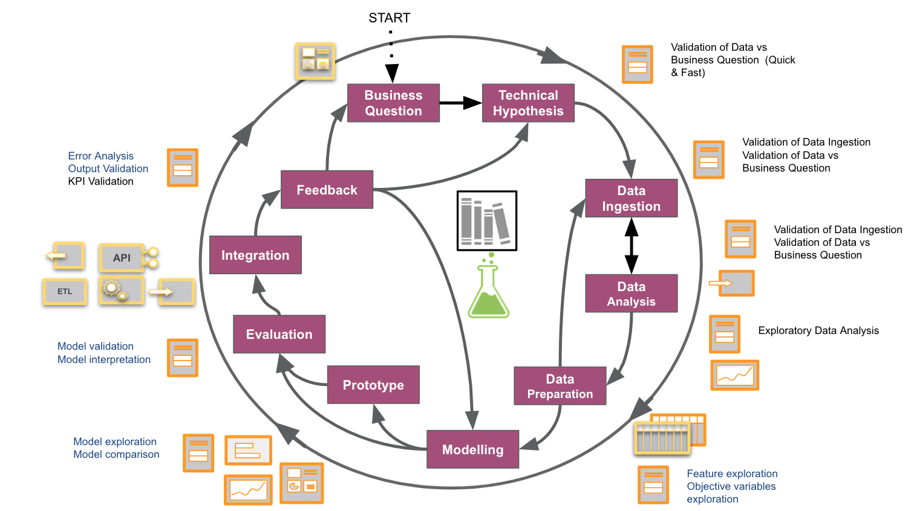
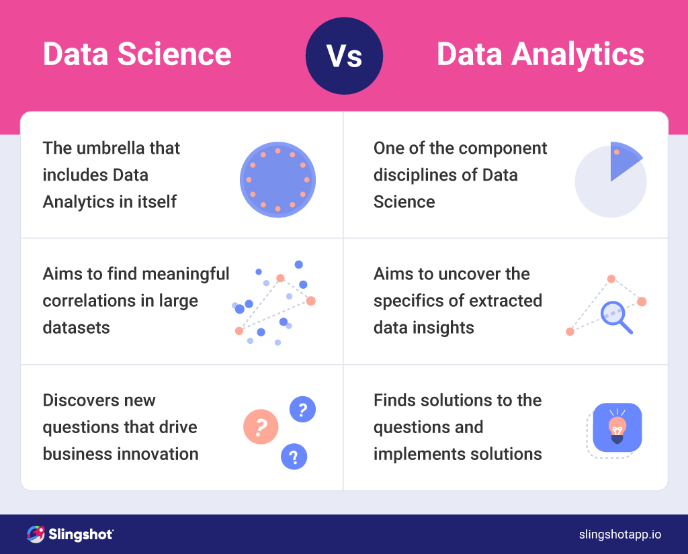
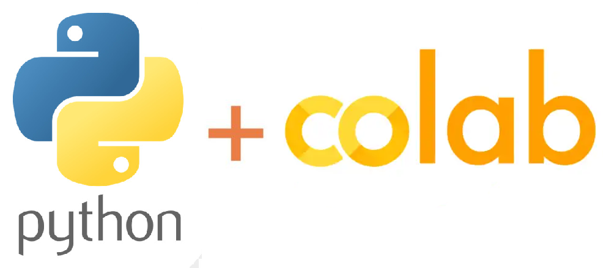

### El Arte y la Ciencia de los Datos

En un mundo cada vez más digitalizado, donde la información fluye como un río incesante, surge una disciplina que se ha convertido en el faro que guía a las empresas hacia decisiones informadas y estrategias sólidas: la Data Science. Pero, ¿qué es realmente la Data Science? ¿Cómo funciona? Y, lo más importante, ¿cómo puede transformar tu carrera y el futuro de las organizaciones?


#### La Esencia de la Data Science

La Data Science es un proceso fascinante que utiliza datos para extraer información valiosa. No se trata simplemente de números y cifras; es una forma de entender el mundo a través de patrones ocultos y tendencias emergentes. Los profesionales dedicados a la Data Science son como detectives modernos, equipados con herramientas tecnológicas avanzadas para resolver los misterios que los datos plantean.

#### Objetivos de la Data Science

Los objetivos principales de la Data Science van más allá de simples cálculos. Se centran en:

- **Tomar Decisiones:** En lugar de confiar en la intuición, las empresas pueden basar sus acciones en datos reales y análisis profundos.
- **Crear Estrategias de Negocio:** Con una comprensión clara de los datos, se pueden desarrollar estrategias que maximicen el potencial de las empresas.
- **Producir Software Basado en Inteligencia Artificial:** Desde sistemas de recomendación hasta chatbots, la Data Science permite crear productos más inteligentes y funcionales.

#### El Proceso Creativo de la Data Science

El proceso de Data Science es un viaje emocionante que comienza con la obtención de datos. Estos pueden provenir de fuentes tan variadas como mediciones directas, encuestas o bases de datos en línea. Una vez recopilados, estos datos deben ser limpiados y transformados para eliminar errores y darles el formato adecuado. Luego, llega la parte más creativa: explorar, analizar y visualizar los datos. Aquí es donde se buscan correlaciones, se encuentran patrones y se grafica la información para hacerla accesible y comprensible.

Pero el proceso no termina ahí. Se utilizan modelos de Machine Learning para predecir información futura y escalar estos modelos para ponerlos a disposición de los usuarios. Todo esto se realiza siguiendo el método científico, planteando preguntas y formulando hipótesis que luego se prueban y refutan constantemente.

#### La Intersección de Conocimientos

La Data Science es una disciplina multidisciplinar que combina matemáticas y estadística, ciencias computacionales y conocimiento del dominio o sector del negocio. Cada uno de estos campos aporta una pieza fundamental al rompecabezas de la Data Science. Las matemáticas y la estadística proporcionan las herramientas necesarias para analizar y modelar los datos, mientras que las ciencias computacionales ofrecen las habilidades técnicas para manejar grandes volúmenes de información. Por último, el conocimiento del dominio asegura que los análisis sean relevantes y aplicables a la realidad empresarial.

#### Construyendo Tu Carrera en Data Science

Construir una carrera en Data Science es un camino lleno de desafíos y oportunidades. Requiere perseverancia, curiosidad y una pasión por aprender. Algunas habilidades básicas que todo aspirante a Data Scientist debe adquirir incluyen programación, estadística descriptiva y probabilidad. Además, es crucial mantenerse actualizado sobre las últimas tendencias y avances en la industria.

La Data Science es un campo apasionante que tiene el poder de transformar el mundo empresarial. Al utilizar múltiples herramientas para encontrar información valiosa en los datos, los Data Scientists juegan un papel crucial en la toma de decisiones y la creación de estrategias efectivas. Si estás listo para embarcarte en este emocionante viaje, ¡no dudes en comenzar hoy mismo!

---
## ¿Para qué sirve la ciencia de datos?


#### **El Poder Transformador de la Ciencia de Datos**

En un mundo cada vez más dominado por la información, la ciencia de datos se ha convertido en una herramienta esencial para las empresas y organizaciones que buscan tomar decisiones informadas y estratégicas. Pero, ¿para qué sirve realmente la ciencia de datos? Vamos a profundizar en cómo este campo simplifica un ciclo vital en cinco puntos clave: captura de datos, almacenamiento de información, procesamiento, análisis de datos y comunicación de hallazgos.

#### 1. Captura de Datos

La captura de datos es el primer paso crucial en el proceso de la ciencia de datos. Se trata de extraer, adquirir e ingresar datos de manera eficiente desde diversas fuentes. Estas fuentes pueden incluir bases de datos internas, sensores físicos, APIs (Interfaces de Programación de Aplicaciones) y hasta redes sociales. 

El objetivo principal aquí es asegurar que los datos sean recopilados de manera precisa y oportuna. Por ejemplo, en el sector retail, los datos pueden provenir de sistemas de punto de venta, aplicaciones móviles y sitios web. En el ámbito de la salud, los sensores médicos y registros electrónicos de salud son fuentes valiosas de información.

La eficiencia en la captura de datos es fundamental porque la calidad de los datos iniciales determinará la precisión y fiabilidad de los análisis posteriores. Herramientas como ETL (Extract, Transform, Load) y plataformas de integración de datos facilitan este proceso, permitiendo a los profesionales de la ciencia de datos centrarse en el análisis en lugar de perder tiempo en la recolección manual de datos.

#### 2. Almacenamiento de Información

Una vez que los datos han sido capturados, el siguiente paso es su almacenamiento. Este no es simplemente un asunto de guardar información en un servidor; implica recopilar, limpiar y procesar datos a gran escala, asegurando su calidad y consistencia.

El almacenamiento adecuado de datos es crucial para mantener la integridad de la información. Esto implica eliminar duplicados, corregir errores y normalizar los datos para que puedan ser utilizados de manera efectiva en análisis futuros. Las bases de datos relacionales y NoSQL, así como los data lakes, son soluciones populares para el almacenamiento de datos.

Además, el almacenamiento debe ser escalable para manejar grandes volúmenes de datos, conocidos como big data. Plataformas como Hadoop y Apache Spark ofrecen soluciones robustas para el procesamiento y almacenamiento de datos masivos, permitiendo a las organizaciones manejar y analizar cantidades enormes de información de manera eficiente.

#### 3. Procesamiento

El procesamiento de datos es donde comienza la verdadera magia de la ciencia de datos. Aquí, los datos son clasificados, modelados y resumidos mediante técnicas avanzadas como la minería de datos y el análisis exploratorio.

La minería de datos implica buscar patrones y relaciones ocultas dentro de los datos. A través de algoritmos especializados, los científicos de datos pueden identificar tendencias, segmentos de clientes y otros insights valiosos que no serían evidentes a simple vista. Por ejemplo, en el marketing, la minería de datos puede ayudar a identificar grupos de clientes con comportamientos similares, permitiendo campañas de marketing más personalizadas y efectivas.

El análisis exploratorio, por otro lado, es un proceso iterativo que implica examinar los datos desde diferentes ángulos para obtener una comprensión profunda de su estructura y características. Esta técnica ayuda a formular hipótesis y preguntas de investigación que luego pueden ser investigadas más a fondo.

#### 4. Análisis de Datos

El análisis de datos es el corazón de la ciencia de datos. En esta etapa, se confirman hipótesis, se exploran patrones y se preven comportamientos futuros utilizando algoritmos avanzados. Los métodos estadísticos, el aprendizaje automático y la inteligencia artificial juegan un papel crucial en este proceso.

Los algoritmos de aprendizaje automático, por ejemplo, pueden predecir resultados futuros basándose en datos históricos. En el sector financiero, estos algoritmos pueden predecir movimientos del mercado, mientras que en el comercio electrónico, pueden recomendar productos a los clientes basándose en sus historiales de compra.

El análisis de datos también permite a las organizaciones entender mejor a sus clientes, optimizar sus operaciones y reducir costos. Por ejemplo, un análisis detallado de los datos de mantenimiento de una flota de vehículos puede identificar patrones de fallas y permitir un mantenimiento predictivo, evitando tiempos de inactividad costosos.

#### 5. Comunicación de Hallazgos

Finalmente, la comunicación de hallazgos es el último pero no menos importante paso en el ciclo de la ciencia de datos. Aquí, los insights obtenidos a través del análisis se transmiten de manera clara y accionable a los tomadores de decisiones.

La visualización de datos es una herramienta poderosa en este proceso. Gráficos, tableros y otras representaciones visuales pueden hacer que incluso los datos más complejos sean accesibles y comprensibles. Herramientas como Tableau, Power BI y Qlik Sense permiten crear visualizaciones interactivas que permiten a los usuarios explorar los datos de manera intuitiva.

Además de la visualización, la narrativa es crucial para comunicar los hallazgos de manera efectiva. Los científicos de datos deben ser capaces de contar una historia convincente con los datos, explicando no solo qué están mostrando los datos, sino también por qué es importante y qué acciones se deben tomar en consecuencia.

En conclusión, la ciencia de datos sirve para transformar datos crudos en información valiosa que puede guiar decisiones estratégicas y mejorar el rendimiento de las organizaciones. Al simplificar este ciclo vital en cinco pasos clave —captura de datos, almacenamiento de información, procesamiento, análisis de datos y comunicación de hallazgos—, la ciencia de datos se convierte en una herramienta indispensable en el mundo moderno. Ya sea en el sector empresarial, la investigación científica o la toma de decisiones gubernamentales, la ciencia de datos tiene el potencial de cambiar el juego y abrir nuevas oportunidades para el crecimiento y la innovación.

---

### Flujo de Trabajo en un Proyecto de Ciencia de Datos: Predicción del Rendimiento Académico



En este curso, exploraremos cómo aplicar el flujo de trabajo estándar de la ciencia de datos para predecir el rendimiento académico de estudiantes. Utilizaremos una metodología como **CRISP-DM** (Cross-Industry Standard Process for Data Mining) y seguiremos los pasos clave para llevar a cabo este proyecto. Además, proporcionaremos una descripción detallada de cómo se ha estructurado nuestro proyecto en archivos y carpetas.

#### 1. Definición del Problema

El primer paso en cualquier proyecto de ciencia de datos es definir claramente el problema que queremos resolver. En este caso, nuestro objetivo es predecir el rendimiento académico de los estudiantes. Esto puede ser útil para identificar factores que influyen en el éxito académico y tomar medidas preventivas o correctivas para mejorar los resultados de los estudiantes.

Para lograr esto, necesitamos responder preguntas como:
- ¿Cuáles son los factores que afectan el rendimiento académico?
- ¿Cómo podemos utilizar estos factores para predecir el rendimiento futuro de los estudiantes?

#### 2. Recolección de Datos

Una vez definido el problema, el siguiente paso es recopilar los datos necesarios. En este proyecto, utilizamos un conjunto de datos llamado `rendimiento_estudiantes.csv`, que contiene información sobre diversos aspectos relacionados con el rendimiento académico de los estudiantes. Estos datos pueden incluir variables como edad, género, tiempo de estudio, calificaciones anteriores, etc.

La estructura de nuestro proyecto incluye una carpeta `/data` donde almacenamos nuestros archivos de datos:
```
/data
│   ├── rendimiento_estudiantes.csv
│   └── rendimiento_estudiantes_limpio.csv  # Generado después de la limpieza
```

#### 3. Limpieza de Datos

La limpieza de datos es un paso crucial para garantizar la calidad y consistencia de nuestros datos. En este proyecto, hemos desarrollado un script llamado `1_limpieza_y_eda.py` que se encarga de eliminar duplicados, manejar valores nulos y realizar otras tareas de limpieza necesarias.

Después de ejecutar este script, generamos un archivo limpio llamado `rendimiento_estudiantes_limpio.csv`, que se almacena en la misma carpeta `/data`.

#### 4. Análisis Exploratorio (EDA)

El análisis exploratorio de datos (EDA) nos permite visualizar las distribuciones y correlaciones entre las variables de nuestro conjunto de datos. Hemos creado un notebook llamado `analisis_exploratorio.ipynb` en la carpeta `/notebooks` para realizar este análisis.

Este notebook nos ayuda a entender mejor nuestros datos y a formular hipótesis sobre las relaciones entre las variables. Por ejemplo, podemos explorar la relación entre el tiempo de estudio y las calificaciones obtenidas por los estudiantes.

#### 5. Modelado

Una vez que tenemos una comprensión clara de nuestros datos, podemos proceder al modelado. En este proyecto, hemos desarrollado un script llamado `2_modelado.py` en la carpeta `/scripts` que entrena un modelo de Random Forest para predecir el rendimiento académico de los estudiantes.

Después de ejecutar este script, generamos un archivo de modelo llamado `modelo_random_forest.pkl`, que se almacena en la carpeta `/models`.

#### 6. Evaluación

Es importante evaluar la precisión de nuestro modelo utilizando métricas adecuadas. En este proyecto, utilizamos métricas como *accuracy* y *F1-score* para medir el rendimiento de nuestro modelo de Random Forest.

Podemos comparar los resultados predichos por el modelo con los valores reales para determinar su precisión. Si el modelo no cumple con los requisitos de precisión, podemos ajustar los parámetros o probar diferentes algoritmos de aprendizaje automático.

#### 7. Despliegue

Finalmente, una vez que nuestro modelo ha sido evaluado y optimizado, podemos desplegarlo en una aplicación real. En este proyecto, hemos desarrollado un dashboard interactivo utilizando Streamlit, que se encuentra en el script `4_dashboard_streamlit.py` en la carpeta `/scripts`.

Este dashboard permite a los usuarios visualizar los resultados del modelo y explorar los factores que influyen en el rendimiento académico de los estudiantes. Los usuarios pueden introducir datos de nuevos estudiantes y obtener predicciones sobre su rendimiento académico.

#### Estructura del Proyecto

Nuestro proyecto está organizado en una estructura de carpetas y archivos que facilita la gestión y el mantenimiento del código y los datos. La estructura completa es la siguiente:

```
/proyecto_rendimiento
│
├── /data
│   ├── rendimiento_estudiantes.csv
│   └── rendimiento_estudiantes_limpio.csv  # Generado después de la limpieza
│
├── /scripts
│   ├── 1_limpieza_y_eda.py
│   ├── 2_modelado.py
│   └── 4_dashboard_streamlit.py
│
├── /notebooks
│   └── analisis_exploratorio.ipynb 
│
├── /models
│   └── modelo_random_forest.pkl            # Generado al ejecutar 2_modelado.py
│
├── requirements.txt
│
└── README.md
```

El archivo `requirements.txt` contiene las dependencias necesarias para ejecutar el proyecto, mientras que el archivo `README.md` proporciona una descripción general del proyecto y instrucciones para su ejecución.

En resumen, siguiendo el flujo de trabajo estándar de la ciencia de datos y utilizando una metodología como CRISP-DM, hemos desarrollado un proyecto que predice el rendimiento académico de los estudiantes. Este proyecto incluye la recolección y limpieza de datos, el análisis exploratorio, el modelado, la evaluación y el despliegue en una aplicación interactiva. Con esta estructura y metodología, podemos abordar problemas complejos y obtener insights valiosos a partir de los datos.

---

### **¿Qué hace un científico de datos?**


Un **científico de datos** actúa como un "chef de la información", combinando datos con ingredientes como inteligencia artificial, estadísticas y prácticas matemáticas para crear un "menú de conocimiento estratégico" para su organización. Sus funciones incluyen:

- **Identificación de patrones**: Utilizar estadística y probabilidad para descubrir relaciones ocultas en los datos.
- **Modelado predictivo**: Desarrollar modelos de *machine learning* para anticipar tendencias futuras.
- **Toma de decisiones**: Traducir datos en insights accionables que impulsen el crecimiento empresarial.
- **Comunicación efectiva**: Explicar hallazgos complejos a audiencias no técnicas mediante visualizaciones claras y narrativas convincentes.

Según estudios recientes, la demanda de científicos de datos está en constante crecimiento, con un aumento proyectado del **36% en la tasa de empleo entre 2021 y 2031**.

---

### **Habilidades clave de un científico de datos**

Para desempeñar sus funciones, un científico de datos debe dominar una amplia gama de habilidades:

1. **Matemáticas y estadísticas**: Fundamentos para entender patrones y validar resultados.
2. **Programación**: Lenguajes como Python, R y SQL son esenciales para manipular y analizar datos.
3. **Machine Learning**: Conocimiento de algoritmos supervisados y no supervisados, redes neuronales y procesamiento de lenguaje natural.
4. **Big Data**: Manejo de herramientas como Hadoop, Spark y bases de datos NoSQL para trabajar con grandes volúmenes de datos.
5. **Visualización de datos**: Uso de herramientas como Tableau, Power BI o Matplotlib para comunicar hallazgos de manera efectiva.
6. **Conocimiento del negocio**: Comprensión del mercado y la industria para contextualizar los datos y generar insights relevantes.

---

### **Beneficios empresariales de la ciencia de datos**

La aplicación efectiva de la ciencia de datos ofrece múltiples beneficios para las empresas:

- **Optimización de procesos internos**: Automatización de tareas repetitivas y mejora de la eficiencia operativa.
- **Personalización de experiencias**: Análisis del comportamiento del cliente para ofrecer productos y servicios personalizados.
- **Predicción de tendencias**: Anticipación de cambios en el mercado para tomar decisiones proactivas.
- **Reducción de riesgos**: Identificación de patrones de fraude o anomalías que puedan afectar el negocio.

Por ejemplo, en el sector financiero, los modelos de ciencia de datos permiten detectar transacciones fraudulentas en tiempo real, protegiendo tanto a las instituciones como a los clientes.

---


### **Diferencias clave**



#### **Ciencia de datos vs. Análisis de datos**
- **Ciencia de datos**: Se enfoca en predecir el futuro mediante modelos avanzados y técnicas de *machine learning*.
- **Análisis de datos**: Se centra en describir lo que ya ha ocurrido mediante el análisis retrospectivo de datos históricos.

#### **Ciencia de datos vs. Ingeniería de datos**
- **Ciencia de datos**: Analiza los datos para descubrir patrones y generar insights.
- **Ingeniería de datos**: Diseña y mantiene las infraestructuras necesarias para almacenar, procesar y distribuir grandes volúmenes de datos.

#### **Ciencia de datos vs. Inteligencia artificial**
- **Ciencia de datos**: Aborda todo el ciclo de vida del análisis de datos, desde la recolección hasta la interpretación.
- **Inteligencia artificial**: Se especializa en desarrollar sistemas autónomos que pueden aprender y tomar decisiones sin intervención humana.


---

### **Otras Herramientas de Trabajo**  
- **Python/R**: Lenguajes para análisis y modelado.  
- **Jupyter Notebook**: Entorno interactivo para código y visualización.  
- **Tableau/Power BI**: Creación de dashboards.  
- **SQL**: Manejo de bases de datos.  

**Nota**: Google Colab es ideal para principiantes por su accesibilidad y gratuidad.  


# Entorno de Ciencia de Datos


La ciencia de datos es un universo en constante expansión, y elegir el lugar adecuado para comenzar a programar es el primer paso para convertirte en un verdadero explorador de datos. En este blog descubrirás desde la elección de la plataforma ideal hasta la configuración de ambientes virtuales para garantizar que cada proyecto tenga su propio espacio seguro y personalizado. 

---

## ¿En Qué Lugar Empezar a Programar?

Existen diversas plataformas y sistemas operativos ideales para la ciencia de datos. La recomendación es optar por sistemas basados en UNIX:  
- **Linux:** Brinda libertad total y una gran capacidad de personalización.  
- **macOS:** Ofrece una experiencia fluida e integración perfecta con herramientas modernas.  
- **WSL en Windows:** Combina lo mejor de ambos mundos, permitiéndote ejecutar Linux sin abandonar tu entorno Windows.

Esta decisión es crucial, ya que define la base sobre la que construirás tus proyectos. 

---

## Herramientas Esenciales para tu Viaje en Ciencia de Datos


### Editores y Entornos de Programación

- **VSCode:** Un editor ágil, extensible y multilenguaje.  
- **PyCharm:** Especializado en Python, ideal para depurar y gestionar proyectos complejos.  
- **Deepnote:** Una opción en la nube que permite colaboración en tiempo real y manejo de proyectos completos.  
- **Jupyter Notebooks:** La herramienta por excelencia que combina código, gráficos, ecuaciones y narrativa en un solo documento.

### Plataformas en la Nube


- **Google Colab:** Permite ejecutar notebooks sin necesidad de configuración local, con acceso gratuito a GPUs/TPUs.  
- **Gradient (Paperspace):** Perfecto para entrenar modelos de gran escala sin preocuparte por las limitaciones de hardware.

Estas herramientas no solo te ayudarán a escribir y probar código, sino que también facilitarán la documentación y la colaboración en tus proyectos. 

---

## Notebooks vs Scripts: ¿Cuál es tu Aliado?


Mientras que los **notebooks** son ideales para la experimentación, prototipado y visualización en tiempo real, los **scripts** ofrecen una solución directa y automatizada para tareas repetitivas y despliegue de modelos.  
> **Tip:** Comienza tu proceso en un notebook para explorar y validar ideas, y cuando estés seguro del funcionamiento, migra a un script para optimizar y automatizar tu flujo de trabajo.

---

## Markdown y la Historia de los Cuadernos Interactivos

El uso de Markdown en Jupyter o Google Colab es fundamental para documentar tu proceso de forma clara y visual.  
```markdown
# Título
**Negritas** para destacar, _cursivas_ para detalles.
- Listas ordenadas o no ordenadas.

```

### **⏳ Breve Historia de los Cuadernos Interactivos**  
- **1980s**: Mathematica pionerea la mezcla de texto y código.  
- **2000s**: Sage Notebook acerca la idea a matemáticos.  
- **2014**: ¡Nace Jupyter! Revoluciona la ciencia de datos con soporte multi-lenguaje.  
- **Hoy**: Los notebooks son esenciales para documentar, enseñar y colaborar.  


La evolución de los notebooks ha sido impresionante: desde los inicios en los 1980s con herramientas pioneras hasta el desarrollo de Jupyter en 2014, estos cuadernos se han convertido en la columna vertebral para enseñar, compartir y reproducir experimentos en ciencia de datos. 

---

## Primeros Pasos en la Nube: Google Colab y Deepnote



### Google Colab
- **Ventajas:** No requiere instalaciones locales, acceso a recursos computacionales gratuitos y una integración perfecta con Google Drive.  
- **Cómo empezar:**  
  1. Visita [colab.research.google.com](https://colab.research.google.com).  
  2. Crea un nuevo notebook y empieza a escribir tu código.  
  3. Utiliza celdas de código y de texto (Markdown) para documentar cada paso.  

### Deepnote


- **Características adicionales:** Gestión de proyectos a nivel colaborativo, terminal integrada, previsualización de archivos CSV y más.
- **Ideal para:** Proyectos en equipo donde la colaboración y la integración de múltiples herramientas son clave. 

---

## Configuración del Entorno de Trabajo con Ambientes Virtuales


Trabajar en ciencia de datos implica manejar múltiples proyectos con diversas dependencias. Para evitar conflictos, es fundamental crear ambientes virtuales que permitan aislar cada proyecto.

### ¿Qué son los ambientes virtuales?
- **Definición:** Son entornos separados en los que cada proyecto puede tener sus propias librerías y configuraciones sin interferir entre sí.
- **Ventaja:** Permiten actualizar o modificar dependencias en un proyecto sin afectar a otros.

### Herramientas para Gestión de Entornos

#### Conda
- **Instalación:** Puedes optar por Anaconda (versión completa) o Miniconda (versión mínima).  
- **Comandos básicos:**
  ```bash
  # Crear un ambiente virtual con una versión específica de Python
  conda create --name mi_entorno python=3.9
  
  # Activar y desactivar ambientes
  conda activate mi_entorno
  conda deactivate
  
  # Listar paquetes instalados
  conda list
  
  # Actualizar un paquete
  conda update paquete
  ```
  
#### Mamba
- **Qué es:** Una re-implementación de Conda en C++ que acelera la creación y gestión de ambientes virtuales.  
- **Instalación y uso:**
  ```bash
  conda install --channel conda-forge mamba
  mamba env create --file environment.yaml
  conda activate mi_entorno
  ```

Además, es recomendable dividir proyectos grandes en módulos (externos, modelos y comunicación) para mantener cada parte organizada, lo que se puede gestionar eficazmente con herramientas como **Snakemake**. 

---

## Pasos Finales para Desarrollar tu Entorno de Trabajo en Ciencia de Datos

Para poner en marcha tu entorno de desarrollo, sigue estos pasos:

1. **Elige tu sistema operativo:** Opta por Linux, macOS o WSL en Windows según tus preferencias y necesidades.
2. **Selecciona tus herramientas:** Instala y configura editores como VSCode o PyCharm y elige entre Google Colab, Deepnote o Jupyter Notebooks para ejecutar tus proyectos.
3. **Decide entre Notebooks y Scripts:** Comienza prototipando en notebooks y migra a scripts una vez que tu código esté optimizado.
4. **Aprende Markdown:** Utiliza este lenguaje para documentar y hacer tus cuadernos interactivos más claros y visuales.
5. **Configura ambientes virtuales:**  
   - Instala Conda o Miniconda.
   - Crea y activa un ambiente virtual para cada proyecto.
   - Utiliza Mamba para agilizar la instalación de dependencias.
6. **Integra herramientas colaborativas:** Si trabajas en equipo, plataformas como Deepnote pueden facilitar la colaboración en tiempo real.

---


Empezar a programar y configurar tu entorno de trabajo en ciencia de datos puede parecer desafiante, pero con la elección correcta de plataformas, herramientas y técnicas de gestión de ambientes, estarás preparado para afrontar cualquier proyecto. Recuerda: la clave está en experimentar, aprender de los errores y, sobre todo, disfrutar el viaje hacia el descubrimiento de patrones y conocimientos en el universo de los datos.

¡Adelante, y que la ciencia de datos te lleve a nuevos horizontes!


# Google Colab: Tu Primer Paso en Ciencia de Datos

En la era del análisis de datos, contar con herramientas que te permitan experimentar y prototipar rápidamente es esencial. Google Colab se destaca como una opción poderosa y accesible para comenzar a programar y desarrollar tus proyectos de ciencia de datos sin complicaciones de configuración. 

---

## ¿Por Qué Empezar a Programar en la Nube?

### **Nube vs. Entorno Local**
- **En la Nube:**  
  Google Colab te ofrece un entorno preconfigurado. No necesitas instalar librerías ni preocuparte por dependencias; todo está listo para que te concentres en aprender y experimentar. Además, Colab te permite aprovechar recursos computacionales como GPUs y TPUs de forma gratuita, ideales para modelos grandes y tareas intensivas.
  
- **En Local:**  
  Aunque trabajar en tu máquina te da mayor control, deberás configurar manualmente tu entorno, instalar paquetes y gestionar dependencias. Esto puede ser un desafío para quienes recién comienzan.

Elegir un entorno basado en la nube como Google Colab es ideal para iniciar tu camino en la ciencia de datos, permitiéndote centrarte en la programación y el análisis sin barreras técnicas. 

---

## Google Colab: Primeros Pasos y Ventajas

Google Colab es un servicio basado en Jupyter Notebooks que combina lo mejor de la interactividad y la colaboración en línea. Entre sus características destacan:

- **Sin configuración:** No es necesario instalar nada; simplemente abre tu navegador o accede desde Google Drive.
- **Recursos gratuitos:** Acceso a GPUs y TPUs para ejecutar modelos complejos.
- **Facilidad para compartir:** Configura permisos para que otros puedan ver, comentar o editar tus notebooks.
- **Interactividad total:** Escribe y ejecuta código, añade celdas de texto en Markdown, inserta imágenes, gráficos y más.

Además, existe una variante interesante: **Gradient de Paperspace**, que en su versión gratuita ofrece hasta 16 GB de GPU RAM, 8 núcleos de CPU, 30 GB de RAM y 5 GB de almacenamiento. Una opción a considerar cuando necesites mayor potencia computacional. 

---

## La Magia del REPL y la Programación Experimental

Una de las bases de la programación en cuadernos interactivos es el paradigma **REPL** (Read-Evaluate-Print Loop). Este enfoque te permite:

- **Escribir y ejecutar código de forma interactiva:** Introduce una línea de código y observa el resultado al instante.
- **Iterar rápidamente:** Si el resultado no es el esperado, modifica y vuelve a ejecutar sin tener que reiniciar todo el proceso.
- **Experimentar sin miedo:** Aprende de los errores y optimiza tu código sobre la marcha.

El REPL es fundamental para el prototipado, ya que permite evaluar ideas de forma inmediata y ajustar soluciones en tiempo real, lo que facilita el proceso creativo en proyectos de ciencia de datos. 

---

## Jupyter Notebooks: Un Ecosistema Interactivo

El proyecto Jupyter, del que Google Colab es un derivado, ofrece una experiencia completa de computación interactiva:
  
- **Componentes Clave:**
  - **Aplicación web:** Una interfaz en tu navegador para crear y gestionar documentos interactivos.
  - **Archivo Notebook:** Guarda todo tu trabajo, desde código y resultados hasta texto enriquecido y multimedia.
  
- **Inspiración Histórica:**  
  El nombre "Jupyter" rinde homenaje a los lenguajes Julia, Python y R, y a los cuadernos de Galileo, simbolizando la unión de ciencia y documentación en un solo espacio.

Esta integración de texto, código y resultados facilita la documentación del proceso analítico, permitiendo compartir y reproducir experimentos de manera efectiva. 

---

## ¿Qué Puedes Hacer en Google Colab?

En Colab, las posibilidades son prácticamente infinitas. Entre las acciones más destacadas se encuentran:

- **Ejecutar celdas de código:** Prueba y valida líneas de código en tiempo real.
- **Documentar con Markdown:** Añade textos, encabezados, listas, imágenes y hasta ecuaciones en LaTeX para explicar tu trabajo.
- **Interactuar con la terminal:** Utiliza el signo de admiración (!) para ejecutar comandos de shell, como `!pwd` o `!pip install nombre-de-paquete`.
- **Instalar librerías adicionales:** Expande las capacidades de tu notebook instalando paquetes directamente desde el entorno.
- **Subir y gestionar archivos:** Integra datos o recursos visuales para enriquecer tus análisis.
- **Visualizar gráficos:** Genera y muestra gráficos dinámicos usando librerías de Python.

Estas características hacen de Google Colab una herramienta ideal para quienes desean experimentar y aprender, permitiéndote enfocarte en el análisis sin preocuparte por la infraestructura subyacente. 

---

## Pasos para Empezar a Desarrollar tu Entorno de Trabajo en Ciencia de Datos

Si quieres aprovechar al máximo las herramientas interactivas, sigue estos pasos:

1. **Accede a Google Colab:**  
   Ingresa desde [colab.research.google.com](https://colab.research.google.com) o accede a través de tu Google Drive.

2. **Crea tu primer notebook:**  
   Empieza escribiendo celdas de código y de texto en Markdown para ir documentando tus experimentos.

3. **Familiarízate con el REPL:**  
   Aprovecha la ejecución interactiva para probar ideas y solucionar errores rápidamente.

4. **Utiliza comandos de la terminal:**  
   Integra comandos de shell con `!` (signo de admiración) para gestionar tu entorno directamente desde el notebook.

5. **Explora recursos adicionales:**  
   Considera alternativas como Gradient de Paperspace si necesitas mayor poder computacional en tus proyectos.

6. **Comparte y colabora:**  
   Configura los permisos de tu notebook para trabajar en equipo y recibir retroalimentación en tiempo real.

---

Google Colab es mucho más que un simple cuaderno de Jupyter en la nube; es una puerta de entrada al mundo interactivo de la programación y la ciencia de datos. Gracias a su facilidad de uso, recursos gratuitos y la potencia del paradigma REPL, esta herramienta te permite aprender, experimentar y colaborar de forma ágil y efectiva. No importa si estás dando tus primeros pasos o ya tienes experiencia en el análisis de datos, Colab te invita a descubrir un universo de posibilidades. 

¡Anímate a explorar y lleva tus proyectos al siguiente nivel!

---

# Conceptos básicos de estadistica y Probabilidad

...