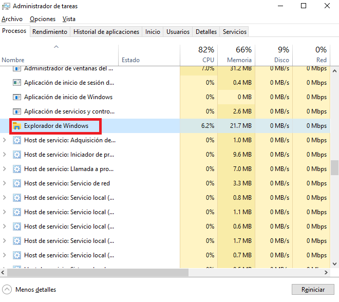
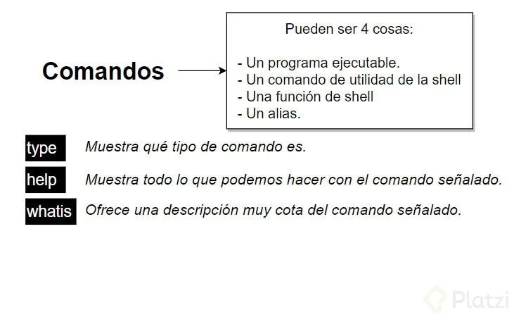

### El Arte y la Ciencia de los Datos

En un mundo cada vez más digitalizado, donde la información fluye como un río incesante, surge una disciplina que se ha convertido en el faro que guía a las empresas hacia decisiones informadas y estrategias sólidas: la Data Science. Pero, ¿qué es realmente la Data Science? ¿Cómo funciona? Y, lo más importante, ¿cómo puede transformar tu carrera y el futuro de las organizaciones?


#### La Esencia de la Data Science

La Data Science es un proceso fascinante que utiliza datos para extraer información valiosa. No se trata simplemente de números y cifras; es una forma de entender el mundo a través de patrones ocultos y tendencias emergentes. Los profesionales dedicados a la Data Science son como detectives modernos, equipados con herramientas tecnológicas avanzadas para resolver los misterios que los datos plantean.

#### Objetivos de la Data Science

Los objetivos principales de la Data Science van más allá de simples cálculos. Se centran en:

- **Tomar Decisiones:** En lugar de confiar en la intuición, las empresas pueden basar sus acciones en datos reales y análisis profundos.
- **Crear Estrategias de Negocio:** Con una comprensión clara de los datos, se pueden desarrollar estrategias que maximicen el potencial de las empresas.
- **Producir Software Basado en Inteligencia Artificial:** Desde sistemas de recomendación hasta chatbots, la Data Science permite crear productos más inteligentes y funcionales.

#### El Proceso Creativo de la Data Science

El proceso de Data Science es un viaje emocionante que comienza con la obtención de datos. Estos pueden provenir de fuentes tan variadas como mediciones directas, encuestas o bases de datos en línea. Una vez recopilados, estos datos deben ser limpiados y transformados para eliminar errores y darles el formato adecuado. Luego, llega la parte más creativa: explorar, analizar y visualizar los datos. Aquí es donde se buscan correlaciones, se encuentran patrones y se grafica la información para hacerla accesible y comprensible.

Pero el proceso no termina ahí. Se utilizan modelos de Machine Learning para predecir información futura y escalar estos modelos para ponerlos a disposición de los usuarios. Todo esto se realiza siguiendo el método científico, planteando preguntas y formulando hipótesis que luego se prueban y refutan constantemente.

#### La Intersección de Conocimientos

La Data Science es una disciplina multidisciplinar que combina matemáticas y estadística, ciencias computacionales y conocimiento del dominio o sector del negocio. Cada uno de estos campos aporta una pieza fundamental al rompecabezas de la Data Science. Las matemáticas y la estadística proporcionan las herramientas necesarias para analizar y modelar los datos, mientras que las ciencias computacionales ofrecen las habilidades técnicas para manejar grandes volúmenes de información. Por último, el conocimiento del dominio asegura que los análisis sean relevantes y aplicables a la realidad empresarial.

#### Construyendo Tu Carrera en Data Science

Construir una carrera en Data Science es un camino lleno de desafíos y oportunidades. Requiere perseverancia, curiosidad y una pasión por aprender. Algunas habilidades básicas que todo aspirante a Data Scientist debe adquirir incluyen programación, estadística descriptiva y probabilidad. Además, es crucial mantenerse actualizado sobre las últimas tendencias y avances en la industria.

La Data Science es un campo apasionante que tiene el poder de transformar el mundo empresarial. Al utilizar múltiples herramientas para encontrar información valiosa en los datos, los Data Scientists juegan un papel crucial en la toma de decisiones y la creación de estrategias efectivas. Si estás listo para embarcarte en este emocionante viaje, ¡no dudes en comenzar hoy mismo!

---
## ¿Para qué sirve la ciencia de datos?


#### **El Poder Transformador de la Ciencia de Datos**

En un mundo cada vez más dominado por la información, la ciencia de datos se ha convertido en una herramienta esencial para las empresas y organizaciones que buscan tomar decisiones informadas y estratégicas. Pero, ¿para qué sirve realmente la ciencia de datos? Vamos a profundizar en cómo este campo simplifica un ciclo vital en cinco puntos clave: captura de datos, almacenamiento de información, procesamiento, análisis de datos y comunicación de hallazgos.

#### 1. Captura de Datos

La captura de datos es el primer paso crucial en el proceso de la ciencia de datos. Se trata de extraer, adquirir e ingresar datos de manera eficiente desde diversas fuentes. Estas fuentes pueden incluir bases de datos internas, sensores físicos, APIs (Interfaces de Programación de Aplicaciones) y hasta redes sociales. 

El objetivo principal aquí es asegurar que los datos sean recopilados de manera precisa y oportuna. Por ejemplo, en el sector retail, los datos pueden provenir de sistemas de punto de venta, aplicaciones móviles y sitios web. En el ámbito de la salud, los sensores médicos y registros electrónicos de salud son fuentes valiosas de información.

La eficiencia en la captura de datos es fundamental porque la calidad de los datos iniciales determinará la precisión y fiabilidad de los análisis posteriores. Herramientas como ETL (Extract, Transform, Load) y plataformas de integración de datos facilitan este proceso, permitiendo a los profesionales de la ciencia de datos centrarse en el análisis en lugar de perder tiempo en la recolección manual de datos.

#### 2. Almacenamiento de Información

Una vez que los datos han sido capturados, el siguiente paso es su almacenamiento. Este no es simplemente un asunto de guardar información en un servidor; implica recopilar, limpiar y procesar datos a gran escala, asegurando su calidad y consistencia.

El almacenamiento adecuado de datos es crucial para mantener la integridad de la información. Esto implica eliminar duplicados, corregir errores y normalizar los datos para que puedan ser utilizados de manera efectiva en análisis futuros. Las bases de datos relacionales y NoSQL, así como los data lakes, son soluciones populares para el almacenamiento de datos.

Además, el almacenamiento debe ser escalable para manejar grandes volúmenes de datos, conocidos como big data. Plataformas como Hadoop y Apache Spark ofrecen soluciones robustas para el procesamiento y almacenamiento de datos masivos, permitiendo a las organizaciones manejar y analizar cantidades enormes de información de manera eficiente.

#### 3. Procesamiento

El procesamiento de datos es donde comienza la verdadera magia de la ciencia de datos. Aquí, los datos son clasificados, modelados y resumidos mediante técnicas avanzadas como la minería de datos y el análisis exploratorio.

La minería de datos implica buscar patrones y relaciones ocultas dentro de los datos. A través de algoritmos especializados, los científicos de datos pueden identificar tendencias, segmentos de clientes y otros insights valiosos que no serían evidentes a simple vista. Por ejemplo, en el marketing, la minería de datos puede ayudar a identificar grupos de clientes con comportamientos similares, permitiendo campañas de marketing más personalizadas y efectivas.

El análisis exploratorio, por otro lado, es un proceso iterativo que implica examinar los datos desde diferentes ángulos para obtener una comprensión profunda de su estructura y características. Esta técnica ayuda a formular hipótesis y preguntas de investigación que luego pueden ser investigadas más a fondo.

#### 4. Análisis de Datos

El análisis de datos es el corazón de la ciencia de datos. En esta etapa, se confirman hipótesis, se exploran patrones y se preven comportamientos futuros utilizando algoritmos avanzados. Los métodos estadísticos, el aprendizaje automático y la inteligencia artificial juegan un papel crucial en este proceso.

Los algoritmos de aprendizaje automático, por ejemplo, pueden predecir resultados futuros basándose en datos históricos. En el sector financiero, estos algoritmos pueden predecir movimientos del mercado, mientras que en el comercio electrónico, pueden recomendar productos a los clientes basándose en sus historiales de compra.

El análisis de datos también permite a las organizaciones entender mejor a sus clientes, optimizar sus operaciones y reducir costos. Por ejemplo, un análisis detallado de los datos de mantenimiento de una flota de vehículos puede identificar patrones de fallas y permitir un mantenimiento predictivo, evitando tiempos de inactividad costosos.

#### 5. Comunicación de Hallazgos

Finalmente, la comunicación de hallazgos es el último pero no menos importante paso en el ciclo de la ciencia de datos. Aquí, los insights obtenidos a través del análisis se transmiten de manera clara y accionable a los tomadores de decisiones.

La visualización de datos es una herramienta poderosa en este proceso. Gráficos, tableros y otras representaciones visuales pueden hacer que incluso los datos más complejos sean accesibles y comprensibles. Herramientas como Tableau, Power BI y Qlik Sense permiten crear visualizaciones interactivas que permiten a los usuarios explorar los datos de manera intuitiva.

Además de la visualización, la narrativa es crucial para comunicar los hallazgos de manera efectiva. Los científicos de datos deben ser capaces de contar una historia convincente con los datos, explicando no solo qué están mostrando los datos, sino también por qué es importante y qué acciones se deben tomar en consecuencia.

En conclusión, la ciencia de datos sirve para transformar datos crudos en información valiosa que puede guiar decisiones estratégicas y mejorar el rendimiento de las organizaciones. Al simplificar este ciclo vital en cinco pasos clave —captura de datos, almacenamiento de información, procesamiento, análisis de datos y comunicación de hallazgos—, la ciencia de datos se convierte en una herramienta indispensable en el mundo moderno. Ya sea en el sector empresarial, la investigación científica o la toma de decisiones gubernamentales, la ciencia de datos tiene el potencial de cambiar el juego y abrir nuevas oportunidades para el crecimiento y la innovación.

---

### Flujo de Trabajo en un Proyecto de Ciencia de Datos: Predicción del Rendimiento Académico


En este curso, exploraremos cómo aplicar el flujo de trabajo estándar de la ciencia de datos para predecir el rendimiento académico de estudiantes. Utilizaremos una metodología como **CRISP-DM** (Cross-Industry Standard Process for Data Mining) y seguiremos los pasos clave para llevar a cabo este proyecto. Además, proporcionaremos una descripción detallada de cómo se ha estructurado nuestro proyecto en archivos y carpetas.

#### 1. Definición del Problema

El primer paso en cualquier proyecto de ciencia de datos es definir claramente el problema que queremos resolver. En este caso, nuestro objetivo es predecir el rendimiento académico de los estudiantes. Esto puede ser útil para identificar factores que influyen en el éxito académico y tomar medidas preventivas o correctivas para mejorar los resultados de los estudiantes.

Para lograr esto, necesitamos responder preguntas como:
- ¿Cuáles son los factores que afectan el rendimiento académico?
- ¿Cómo podemos utilizar estos factores para predecir el rendimiento futuro de los estudiantes?

#### 2. Recolección de Datos

Una vez definido el problema, el siguiente paso es recopilar los datos necesarios. En este proyecto, utilizamos un conjunto de datos llamado `rendimiento_estudiantes.csv`, que contiene información sobre diversos aspectos relacionados con el rendimiento académico de los estudiantes. Estos datos pueden incluir variables como edad, género, tiempo de estudio, calificaciones anteriores, etc.

La estructura de nuestro proyecto incluye una carpeta `/data` donde almacenamos nuestros archivos de datos:
```
/data
│   ├── rendimiento_estudiantes.csv
│   └── rendimiento_estudiantes_limpio.csv  # Generado después de la limpieza
```

#### 3. Limpieza de Datos

La limpieza de datos es un paso crucial para garantizar la calidad y consistencia de nuestros datos. En este proyecto, hemos desarrollado un script llamado `1_limpieza_y_eda.py` que se encarga de eliminar duplicados, manejar valores nulos y realizar otras tareas de limpieza necesarias.

Después de ejecutar este script, generamos un archivo limpio llamado `rendimiento_estudiantes_limpio.csv`, que se almacena en la misma carpeta `/data`.

#### 4. Análisis Exploratorio (EDA)

El análisis exploratorio de datos (EDA) nos permite visualizar las distribuciones y correlaciones entre las variables de nuestro conjunto de datos. Hemos creado un notebook llamado `analisis_exploratorio.ipynb` en la carpeta `/notebooks` para realizar este análisis.

Este notebook nos ayuda a entender mejor nuestros datos y a formular hipótesis sobre las relaciones entre las variables. Por ejemplo, podemos explorar la relación entre el tiempo de estudio y las calificaciones obtenidas por los estudiantes.

#### 5. Modelado

Una vez que tenemos una comprensión clara de nuestros datos, podemos proceder al modelado. En este proyecto, hemos desarrollado un script llamado `2_modelado.py` en la carpeta `/scripts` que entrena un modelo de Random Forest para predecir el rendimiento académico de los estudiantes.

Después de ejecutar este script, generamos un archivo de modelo llamado `modelo_random_forest.pkl`, que se almacena en la carpeta `/models`.

#### 6. Evaluación

Es importante evaluar la precisión de nuestro modelo utilizando métricas adecuadas. En este proyecto, utilizamos métricas como *accuracy* y *F1-score* para medir el rendimiento de nuestro modelo de Random Forest.

Podemos comparar los resultados predichos por el modelo con los valores reales para determinar su precisión. Si el modelo no cumple con los requisitos de precisión, podemos ajustar los parámetros o probar diferentes algoritmos de aprendizaje automático.

#### 7. Despliegue

Finalmente, una vez que nuestro modelo ha sido evaluado y optimizado, podemos desplegarlo en una aplicación real. En este proyecto, hemos desarrollado un dashboard interactivo utilizando Streamlit, que se encuentra en el script `4_dashboard_streamlit.py` en la carpeta `/scripts`.

Este dashboard permite a los usuarios visualizar los resultados del modelo y explorar los factores que influyen en el rendimiento académico de los estudiantes. Los usuarios pueden introducir datos de nuevos estudiantes y obtener predicciones sobre su rendimiento académico.

#### Estructura del Proyecto

Nuestro proyecto está organizado en una estructura de carpetas y archivos que facilita la gestión y el mantenimiento del código y los datos. La estructura completa es la siguiente:

```
/proyecto_rendimiento
│
├── /data
│   ├── rendimiento_estudiantes.csv
│   └── rendimiento_estudiantes_limpio.csv  # Generado después de la limpieza
│
├── /scripts
│   ├── 1_limpieza_y_eda.py
│   ├── 2_modelado.py
│   └── 4_dashboard_streamlit.py
│
├── /notebooks
│   └── analisis_exploratorio.ipynb 
│
├── /models
│   └── modelo_random_forest.pkl            # Generado al ejecutar 2_modelado.py
│
├── requirements.txt
│
└── README.md
```

El archivo `requirements.txt` contiene las dependencias necesarias para ejecutar el proyecto, mientras que el archivo `README.md` proporciona una descripción general del proyecto y instrucciones para su ejecución.

En resumen, siguiendo el flujo de trabajo estándar de la ciencia de datos y utilizando una metodología como CRISP-DM, hemos desarrollado un proyecto que predice el rendimiento académico de los estudiantes. Este proyecto incluye la recolección y limpieza de datos, el análisis exploratorio, el modelado, la evaluación y el despliegue en una aplicación interactiva. Con esta estructura y metodología, podemos abordar problemas complejos y obtener insights valiosos a partir de los datos.

---

### **¿Qué hace un científico de datos?**


Un **científico de datos** actúa como un "chef de la información", combinando datos con ingredientes como inteligencia artificial, estadísticas y prácticas matemáticas para crear un "menú de conocimiento estratégico" para su organización. Sus funciones incluyen:

- **Identificación de patrones**: Utilizar estadística y probabilidad para descubrir relaciones ocultas en los datos.
- **Modelado predictivo**: Desarrollar modelos de *machine learning* para anticipar tendencias futuras.
- **Toma de decisiones**: Traducir datos en insights accionables que impulsen el crecimiento empresarial.
- **Comunicación efectiva**: Explicar hallazgos complejos a audiencias no técnicas mediante visualizaciones claras y narrativas convincentes.

Según estudios recientes, la demanda de científicos de datos está en constante crecimiento, con un aumento proyectado del **36% en la tasa de empleo entre 2021 y 2031**.

---

### **Habilidades clave de un científico de datos**

Para desempeñar sus funciones, un científico de datos debe dominar una amplia gama de habilidades:

1. **Matemáticas y estadísticas**: Fundamentos para entender patrones y validar resultados.
2. **Programación**: Lenguajes como Python, R y SQL son esenciales para manipular y analizar datos.
3. **Machine Learning**: Conocimiento de algoritmos supervisados y no supervisados, redes neuronales y procesamiento de lenguaje natural.
4. **Big Data**: Manejo de herramientas como Hadoop, Spark y bases de datos NoSQL para trabajar con grandes volúmenes de datos.
5. **Visualización de datos**: Uso de herramientas como Tableau, Power BI o Matplotlib para comunicar hallazgos de manera efectiva.
6. **Conocimiento del negocio**: Comprensión del mercado y la industria para contextualizar los datos y generar insights relevantes.

---

### **Beneficios empresariales de la ciencia de datos**

La aplicación efectiva de la ciencia de datos ofrece múltiples beneficios para las empresas:

- **Optimización de procesos internos**: Automatización de tareas repetitivas y mejora de la eficiencia operativa.
- **Personalización de experiencias**: Análisis del comportamiento del cliente para ofrecer productos y servicios personalizados.
- **Predicción de tendencias**: Anticipación de cambios en el mercado para tomar decisiones proactivas.
- **Reducción de riesgos**: Identificación de patrones de fraude o anomalías que puedan afectar el negocio.

Por ejemplo, en el sector financiero, los modelos de ciencia de datos permiten detectar transacciones fraudulentas en tiempo real, protegiendo tanto a las instituciones como a los clientes.

---


### **Diferencias clave**


#### **Ciencia de datos vs. Análisis de datos**
- **Ciencia de datos**: Se enfoca en predecir el futuro mediante modelos avanzados y técnicas de *machine learning*.
- **Análisis de datos**: Se centra en describir lo que ya ha ocurrido mediante el análisis retrospectivo de datos históricos.

#### **Ciencia de datos vs. Ingeniería de datos**
- **Ciencia de datos**: Analiza los datos para descubrir patrones y generar insights.
- **Ingeniería de datos**: Diseña y mantiene las infraestructuras necesarias para almacenar, procesar y distribuir grandes volúmenes de datos.

#### **Ciencia de datos vs. Inteligencia artificial**
- **Ciencia de datos**: Aborda todo el ciclo de vida del análisis de datos, desde la recolección hasta la interpretación.
- **Inteligencia artificial**: Se especializa en desarrollar sistemas autónomos que pueden aprender y tomar decisiones sin intervención humana.


---

### **Otras Herramientas de Trabajo**  
- **Python/R**: Lenguajes para análisis y modelado.  
- **Jupyter Notebook**: Entorno interactivo para código y visualización.  
- **Tableau/Power BI**: Creación de dashboards.  
- **SQL**: Manejo de bases de datos.  

**Nota**: Google Colab es ideal para principiantes por su accesibilidad y gratuidad.  


# Entorno de Ciencia de Datos


La ciencia de datos es un universo en constante expansión, y elegir el lugar adecuado para comenzar a programar es el primer paso para convertirte en un verdadero explorador de datos. En este curso descubrirás desde la elección de la plataforma ideal hasta la configuración de ambientes virtuales para garantizar que cada proyecto tenga su propio espacio seguro y personalizado. 

---

## ¿En Qué Lugar Empezar a Programar?

Existen diversas plataformas y sistemas operativos ideales para la ciencia de datos. La recomendación es optar por sistemas basados en UNIX:  
- **Linux:** Brinda libertad total y una gran capacidad de personalización.  
- **macOS:** Ofrece una experiencia fluida e integración perfecta con herramientas modernas.  
- **WSL en Windows:** Combina lo mejor de ambos mundos, permitiéndote ejecutar Linux sin abandonar tu entorno Windows.

Esta decisión es crucial, ya que define la base sobre la que construirás tus proyectos. 

---

## Herramientas Esenciales para tu Viaje en Ciencia de Datos


### Editores y Entornos de Programación

- **VSCode:** Un editor ágil, extensible y multilenguaje.  
- **PyCharm:** Especializado en Python, ideal para depurar y gestionar proyectos complejos.  
- **Deepnote:** Una opción en la nube que permite colaboración en tiempo real y manejo de proyectos completos.  
- **Jupyter Notebooks:** La herramienta por excelencia que combina código, gráficos, ecuaciones y narrativa en un solo documento.

### Plataformas en la Nube


- **Google Colab:** Permite ejecutar notebooks sin necesidad de configuración local, con acceso gratuito a GPUs/TPUs.  
- **Gradient (Paperspace):** Perfecto para entrenar modelos de gran escala sin preocuparte por las limitaciones de hardware.

Estas herramientas no solo te ayudarán a escribir y probar código, sino que también facilitarán la documentación y la colaboración en tus proyectos. 

---

## Notebooks vs Scripts: ¿Cuál es tu Aliado?


Mientras que los **notebooks** son ideales para la experimentación, prototipado y visualización en tiempo real, los **scripts** ofrecen una solución directa y automatizada para tareas repetitivas y despliegue de modelos.  
> **Tip:** Comienza tu proceso en un notebook para explorar y validar ideas, y cuando estés seguro del funcionamiento, migra a un script para optimizar y automatizar tu flujo de trabajo.

---

## Markdown y la Historia de los Cuadernos Interactivos

El uso de Markdown en Jupyter o Google Colab es fundamental para documentar tu proceso de forma clara y visual.  
```markdown
# Título
**Negritas** para destacar, _cursivas_ para detalles.
- Listas ordenadas o no ordenadas.

```

### **⏳ Breve Historia de los Cuadernos Interactivos**  
- **1980s**: Mathematica pionerea la mezcla de texto y código.  
- **2000s**: Sage Notebook acerca la idea a matemáticos.  
- **2014**: ¡Nace Jupyter! Revoluciona la ciencia de datos con soporte multi-lenguaje.  
- **Hoy**: Los notebooks son esenciales para documentar, enseñar y colaborar.  


La evolución de los notebooks ha sido impresionante: desde los inicios en los 1980s con herramientas pioneras hasta el desarrollo de Jupyter en 2014, estos cuadernos se han convertido en la columna vertebral para enseñar, compartir y reproducir experimentos en ciencia de datos. 

---

## Primeros Pasos en la Nube: Google Colab y Deepnote


### Google Colab
- **Ventajas:** No requiere instalaciones locales, acceso a recursos computacionales gratuitos y una integración perfecta con Google Drive.  
- **Cómo empezar:**  
  1. Visita [colab.research.google.com](https://colab.research.google.com).  
  2. Crea un nuevo notebook y empieza a escribir tu código.  
  3. Utiliza celdas de código y de texto (Markdown) para documentar cada paso.  

### Deepnote


- **Características adicionales:** Gestión de proyectos a nivel colaborativo, terminal integrada, previsualización de archivos CSV y más.
- **Ideal para:** Proyectos en equipo donde la colaboración y la integración de múltiples herramientas son clave. 

---

## Configuración del Entorno de Trabajo con Ambientes Virtuales


Trabajar en ciencia de datos implica manejar múltiples proyectos con diversas dependencias. Para evitar conflictos, es fundamental crear ambientes virtuales que permitan aislar cada proyecto.

### ¿Qué son los ambientes virtuales?
- **Definición:** Son entornos separados en los que cada proyecto puede tener sus propias librerías y configuraciones sin interferir entre sí.
- **Ventaja:** Permiten actualizar o modificar dependencias en un proyecto sin afectar a otros.

### Herramientas para Gestión de Entornos

#### Conda
- **Instalación:** Puedes optar por Anaconda (versión completa) o Miniconda (versión mínima).  
- **Comandos básicos:**
  ```bash
  # Crear un ambiente virtual con una versión específica de Python
  conda create --name mi_entorno python=3.9
  
  # Activar y desactivar ambientes
  conda activate mi_entorno
  conda deactivate
  
  # Listar paquetes instalados
  conda list
  
  # Actualizar un paquete
  conda update paquete
  ```
  
#### Mamba
- **Qué es:** Una re-implementación de Conda en C++ que acelera la creación y gestión de ambientes virtuales.  
- **Instalación y uso:**
  ```bash
  conda install --channel conda-forge mamba
  mamba env create --file environment.yaml
  conda activate mi_entorno
  ```

Además, es recomendable dividir proyectos grandes en módulos (externos, modelos y comunicación) para mantener cada parte organizada, lo que se puede gestionar eficazmente con herramientas como **Snakemake**. 

---

## Pasos Finales para Desarrollar tu Entorno de Trabajo en Ciencia de Datos

Para poner en marcha tu entorno de desarrollo, sigue estos pasos:

1. **Elige tu sistema operativo:** Opta por Linux, macOS o WSL en Windows según tus preferencias y necesidades.
2. **Selecciona tus herramientas:** Instala y configura editores como VSCode o PyCharm y elige entre Google Colab, Deepnote o Jupyter Notebooks para ejecutar tus proyectos.
3. **Decide entre Notebooks y Scripts:** Comienza prototipando en notebooks y migra a scripts una vez que tu código esté optimizado.
4. **Aprende Markdown:** Utiliza este lenguaje para documentar y hacer tus cuadernos interactivos más claros y visuales.
5. **Configura ambientes virtuales:**  
   - Instala Conda o Miniconda.
   - Crea y activa un ambiente virtual para cada proyecto.
   - Utiliza Mamba para agilizar la instalación de dependencias.
6. **Integra herramientas colaborativas:** Si trabajas en equipo, plataformas como Deepnote pueden facilitar la colaboración en tiempo real.

---


Empezar a programar y configurar tu entorno de trabajo en ciencia de datos puede parecer desafiante, pero con la elección correcta de plataformas, herramientas y técnicas de gestión de ambientes, estarás preparado para afrontar cualquier proyecto. Recuerda: la clave está en experimentar, aprender de los errores y, sobre todo, disfrutar el viaje hacia el descubrimiento de patrones y conocimientos en el universo de los datos.

¡Adelante, y que la ciencia de datos te lleve a nuevos horizontes!


# Google Colab: Tu Primer Paso en Ciencia de Datos

En la era del análisis de datos, contar con herramientas que te permitan experimentar y prototipar rápidamente es esencial. Google Colab se destaca como una opción poderosa y accesible para comenzar a programar y desarrollar tus proyectos de ciencia de datos sin complicaciones de configuración. 

---

## ¿Por Qué Empezar a Programar en la Nube?

### **Nube vs. Entorno Local**
- **En la Nube:**  
  Google Colab te ofrece un entorno preconfigurado. No necesitas instalar librerías ni preocuparte por dependencias; todo está listo para que te concentres en aprender y experimentar. Además, Colab te permite aprovechar recursos computacionales como GPUs y TPUs de forma gratuita, ideales para modelos grandes y tareas intensivas.
  
- **En Local:**  
  Aunque trabajar en tu máquina te da mayor control, deberás configurar manualmente tu entorno, instalar paquetes y gestionar dependencias. Esto puede ser un desafío para quienes recién comienzan.

Elegir un entorno basado en la nube como Google Colab es ideal para iniciar tu camino en la ciencia de datos, permitiéndote centrarte en la programación y el análisis sin barreras técnicas. 

---

## Google Colab: Primeros Pasos y Ventajas

Google Colab es un servicio basado en Jupyter Notebooks que combina lo mejor de la interactividad y la colaboración en línea. Entre sus características destacan:

- **Sin configuración:** No es necesario instalar nada; simplemente abre tu navegador o accede desde Google Drive.
- **Recursos gratuitos:** Acceso a GPUs y TPUs para ejecutar modelos complejos.
- **Facilidad para compartir:** Configura permisos para que otros puedan ver, comentar o editar tus notebooks.
- **Interactividad total:** Escribe y ejecuta código, añade celdas de texto en Markdown, inserta imágenes, gráficos y más.

Además, existe una variante interesante: **Gradient de Paperspace**, que en su versión gratuita ofrece hasta 16 GB de GPU RAM, 8 núcleos de CPU, 30 GB de RAM y 5 GB de almacenamiento. Una opción a considerar cuando necesites mayor potencia computacional. 

---

## La Magia del REPL y la Programación Experimental

Una de las bases de la programación en cuadernos interactivos es el paradigma **REPL** (Read-Evaluate-Print Loop). Este enfoque te permite:

- **Escribir y ejecutar código de forma interactiva:** Introduce una línea de código y observa el resultado al instante.
- **Iterar rápidamente:** Si el resultado no es el esperado, modifica y vuelve a ejecutar sin tener que reiniciar todo el proceso.
- **Experimentar sin miedo:** Aprende de los errores y optimiza tu código sobre la marcha.

El REPL es fundamental para el prototipado, ya que permite evaluar ideas de forma inmediata y ajustar soluciones en tiempo real, lo que facilita el proceso creativo en proyectos de ciencia de datos. 

---

## Jupyter Notebooks: Un Ecosistema Interactivo

El proyecto Jupyter, del que Google Colab es un derivado, ofrece una experiencia completa de computación interactiva:
  
- **Componentes Clave:**
  - **Aplicación web:** Una interfaz en tu navegador para crear y gestionar documentos interactivos.
  - **Archivo Notebook:** Guarda todo tu trabajo, desde código y resultados hasta texto enriquecido y multimedia.
  
- **Inspiración Histórica:**  
  El nombre "Jupyter" rinde homenaje a los lenguajes Julia, Python y R, y a los cuadernos de Galileo, simbolizando la unión de ciencia y documentación en un solo espacio.

Esta integración de texto, código y resultados facilita la documentación del proceso analítico, permitiendo compartir y reproducir experimentos de manera efectiva. 

---

## ¿Qué Puedes Hacer en Google Colab?

En Colab, las posibilidades son prácticamente infinitas. Entre las acciones más destacadas se encuentran:

- **Ejecutar celdas de código:** Prueba y valida líneas de código en tiempo real.
- **Documentar con Markdown:** Añade textos, encabezados, listas, imágenes y hasta ecuaciones en LaTeX para explicar tu trabajo.
- **Interactuar con la terminal:** Utiliza el signo de admiración (!) para ejecutar comandos de shell, como `!pwd` o `!pip install nombre-de-paquete`.
- **Instalar librerías adicionales:** Expande las capacidades de tu notebook instalando paquetes directamente desde el entorno.
- **Subir y gestionar archivos:** Integra datos o recursos visuales para enriquecer tus análisis.
- **Visualizar gráficos:** Genera y muestra gráficos dinámicos usando librerías de Python.

Estas características hacen de Google Colab una herramienta ideal para quienes desean experimentar y aprender, permitiéndote enfocarte en el análisis sin preocuparte por la infraestructura subyacente. 

---

## Pasos para Empezar a Desarrollar tu Entorno de Trabajo en Ciencia de Datos

Si quieres aprovechar al máximo las herramientas interactivas, sigue estos pasos:

1. **Accede a Google Colab:**  
   Ingresa desde [colab.research.google.com](https://colab.research.google.com) o accede a través de tu Google Drive.

2. **Crea tu primer notebook:**  
   Empieza escribiendo celdas de código y de texto en Markdown para ir documentando tus experimentos.

3. **Familiarízate con el REPL:**  
   Aprovecha la ejecución interactiva para probar ideas y solucionar errores rápidamente.

4. **Utiliza comandos de la terminal:**  
   Integra comandos de shell con `!` (signo de admiración) para gestionar tu entorno directamente desde el notebook.

5. **Explora recursos adicionales:**  
   Considera alternativas como Gradient de Paperspace si necesitas mayor poder computacional en tus proyectos.

6. **Comparte y colabora:**  
   Configura los permisos de tu notebook para trabajar en equipo y recibir retroalimentación en tiempo real.

---

Google Colab es mucho más que un simple cuaderno de Jupyter en la nube; es una puerta de entrada al mundo interactivo de la programación y la ciencia de datos. Gracias a su facilidad de uso, recursos gratuitos y la potencia del paradigma REPL, esta herramienta te permite aprender, experimentar y colaborar de forma ágil y efectiva. No importa si estás dando tus primeros pasos o ya tienes experiencia en el análisis de datos, Colab te invita a descubrir un universo de posibilidades. 

¡Anímate a explorar y lleva tus proyectos al siguiente nivel!

---


# instalaciones de otras herramientas


## VSCode

Aqui encontraras el tutorial paso a paso para instalar VSCode en tu sistema operativo


**🚀 Instala VSCode en Windows, Linux y Mac (¡Sin Morir en el Intento!) 🌟**  

**Visual Studio Code (VSCode)** es como el *Swiss Army Knife* de los programadores: ligero, personalizable y con extensiones para todo. En este tutorial, te guiaré paso a paso para instalarlo en **Windows, Linux y Mac**. ¡Vamos!  

---

### **🎮 Paso 1: Elige Tu Sistema Operativo**  
*¿Eres team Windows, un rebelde de Linux o un artista de Mac? Salta directamente a tu sección.*  

---

## **🪟 Windows: Instalación en 3 Clicks (¡O Casi!)**  

1. **Descarga el Instalador**  
   🌐 Visita [code.visualstudio.com](https://code.visualstudio.com/) y haz clic en el botón **"Download for Windows"** (se descargará un `.exe`).  

2. **Ejecuta el Instalador**  
   - Doble clic en el archivo descargado.  
   - **Sí, acepto los términos** (¡no hay que ser rebelde aquí!).  
   - En *Opciones Adicionales*:  
     ✅ Marca **"Añadir a PATH"** (para abrir VSCode desde la terminal).  
     ✅ Crea un icono en el escritorio (¡para acceso rápido!).  

3. **¡Listo!**  
   Abre VSCode desde el menú de inicio y… ¡boom! Verás la pantalla de bienvenida.  

**💡 Pro Tip**: En la terminal, escribe `code .` para abrir VSCode en la carpeta actual.  

Video tutorial 👇👇👇👇👇👇👇

[](https://www.youtube.com/watch?v=X_Z7d04x9-E)

---

## **🍎 Mac: Instalación con Estilo**  

**Método 1: Descarga Directa**  
1. 🌐 Ve a [code.visualstudio.com](https://code.visualstudio.com/) y pulsa **"Download for Mac"** (se descargará un archivo `.zip`).  
2. **Extrae el .zip** y arrastra `Visual Studio Code.app` a la carpeta **Aplicaciones**.  
3. **Ejecútalo** desde *Launchpad* o *Spotlight* (⌘ + espacio y escribe "VSCode").  

**Método 2: Homebrew (Para Devs Pro)**  
1. Si tienes Homebrew instalado, abre la terminal y escribe:  
   ```bash  
   brew install --cask visual-studio-code  
   ```  
2. ¡Homebrew hará el resto!  

**⚠️ Nota**: Si macOS te bloquea, ve a *Preferencias del Sistema → Seguridad y Privacidad → Permite VSCode*.  

Video tutorial 👇👇👇👇👇👇👇

[](https://www.youtube.com/watch?v=mU3wQfU26_A)


---

## **🐧 Linux: Para Hackers de Terminal**  

**Método 1: .deb o .rpm (Ubuntu, Fedora, etc.)**  
1. Descarga el paquete desde [code.visualstudio.com](https://code.visualstudio.com/).  
   - **.deb** para Debian/Ubuntu.  
   - **.rpm** para Fedora/Red Hat.  
2. Instala desde la terminal:  
   ```bash  
   # Debian/Ubuntu  
   sudo dpkg -i ~/Descargas/code_*.deb  
   sudo apt install -f  # Si hay dependencias faltantes  

   # Fedora/Red Hat  
   sudo rpm -i ~/Descargas/code_*.rpm  
   ```  

**Método 2: Repositorio Oficial (Actualizaciones Automáticas)**  
```bash  
# Agrega la clave GPG  
wget -qO- https://packages.microsoft.com/keys/microsoft.asc | gpg --dearmor > packages.microsoft.gpg  
sudo install -o root -g root -m 644 packages.microsoft.gpg /etc/apt/trusted.gpg.d/  

# Añade el repositorio  
echo "deb [arch=amd64 signed-by=/etc/apt/trusted.gpg.d/packages.microsoft.gpg] https://packages.microsoft.com/repos/vscode stable main" | sudo tee /etc/apt/sources.list.d/vscode.list  

# Instala VSCode  
sudo apt update  
sudo apt install code  
```  

**Método 3: Snap (Para los que Aman lo Simple)**  
```bash  
sudo snap install --classic code  
```  

**🎉 Verificación**: ¡Ejecuta `code` en la terminal o búscalo en tus aplicaciones!  


Video tutorial 👇👇👇👇👇👇👇

[](https://www.youtube.com/watch?v=g1kqDhq5Xxc)


---

### **✨ Paso Final: Personaliza Tu VSCode**  
Ahora que lo tienes instalado:  
1. Abre la pestaña **Extensiones** (Ctrl+Shift+X / ⌘+Shift+X).  
2. Instala temas, soporte para Python, JavaScript... ¡lo que necesites!  
3. **Pro Tip**: Prueba el tema *"Night Owl"* para programar de madrugada sin quemarte los ojos.  

---

### **🚀 ¡A Codear!**  
Ya seas un *Windows Warrior*, un *Mac Maestro* o un *Linux Legend*, VSCode está listo para ser tu compañero de código. ¿Qué esperas? ¡Instala, personaliza y domina el editor!  

¿Te sirvió el tutorial? **¡Comparte y sígueme para más guías creativas!** 🚀  

---

# La terminal

Si alguna vez viste una película de hackers, seguro has visto la ventana negra que abren en sus computadoras, donde escriben muchas letras sin sentido. Esto se conoce como terminal, pero te lo explicaremos con más detalle.

# Introducción a la Línea de Comandos

## ¿Qué es la terminal?
La terminal es un programa que ejecuta líneas de comandos, que a su vez realizan acciones en el sistema. Para entender mejor este concepto, es importante conocer dos términos clave: **terminal** y **shell**.

### Concepto de terminal
Estamos muy acostumbrados a utilizar sistemas operativos con una interfaz gráfica donde podemos abrir carpetas, ejecutar programas y mover archivos con el ratón. Sin embargo, la terminal es otra forma de interactuar con la computadora.

La terminal es una ventana más, un programa que recibe comandos y los pasa a la shell para su ejecución. Con ella, podemos hacer todo lo que permite la interfaz gráfica del sistema operativo, pero usando texto y comandos.

**Te explicamos: qué es un comando.**

### Concepto de shell
La terminal no ejecuta directamente las líneas de código, solo las recibe. Quien realmente las ejecuta es la **shell**. Este programa toma el comando, lo interpreta y lo envía al procesador y la memoria RAM para que se ejecute.

Podemos verlo de esta manera: la shell nos permite comunicarnos con el procesador y la RAM sin necesidad de usar la interfaz gráfica del sistema operativo.

## ¿Por qué usar la shell en lugar de la interfaz gráfica?

Al final del día, la interfaz gráfica es solo un programa más que ocupa espacio en la memoria RAM y usa recursos del procesador. Por ejemplo, en Windows 10, si abres el Administrador de Tareas y vas a la pestaña **Procesos**, en el grupo **Procesos de Windows**, encontrarás un proceso llamado **Explorador de Windows**.



Este programa gestiona el sistema de archivos y parte de la interfaz gráfica del sistema operativo. Como se puede ver, consume CPU y memoria RAM.

En cambio, la terminal es mucho más ligera, ya que te permite comunicarte directamente con los recursos del sistema operativo sin necesidad de una interfaz gráfica. Además, en algunas situaciones podrías no contar con una interfaz gráfica (por ejemplo, en servidores) o esta podría fallar, obligándote a usar la terminal de comandos para resolver problemas.

## Requisitos para este curso
Para seguir este curso, necesitarás un sistema operativo basado en **Linux** o instalar **Windows Subsystem for Linux (WSL)** en Windows.

# WSL


# 🚀 Guía Completa para Instalar WSL en Windows y Disfrutar de Linux en tu PC

¿Alguna vez has querido combinar la potencia de Linux con la comodidad de Windows? Con el **Subsistema de Windows para Linux (WSL)**, puedes ejecutar un entorno Linux directamente en tu sistema sin necesidad de máquinas virtuales. Sigue esta guía paso a paso para instalarlo y configurarlo correctamente.


[](https://www.youtube.com/watch?v=Qy44XLpiChc)

---

## 📌 ¿Qué es WSL?

WSL es una capa de compatibilidad que permite ejecutar Linux en Windows sin necesidad de una máquina virtual. Con WSL puedes:
- Usar herramientas como `bash`, `git`, `python`, entre otras.
- Ejecutar aplicaciones Linux dentro de Windows.
- Integrar Windows y Linux en un solo entorno de trabajo.

WSL tiene dos versiones:
- **WSL 1**: Ofrece un acceso rápido a los archivos de Windows.
- **WSL 2**: Mejor compatibilidad y rendimiento. Recomendado.

Para verificar tu versión, usa:
```powershell
wsl -l -v
```

---

## ✅ Requisitos Previos

Antes de comenzar, asegúrate de lo siguiente:
- **Sistema Operativo:** Tener **Windows 10 (versión 2004 o superior)** o **Windows 11**.
- **Virtualización:** Verifica que la virtualización esté habilitada en la BIOS/UEFI de tu PC.
- **Características de Windows:** Asegúrate de que las siguientes características estén activadas:
  - **Subsistema de Windows para Linux (WSL)**
  - **Plataforma de Máquina Virtual**

Para verificar la versión de Windows:
1. Presiona `Windows + R`, escribe `winver` y presiona Enter.
2. Confirma que tu versión sea compatible.

---

## 🛠️ Instalación de WSL

### **Opción 1: Instalación Automática**

Si tienes Windows actualizado y las características necesarias habilitadas, puedes instalar WSL con un solo comando:
```powershell
wsl --install
```
Este comando habilitará WSL, activará las características necesarias y descargará Ubuntu como distribución predeterminada.

### **Opción 2: Instalación Manual**

Si la opción automática no funciona, sigue estos pasos:
1. Abre **PowerShell como Administrador**.
2. Ejecuta los siguientes comandos para habilitar las características de Windows:
   ```powershell
   dism.exe /online /enable-feature /featurename:Microsoft-Windows-Subsystem-Linux /all /norestart
   dism.exe /online /enable-feature /featurename:VirtualMachinePlatform /all /norestart
   ```
3. Reinicia tu computadora cuando se te solicite.

---

## 🔄 Actualización del Kernel de Linux

Para que WSL 2 funcione correctamente, es recomendable actualizar el kernel de Linux:
1. Descarga la actualización desde [Microsoft](https://aka.ms/wsl2kernel).
2. Instálala siguiendo las instrucciones.
3. Reinicia tu computadora.

Para establecer **WSL 2 como versión predeterminada**, usa:
```powershell
wsl --set-default-version 2
```

---

## 🐧 Instalación de una Distribución Linux

1. Abre la **Microsoft Store** y busca “Linux”.
2. Selecciona tu distribución favorita:
   - **Ubuntu** (Recomendada para principiantes).
   - **Debian** (Ligero y estable).
   - **Kali Linux** (Para pruebas de seguridad y hacking ético).
3. Haz clic en **Instalar** y espera a que se complete la instalación.

---

## ⚙️ Configuración Inicial de Linux

Después de instalar tu distribución, ábrela desde el menú de Inicio y sigue estos pasos:
1. Crea un **nombre de usuario** y una **contraseña**.
2. Una vez configurado, tendrás acceso a la terminal de Linux dentro de Windows.

Para actualizar los paquetes de tu distribución, usa:
```bash
sudo apt update && sudo apt upgrade -y
```

---

## 🎨 Personalización y Herramientas Útiles

### **📦 Instalación de herramientas esenciales**

- **Git**: Control de versiones  
  ```bash
  sudo apt install git
  ```
- **Python**: Desarrollo en Python  
  ```bash
  sudo apt install python3
  ```
- **Node.js**: Desarrollo web  
  ```bash
  curl -fsSL https://deb.nodesource.com/setup_18.x | sudo -E bash -
  sudo apt-get install -y nodejs
  ```

### **🖥️ Integración con VS Code**

Para una mejor experiencia de desarrollo, instala la extensión **Remote - WSL** en Visual Studio Code y utiliza:
```bash
code .
```

### **📂 Acceder a los Archivos de Windows**

Puedes acceder a tus archivos de Windows desde WSL en:
```bash
cd /mnt/c/
```

### **🔄 Apagar WSL**

Si necesitas detener WSL, usa:
```powershell
wsl --shutdown
```

---

## 🚀 ¡Comienza tu Aventura en Linux desde Windows!

¡Felicidades! 🎉 Ahora tienes WSL instalado y listo para usar. Puedes desarrollar software, aprender Linux o experimentar con herramientas avanzadas sin salir de Windows.


🌟 ¡Explora, crea y diviértete en el mundo de Linux dentro de Windows!

---


# primeros comandos bash

## ¡El Poder de la Línea de Comando!

En los sistemas operativos, los archivos se organizan en una estructura de carpetas similar a un árbol jerárquico. En Linux, esta estructura es sencilla y elegante. La **carpeta raíz** se representa con el símbolo `/`, que es el punto de partida de todo el sistema de ficheros (en Windows sería similar a `C:\`). Dentro de `/`, encontrarás varias carpetas esenciales, entre ellas **Home**.

La carpeta **Home** contiene un directorio para cada usuario, y en cada uno de estos directorios se guardan tus archivos personales como imágenes, documentos, música, etc.

.webp)

---

## Conociendo la Terminal

Cuando abres la terminal, probablemente veas algo como esto:

```
miguelangel@DESKTOP-3R804MK:~$
```

Aunque parezca un código secreto, cada parte tiene un significado:
- **miguelangel**: Es el nombre del usuario activo.
- **DESKTOP-3R804MK**: Es el nombre que se le asignó a tu computadora.
- **~**: Indica que estás en el directorio **Home** de tu usuario.
- **$**: Significa que estás utilizando una cuenta de usuario normal, no de superusuario (root).

---

## Tus Primeros Comandos Bash

### 1. Descubre Dónde Estás: `pwd`

El comando `pwd` (Print Working Directory) te muestra en qué directorio te encuentras actualmente. Escríbelo en la terminal:

```bash
pwd
```

La salida típica será algo así:

```
/home/miguelangel
```

Esto te confirma que estás en el directorio **Home** de tu usuario.

### 2. Muévete Entre Carpetas: `cd`

Para cambiar de directorio, utiliza el comando `cd` (Change Directory). Por ejemplo, para entrar en la carpeta **Documents** dentro de tu Home, escribe:

```bash
cd Documents
```

El prompt de tu terminal cambiará para reflejar la nueva ubicación:

```
miguelangel@DESKTOP-3R804MK:~/Documents$
```

### 3. Atajos Esenciales

#### Virgulilla (`~`)

La virgulilla `~` es un atajo que representa tu directorio **Home**. Si te encuentras en un camino complejo y deseas volver a tu Home, simplemente escribe:

```bash
cd ~
```

#### Punto (`.`) y Doble Punto (`..`)

- **Punto (`.`):** Representa el directorio actual.
- **Doble Punto (`..`):** Te lleva al directorio superior. Por ejemplo, si estás en `/home/miguelangel/Documents` y deseas volver a `/home/miguelangel`, escribe:
  
  ```bash
  cd ..
  ```

#### Slash (`/`)

El slash `/` te lleva a la raíz del sistema, permitiéndote navegar a cualquier carpeta comenzando desde el inicio.

---

## Explorando el Contenido con `ls`

El comando `ls` (List) te permite ver los archivos y carpetas que hay en el directorio en el que te encuentras:

```bash
ls
```

Cada nombre puede aparecer en distintos colores, por ejemplo, azul para carpetas y otro color para archivos, dependiendo de la configuración de tu terminal.

.webp)

### Opciones Adicionales: `ls -l` y `ls -lh`

- **`ls -l`:** Muestra la lista en formato largo, proporcionando detalles como permisos, tamaño y fecha de modificación.

  .webp)

- **`ls -lh`:** Agrega la opción "human readable" para que el tamaño se muestre en KB, MB, etc.

  .webp)

---

## Identifica Archivos con `file`

A veces necesitas saber qué tipo de elemento es un archivo o carpeta. El comando `file` te ofrece esta información. Por ejemplo:

```bash
file lib
```

La salida te indicará si se trata de un directorio, un enlace simbólico, etc.

.webp)

---

## Tabla Resumen de Comandos

| Comando | Función |
| --- | --- |
| **pwd** | Muestra el directorio en el que te encuentras. |
| **cd** | Cambia de directorio. |
| **ls** | Lista los archivos y carpetas del directorio actual. |
| **file** | Muestra información sobre el tipo de archivo seleccionado. |

---

## Recursos Adicionales

Para profundizar en la **estructura de directorios en Linux**, te recomiendo leer este artículo: [Estructura de Directorios en Linux](https://www.geeksforgeeks.org/linux-file-hierarchy-structure/).

---

¡Y ahí lo tienes! Con estos comandos básicos ya puedes empezar a explorar y dominar la línea de comando en Linux. No solo es una herramienta poderosa para el desarrollo y la administración de sistemas, sino también una puerta de entrada a un universo lleno de posibilidades. Experimenta, navega y, sobre todo, ¡disfruta del viaje!


---


# ¡Conviértete en un Ninja de la Terminal! Manipula Archivos como un Pro

Una vez que ya sabes moverte entre carpetas y listar su contenido, ¡es hora de darle vida a tus archivos! En esta aventura, aprenderás a crear, copiar, mover y eliminar archivos y directorios usando comandos Bash. Prepárate para desatar el poder de la línea de comando.

---

## Crea Directorios con `mkdir`

El comando `mkdir` (Make Directory) te permite crear nuevas carpetas de manera rápida. Solo tienes que escribir el comando seguido del nombre del directorio que deseas crear. Por ejemplo:

```bash
mkdir DirectorioInteresante
```

¿Y si quieres crear varios directorios a la vez? Es muy sencillo:

```bash
mkdir DirectorioInteresante SecretosDeEstado
```

.webp)

---

## Crea Archivos con `touch`

¿Necesitas crear archivos en un instante? El comando `touch` es tu aliado. Funciona de forma similar a `mkdir`: simplemente escribe el comando seguido del nombre del archivo que deseas generar. Por ejemplo:

```bash
touch Secreto1 Secreto2 SecretoSecretario
```

.webp)

---

## Copia Archivos con `cp`

Para hacer una copia de un archivo, utiliza el comando `cp` (Copy). La sintaxis es muy simple: primero, el archivo que deseas copiar y luego el nombre para la copia. Mira este ejemplo:

```bash
cp Secreto1 Secreto_bk
```

.webp)

---

## Mueve Archivos o Directorios con `mv`

Si necesitas mover un archivo o directorio a otra ubicación, el comando `mv` (Move) es la herramienta perfecta. La sintaxis es similar a la de copiar: primero, el archivo que deseas mover, y luego la ruta de destino. Por ejemplo:

```bash
mv SecretoQueSeHizoPublico ../SecretosPublicos/
```

.webp)

---

## Elimina Archivos con `rm`

Finalmente, si quieres eliminar archivos, el comando `rm` (Remove) te permitirá hacerlo de manera sencilla. Solo escribe el comando seguido del nombre del archivo que deseas borrar:

```bash
rm SecretoQueNadieDebeVer
```

.webp)

### Opciones Poderosas de `rm`

El comando `rm` tiene varias opciones útiles:
- **`-i` (interactive):** Te pregunta si estás seguro de eliminar el archivo.
- **`-r` (recursive):** Elimina recursivamente todo lo que haya dentro de un directorio.
- **`-f` (force):** Fuerza la eliminación incluso si el archivo está en uso.

Mira este ejemplo en la terminal:

.webp)

---

## Tabla Resumen de Comandos

| Comando | Función |
| --- | --- |
| **mkdir** | Make Directory: Crea carpetas |
| **touch** | Crea archivos |
| **cp** | Copy: Copia archivos |
| **mv** | Move: Mueve archivos o directorios |
| **rm** | Remove: Elimina archivos o carpetas |

---

¡Y ahí lo tienes! Con estos comandos básicos, ya estás listo para manipular archivos y directorios como un verdadero experto en la terminal. Experimenta, crea y, sobre todo, ¡diviértete explorando el mundo de Bash!

¿Estás listo para el siguiente nivel? Sigue practicando y pronto dominarás el arte de la línea de comando. 


---


# ¡Explora el Universo de la Visualización de Archivos en la Terminal!

Cuando ya dominas cómo moverte entre carpetas y listar sus contenidos, es hora de aprender a ver qué hay dentro de tus archivos. En esta guia, descubrirás cómo utilizar comandos esenciales para inspeccionar, abrir y explorar el contenido de documentos y directorios desde la línea de comando. ¡Prepárate para sentirte como un auténtico hacker digital!

---

## Vistazo Rápido con `head` y `tail`

¿Quieres ver solo un fragmento de un archivo? Los comandos **head** y **tail** son tus aliados:

- **`head`**: Imprime las primeras 10 líneas de un archivo.
- **`tail`**: Muestra las últimas 10 líneas.

La sintaxis es muy sencilla: coloca el nombre del archivo detrás del comando y listo.

.webp)

Aquí puedes ver cómo se inspecciona un documento HTML, mostrando tanto las primeras como las últimas líneas.

Si deseas ver más líneas, por ejemplo, las primeras 20, simplemente usa la opción `-n` seguida del número deseado:

```bash
head proyecto.html -n 20
```

.webp)

---

## Visualiza el Documento Entero con `less`

¿Necesitas revisar todo el contenido de un archivo? El comando **less** es perfecto para ello. Escribe:

```bash
less [nombreDelArchivoParaAbrir]
```

.webp)

Con **less**, se abrirá una interfaz interactiva en la terminal donde puedes desplazarte usando las flechas o el scroll. Además, si presionas la tecla slash (`/`), podrás buscar palabras específicas dentro del documento. Solo escribe la palabra y presiona Enter. Para salir de esta interfaz, simplemente presiona **q**.

.webp)

---

## Abre Archivos con `xdg-open`

A veces, prefieres ver tus archivos en un programa gráfico. Aquí es donde **xdg-open** entra en acción: abre el archivo en el programa predeterminado para su extensión. Por ejemplo, si abres un documento HTML, se lanzará el editor predeterminado para ese tipo de archivos.

Pero, ¿qué pasa si recibes un error? Es posible que veas un mensaje como este:

.webp)

El error te indica:  
*"Comando 'xdg-open' no encontrado, pero puede ser instalado con: sudo apt install xdg-utils"*.  
La solución es sencilla: sigue la recomendación del mensaje y ejecuta el comando para instalar el paquete necesario.

.webp)

Una vez instalado, puedes abrir cualquier archivo con:

```bash
xdg-open [archivoParaAbrir]
```

Si abres un archivo HTML sin un programa predeterminado, podría abrirse en una interfaz similar a **less**; sin embargo, al abrir un PDF, verás la interfaz del lector de PDF.

.webp)

---

## Explora Carpetas con `nautilus`

¿Sabías que también puedes abrir carpetas en una interfaz gráfica desde la terminal? Con **nautilus**, el explorador de archivos de GNOME, podrás hacerlo de manera sencilla:

```bash
nautilus [ruta_de_la_carpeta]
```

Esto te permitirá navegar visualmente por tus directorios, como si estuvieras usando una ventana normal del sistema operativo.

---

## Tabla Resumen de Comandos

| Comando    | Función                                                    |
| ---------- | ---------------------------------------------------------- |
| **head**   | Muestra las primeras 10 líneas de un archivo.             |
| **tail**   | Muestra las últimas 10 líneas de un archivo.              |
| **less**   | Permite ver todo el contenido de un archivo de forma interactiva. |
| **xdg-open** | Abre un archivo en el programa predeterminado para su extensión. |
| **nautilus** | Abre una carpeta en la interfaz gráfica de ventanas.      |

---

¡Y ahí lo tienes! Con estos comandos, puedes inspeccionar y explorar el contenido de tus archivos y directorios como un verdadero experto en la terminal. Sigue practicando y pronto dominarás el arte de visualizar y manipular la información en Linux. 

¡Sigue explorando y conviértete en el maestro de la línea de comando!

---

# ¡Domina el Arte de los Comandos y Wildcards en la Terminal!

¡Bienvenido, intrépido explorador digital! En este viaje nos adentraremos en el lenguaje secreto de la línea de comando, donde cada instrucción es una orden directa a tu ordenador. Descubre cómo funcionan los comandos, qué significan y cómo usar wildcards para encontrar patrones en tus archivos y directorios. Prepárate para convertirte en un verdadero maestro de la terminal.

---

## ¿Qué es un Comando?

Un **comando** es un mensaje enviado al ordenador que provoca una respuesta; es una orden que le indica al sistema qué acción debe ejecutar. Cada sistema operativo incluye un conjunto de comandos básicos que te permiten realizar tareas simples de forma directa. En sistemas basados en **UNIX**, los comandos son la clave para interactuar con el entorno.

Un comando puede significar cuatro cosas:
- **Un programa ejecutable.**
- **Un comando de utilidad de la shell:** Es un programa que tiene funciones específicas, como `cd`.
- **Una función de shell:** Son funciones definidas en la shell, por ejemplo, `mkdir`.
- **Un alias:** Una forma abreviada de un comando, como `ls`.



---

## Ejemplos de Comandos Básicos en la Terminal

Aquí te presentamos algunos comandos esenciales que te ayudarán a explorar y personalizar tu experiencia en la terminal:

- **`type <comando>`:** Conoce qué tipo de comando es (ejemplo: `type ls`).
- **`alias l="<secuencia de comandos>"`:** Crea un alias temporal para un comando. Por ejemplo, para definir `l` como un atajo para `ls -lh`:
  ```bash
  alias l="ls -lh"
  ```
  Nota: Los alias se pierden al cerrar la terminal.
- **`help <comando>`:** Muestra una breve ayuda sobre el comando.
- **`man <comando>`:** Abre el manual completo del comando.
- **`info <comando>`:** Proporciona información resumida en otro formato.
- **`whatis <comando>`:** Describe el comando en una sola línea (por ejemplo, `whatis ls`).

Con estos comandos, no solo descubres qué hace cada instrucción, sino que también aprendes a crear tus propios atajos para agilizar tu trabajo.

---

## Wildcards: Los Comodines del Mundo Digital

Las **wildcards** o comodines son caracteres especiales que te permiten buscar patrones en nombres de archivos y directorios. Son especialmente útiles cuando trabajas con comandos de manipulación de archivos como `mv`, `cp` y `rm`.

### Buscar Todo: El Asterisco (*)

El asterisco te ayuda a seleccionar todos los archivos que cumplan con un patrón. Por ejemplo, para listar todos los archivos con extensión `.png`:
```bash
ls -l *.png
```

.webp)

También puedes colocarlo al final para buscar archivos que comiencen con ciertos caracteres. Por ejemplo, para buscar archivos que comiencen por "fotoDe":
```bash
ls -l fotoDe*
```

.webp)

### Buscar por Cantidad Exacta de Caracteres: El Signo de Interrogación (?)

El signo de interrogación `?` te permite sustituir un único carácter. Por ejemplo, para buscar archivos como "foto1.png", "foto2.png", etc.:
```bash
ls -l foto?.png
```

.webp)

Si sabes que el nombre tiene dos dígitos, utiliza dos signos de interrogación:
```bash
ls -l foto??.jpg
```

.webp)

También puedes combinar wildcards para mayor flexibilidad:
```bash
ls -l foto?.*
```

.webp)

### Buscar por Caracteres Específicos: Los Corchetes ([])

Para buscar archivos que comiencen por ciertos caracteres, usa corchetes. Por ejemplo, para listar archivos que comiencen con "c" o "i":
```bash
ls -l [ci]*
```

.webp)

Recuerda que la búsqueda es **case sensitive**. Para incluir ambas variantes (minúsculas y mayúsculas), escribe:
```bash
ls -l [cCiI]*
```

.webp)

También puedes buscar por un rango de números. Por ejemplo, para buscar archivos que comiencen con "foto" y tengan un número entre 2 y 6:
```bash
ls -l foto[2-6]*
```

.webp)

---

## Tabla Resumen de Wildcards

| Wildcard | Función                                      |
| -------- | -------------------------------------------- |
| **\***  | Busca todo.                                  |
| **?**   | Busca por cantidad exacta de caracteres.   |
| **[ ]** | Busca por caracteres específicos o rangos. |

---


Los comandos y wildcards son herramientas poderosas en la línea de comando que te permiten interactuar con el sistema de forma directa y eficiente. Ya sea que estés creando alias para agilizar tu flujo de trabajo o usando wildcards para encontrar archivos específicos, dominar estos conceptos te abrirá un mundo de posibilidades.

¡Sigue explorando, practicando y perfeccionando tus habilidades en la terminal! Con cada comando, te acercarás más a convertirte en un verdadero maestro del entorno UNIX. ¡Adelante, hacker en potencia!


---


# Comandos de entrada y salida

¿Alguna vez te has preguntado cómo **domesticar la salida de tus comandos**? ¡Hoy descubrirás el arte de las redirecciones! Aprende a guardar resultados, manejar errores y concatenar información como un verdadero ninja de la terminal. 🌟  

---

### **🌌 Entradas y Salidas**  
Cuando escribes un comando, **creas una entrada** (*Standard Input* o `stdin*), y al ejecutarlo, generas una **salida** (*Standard Output* o `stdout`). Pero… ¿y si algo falla? Ahí aparece el *Standard Error* (`stderr`), tu alerta roja.  

💡 *¿Sabías que* estos flujos se identifican con números llamados **file descriptors**? ¡Así es!  
- **0**: `stdin` (entrada).  
- **1**: `stdout` (salida).  
- **2**: `stderr` (error).  

  
*Los file descriptors son como canales secretos de comunicación.*  

---

### **🚀 Redireccionando Salidas con `>`: ¡Guarda Tus Resultados!**  
Imagina que ejecutas `ls -l` y ves una lista de archivos. ¿Y si quieres **guardar esa info** en un archivo? ¡Usa el operador `>`!  

```bash  
ls -l > output.txt  
```  
  
*El resultado ya no aparece en pantalla… ¡ahora vive en `output.txt`!*  

⚠️ *Cuidado*: Si el archivo ya existe, `>` lo **sobrescribirá**.  

---

### **🔄 Concatenando con `>>`: Suma sin Borrar**  
¿Quieres **agregar** contenido sin perder lo anterior? ¡Usa `>>`!  

```bash  
ls -l >> output.txt  
```  
  
*Observa cómo se repite la palabra `total`: es el tamaño acumulado de tus carpetas.*  

---

### **❌ Manejo de Errores con `2>`: Atrapa los Fallos**  
Los errores también pueden redirigirse. Por ejemplo, si usas una opción inválida:  

```bash  
ls -lñ 2> error.txt  
```  
  
*El error se guarda en `error.txt`, ¡y tu pantalla sigue limpia!*  

---

### **🎭 Combinando Salidas y Errores con `2>&1`**  
¿Quieres capturar **todo** (éxitos y errores) en un mismo archivo? ¡Combina los file descriptors!  

```bash  
ls -l > output.txt 2>&1  
```  
  
*Primero se guarda el éxito, luego el error. ¡Nada se escapa!*  

---

### **📋 Tabla de Operadores**  

| Operador | Función |  
| --- | --- |  
| `>` | Redirige `stdout` (sobrescribe el archivo). |  
| `>>` | Concatena `stdout` al final del archivo. |  
| `2>` | Redirige `stderr`. |  
| `2>&1` | Redirige `stderr` y `stdout` al mismo lugar. |  

---

### **🎉 ¡Tú Eres el Dueño del Flujo!**  
Ahora que controlas las redirecciones, podrás:  
- **Automatizar tareas** (guardar logs de procesos).  
- **Depurar errores** sin saturar la terminal.  
- **Organizar información** como un profesional.  

🛠️ *Reto*: Crea un script que guarde en un archivo la fecha actual y liste tu carpeta de documentos… ¡usando solo redirecciones!  

---

**💡 ¿Quieres más poder?** Aprende a combinar redirecciones con pipes (`|`) o domina el arte de los scripts Bash. ¡El límite es tu imaginación!  

👉 *¿Te sirvió esta guía? Compártela con alguien que esté aprendiendo a usar la terminal. ¡Juntos somos más fuertes!*  

---  

# Pipe operator

¿Sabías que puedes **encadenar comandos** como si fueran eslabones de un poder infinito? ¡El operador `|` (pipe) es tu varita mágica! Descubre cómo combinar comandos, crear flujos de trabajo y hasta imprimir vacas parlantes. 🌈  

---

### **🌌 ¿Qué es el Pipe Operator?**  
El operador `|` toma la **salida de un comando** y la convierte en la **entrada de otro**. Imagínalo como un *tubo mágico* que conecta acciones:  
```bash  
comando1 | comando2  
```  
- **Ejemplo**: `ls -lh | less` → Lista archivos y los muestra en un scroll interactivo.  

---

### **🛠️ Comandos Clave para Pipe Operator**  

#### **1. Concatenar Archivos con `cat`**  
¿Quieres unir el contenido de dos archivos en uno solo? ¡Usa `cat`!  
```bash  
cat images.txt secretosDeEstado.txt  
```  
  
*Combina listas de archivos en una sola salida.*  

---

#### **2. Guardar Salidas con `tee`**  
¿Necesitas crear un archivo *mientras* ves el resultado en pantalla? `tee` es tu aliado:  
```bash  
cat images.txt secretosDeEstado.txt | tee archivos.txt  
```  
  
*El archivo `archivos.txt` guarda la salida, ¡y tú ves todo en vivo!*  

🔍 **Inspecciona el resultado**:  
```bash  
less archivos.txt  
```  
  

---

#### **3. Ordenar con `sort`**  
¿Caos en tus listas? Organízalas alfabéticamente:  
```bash  
ls | sort | tee archivosHome.txt  
```  
  
*Ahora tus archivos están en orden A-Z.*  

---

### **🎨 Extra: Vacas y Colores**  
¡Convierte la terminal en un parque de diversiones!  

#### **Vacas Parlantes con `cowsay`**  
```bash  
echo "Nunca pares de aprender" | cowsay  
```  
```
_________________________  
< Nunca pares de aprender >  
 -------------------------  
        \   ^__^  
         \  (oo)\_______  
            (__)\       )\/\  
                ||----w |  
                ||     ||  
```  
*¡Una vaca filosofa! 🐄*  

#### **Texto Arcoíris con `lolcat`**  
```bash  
echo "Texto" | lolcat  
```  


---

### **📋 Cheat Sheet: Comandos + Pipe Operator**  

| Comando | Función |  
| --- | --- |  
| `sort` | Ordena salidas alfabéticamente. |  
| `cat` | Concatena archivos o entradas. |  
| `tee` | Guarda salidas en archivo *y* muestra en pantalla. |  
| `cowsay` | Dibuja una vaca que habla. |  
| `lolcat` | Pinta texto con colores del arcoíris. |  

---

### **🚀 Casos de Uso Épicos**  
- **Generar logs organizados**:  
  ```bash  
  ls -l | sort | tee lista_ordenada.txt  
  ```  
- **Depurar errores creativamente**:  
  ```bash  
  ls -ñ 2>&1 | cowsay  
  ```  
  *¡Una vaca te dirá qué salió mal!*  

---

### **🔍 Preguntas Frecuentes**  
❓ *¿Puedo usar múltiples pipes?*  
¡Sí! Ejemplo: `comando1 | comando2 | comando3`.  

❓ *¿Cómo instalo `cowsay` o `lolcat`?*  
En Ubuntu:  
```bash  
sudo apt install cowsay lolcat  
```  

---

### **🎯 Tu Terminal es un Playground**  
Con el pipe operator, puedes:  
- Automatizar tareas complejas en segundos.  
- Transformar salidas aburridas en obras de arte.  
- Impresionar a tus amigos (o a tu yo futuro).  

🛠️ **Reto**: Crea un script que liste archivos, los ordene, guarde el resultado en un archivo y lo muestre con `lolcat`.  

---

**💡 ¿Listo para más?** Aprende a combinar pipes con `grep` para buscar patrones o usa `awk` para procesar texto como un profesional.  


---  


# **¡Operadores de Control en Linux**  

¿Alguna vez has querido ejecutar múltiples comandos en la terminal sin perder tiempo pulsando *Enter* una y otra vez? ¡Los operadores de control son la clave! Estos símbolos reservados te permiten encadenar comandos como un experto, automatizar tareas y hasta tomar decisiones en tiempo real. Aquí te revelamos cómo usarlos.  

---

### **1. El Poder del «;»: Ejecución Secuencial**  
Imagina crear un directorio, listar archivos y ver la fecha actual… ¡todo en una línea! Con el operador `;`, los comandos se ejecutan **uno tras otro**, en orden:  

```bash
mkdir ProyectosSecretos; ls; date
```  

  

- **¿Qué pasó?**  
  - Se creó la carpeta `ProyectosSecretos`.  
  - Se listaron los archivos del directorio actual.  
  - ¡Y apareció la fecha del sistema!  

---

### **2. «&»: Multitarea en la Terminal**  
¿Quieres ser más eficiente? Con `&`, los comandos se ejecutan **en segundo plano**, liberando la terminal para seguir trabajando:  

```bash
date & echo "Hola" & cal
```  

  

- **Detalles clave**:  
  - Los números como `[1] 349` indican *procesos en segundo plano*.  
  - `date` y `echo "Hola"` + `cal` se ejecutaron en hilos separados.  

---

### **3. «&&»: Ejecución Condicional (AND)**  
¿Solo quieres que un comando se ejecute si el anterior tuvo éxito? ¡Usa `&&`!  

**Ejemplo fallido**:  
```bash
cd lp && mkdir Comida  
```  
  
*Como `cd lp` falló (no existe el directorio), `mkdir` no se ejecutó.*  

**Ejemplo exitoso**:  
```bash
cd ProyectosSecretos/ && touch ProyectoExplosivo.txt && ls  
```  
  
*¡Todo funcionó! Se cambió de directorio, se creó el archivo y se listó el contenido.*  

---

### **4. «||»: Condicional OR (Uno u Otro)**  
¿No estás seguro de qué comando usar? Con `||`, la terminal intentará ejecutar **al menos uno**:  

```bash
cd ProyectosSecretos/ || cambia-carpeta ProyectosSecretos/  
```  
  
*Aunque `cambia-carpeta` no existe, `cd` funcionó, ¡así que el resultado fue exitoso!*  

---

### **5. Combinando Operadores: ¡El Toque Final!**  
Mezcla `||` y `&&` para crear flujos avanzados:  

```bash
cd ProyectosSecretos/ || cambia-carpeta ProyectosSecretos/ && mkdir ProyectoIncreible  
```  
  
*Si `cd` o `cambia-carpeta` funcionan, se creará la carpeta `ProyectoIncreible`.*  

---

### **Resumen Visual: Operadores y Comandos**  

#### Tabla de Operadores  
| Símbolo | Función |  
|---------|---------|  
| `;`     | Ejecución secuencial (uno tras otro). |  
| `&`     | Ejecución asíncrona (en segundo plano). |  
| `&&`    | Ejecuta solo si el anterior tuvo éxito. |  
| `\|\|`   | Ejecuta hasta que uno funcione. |  

#### Comandos Clave  
| Comando | Acción |  
|---------|--------|  
| `echo`  | Imprime texto en pantalla. |  
| `cal`   | Muestra un calendario. |  
| `date`  | Revela la fecha y hora actual. |  

---

### **¡Conviértete en un Ninja de la Terminal!**  
Los operadores de control son herramientas esenciales para dominar Linux. ¿Por qué no pruebas combinarlos? Por ejemplo:  

```bash
mkdir NuevoProyecto && cd $_ & echo "¡Listo!"  
```  

*¿Qué hace esto?*  
1. Crea `NuevoProyecto`.  
2. Si se crea, entra al directorio (`$_` usa el último argumento del comando anterior).  
3. Muestra "¡Listo!" mientras trabajas en segundo plano.  

¡Experimenta, falla, aprende y repite! La terminal es tu lienzo. �💻


---


**¡Domina los Permisos en Linux: Entendiendo Quién Puede Hacer Qué!**  

¿Alguna vez te has preguntado por qué algunos archivos no se pueden modificar o ejecutar? La respuesta está en los **permisos**, un sistema que protege tus archivos y directorios de accesos no autorizados. Aquí te explicamos cómo funcionan y cómo interpretarlos como un experto.  

---

### **1. El Primer Carácter: ¿Archivo, Directorio o Enlace?**  
Cuando ejecutas `ls -l`, la primera columna muestra un código como `-rwxr-xr--`. **El primer carácter** revela el tipo de archivo:  

| Símbolo | Tipo | Ejemplo |  
|---------|------|---------|  
| `-`     | Archivo normal (documento, imagen, etc.). | `-rw-r--r--` |  
| `d`     | Directorio. | `drwxr-xr-x` |  
| `l`     | Enlace simbólico (acceso directo a otro archivo). | `lrwxrwxrwx` |  
| `b`     | Archivo especial (como un disco duro). | `brw-rw----` |  

  
*Ejemplo de salida de `ls -l`.*  

---

### **2. Dueño, Grupo y Mundo: ¿Quién es Quién?**  
Los permisos se dividen en tres grupos de usuarios, representados por **tres caracteres cada uno**:  

1. **Dueño (Owner)**: El creador del archivo. Tiene los **primeros 3 caracteres**.  
2. **Grupo (Group)**: Usuarios con permisos asignados. Siguientes 3 caracteres.  
3. **Mundo (World)**: Cualquier otro usuario. Últimos 3 caracteres.  

  
*Estructura de los permisos: Dueño, Grupo y Mundo.*  

---

### **3. r, w, x: El ABC de los Permisos**  
Cada grupo de 3 caracteres indica si un usuario puede **leer**, **escribir** o **ejecutar** el archivo:  

| Símbolo | Permiso | Acción |  
|---------|---------|--------|  
| `r`     | Lectura | Ver el contenido. |  
| `w`     | Escritura | Modificar o borrar. |  
| `x`     | Ejecución | Ejecutar (si es un programa). |  

**Ejemplo 1**: `drwxr-xr-x`  
- **`d`**: Directorio.  
- **`rwx`**: El dueño puede leer, escribir y entrar al directorio.  
- **`r-x`**: El grupo puede leer y entrar, pero no escribir.  
- **`r-x`**: Los demás tienen los mismos permisos que el grupo.  

**Ejemplo 2**: `-rw-r--r--`  
- **`-`**: Archivo normal.  
- **`rw-`**: El dueño puede leer y escribir.  
- **`r--`**: Grupo y mundo solo pueden leer.  

---

### **4. Permisos en Octal: La Magia de los Números**  
Los permisos también se representan con números del 0 al 7. Cada dígito corresponde a un grupo (dueño, grupo, mundo), y se calcula sumando:  
- **4** para lectura (`r`).  
- **2** para escritura (`w`).  
- **1** para ejecución (`x`).  

**Ejemplo**: `r-x` = 4 (lectura) + 0 (escritura) + 1 (ejecución) = **5**.  

| Permisos | Cálculo | Octal |  
|----------|---------|-------|  
| `rwx`    | 4+2+1   | 7     |  
| `r-x`    | 4+0+1   | 5     |  
| `rw-`    | 4+2+0   | 6     |  
| `r--`    | 4+0+0   | 4     |  

Así, `rwxr-xr--` se traduce a **751**:  
- Dueño: 7 (`rwx`).  
- Grupo: 5 (`r-x`).  
- Mundo: 4 (`r--`).  

---

### **5. Ejercicios Prácticos**  
¡Pon a prueba lo aprendido! Convierte estos casos a símbolos y números:  

**1. Directorio**: Dueño (lectura y escritura), Grupo (escritura y ejecución), Mundo (sin permisos).  
- **Símbolos**: `drw--wx---`  
- **Octal**: `630` (6 para dueño, 3 para grupo, 0 para mundo).  

**2. Enlace simbólico**: Dueño (todos los permisos), Grupo y Mundo (solo lectura).  
- **Símbolos**: `lrwxr--r--`  
- **Octal**: `744` (7 para dueño, 4 para grupo y mundo).  

**3. Archivo normal**: Todos pueden leer y escribir, pero Mundo no ejecuta.  
- **Símbolos**: `-rw-rw-rw-`  
- **Octal**: `666` (6 para todos).  

---

### **6. Representación Gráfica**  
  
*Diagrama visual de permisos en Linux.*  

---

### **¡Conviértete en el Guardián de Tus Archivos!**  
Los permisos son tu primera línea de defensa en Linux. ¿Quieres cambiar permisos? Usa `chmod`:  
```bash  
chmod 755 archivo_importante.sh  # rwxr-xr-x  
```  
O con símbolos:  
```bash  
chmod u+x,go-w script_secreto  # Agrega ejecución al dueño, quita escritura a grupo y mundo.  
```  

¿Listo para dominar la terminal? ¡Experimenta y protege tus archivos como un profesional! 🔐💻

# Conceptos básicos de estadistica y Probabilidad

...
