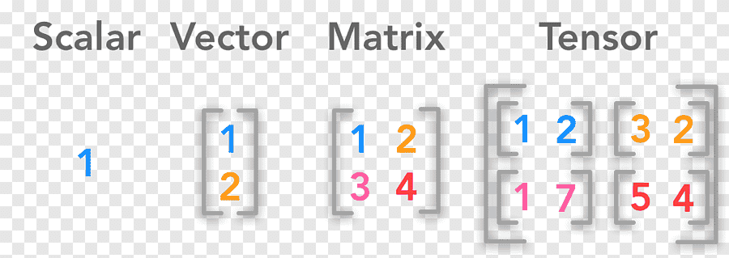

# Numpy & Pandas

**Mejorar recomendaciones y análisis de patrones de visualización**  
En el ámbito del streaming de contenido multimedia, optimizar las recomendaciones e identificar los tipos de contenido más demandados es crucial para el éxito empresarial. Analizar los hábitos de visualización de millones de usuarios supone un reto técnico debido al volumen masivo de datos procesados diariamente. Herramientas como **NumPy** y **Pandas** en Python permiten manejar estos datos de forma eficiente y precisa.

**NumPy en el análisis de datos**  
Esta librería es fundamental para trabajar con grandes conjuntos de datos, gracias a su capacidad para ejecutar operaciones matemáticas y estadísticas de alto rendimiento. Sus ventajas incluyen:  
- **Rapidez**: Opera con arrays de forma vectorizada, superando en velocidad a las listas estándar de Python.  
- **Manejo multidimensional**: Simplifica la manipulación de matrices y estructuras complejas.  

**Pandas: Potencia en datos tabulares**  
Construida sobre NumPy, esta herramienta facilita el análisis y manipulación de datos estructurados. Sus principales beneficios son:  
- **Filtrado y agrupación**: Ideal para organizar datos en formato tabular.  
- **DataFrames**: Estructuras que agilizan la exploración y toma de decisiones basadas en datos.  
Además, su dominio abre oportunidades en áreas como *business intelligence* y ciencia de datos.  

**Metodología de aprendizaje**  
El enfoque práctico incluye un proyecto de análisis de ventas en e-commerce, diseñado para aplicar lo aprendido y enriquecer el portafolio profesional.  

**Habilidades a desarrollar**  
- Manipulación eficiente de grandes volúmenes de datos  
- Análisis estadístico detallado  
- Limpieza y preparación de datos  
- Visualización clara de resultados  
- Automatización de procesos repetitivos  

**Configuración inicial**  
Se recomienda usar **Google Colab** o **VS Code**. Instala las librerías con:  

<div style="background: #1E1E1E; padding: 10px; border-radius: 8px; width: fit-content; font-family: monospace; color: white;">
  <div style="display: flex; gap: 6px; padding: 5px;">
    <span style="width: 12px; height: 12px; background: #FF5F57; border-radius: 50%; display: inline-block;"></span>
    <span style="width: 12px; height: 12px; background: #FFBD2E; border-radius: 50%; display: inline-block;"></span>
    <span style="width: 12px; height: 12px; background: #27C93F; border-radius: 50%; display: inline-block;"></span>
  </div>
  <hr style="border: 1px solid black; background: none; margin:0; padding:0;  height: 0px; ">

```python
# Configura tu entorno de batalla
!pip install numpy pandas matplotlib

```
</div>
<br>


<div style="background: #1E1E1E; padding: 10px; border-radius: 8px; width: fit-content; font-family: monospace; color: white;">
  <div style="display: flex; gap: 6px; padding: 5px;">
    <span style="width: 12px; height: 12px; background: #FF5F57; border-radius: 50%; display: inline-block;"></span>
    <span style="width: 12px; height: 12px; background: #FFBD2E; border-radius: 50%; display: inline-block;"></span>
    <span style="width: 12px; height: 12px; background: #27C93F; border-radius: 50%; display: inline-block;"></span>
  </div>
  <hr style="border: 1px solid black; background: none; margin:0; padding:0;  height: 0px; ">

```python
# Importa las herramientas
import numpy as np
import pandas as pd
import matplotlib.pyplot as plt
```
</div>
<br>


# **Manejo de dimensiones en NumPy**  
Las dimensiones en NumPy son fundamentales para trabajar con datos estructurados. Permiten abordar problemas complejos en ciencia de datos mediante operaciones eficientes. A continuación, se explican los conceptos clave:


#### **Escalar: Dimensión cero**  
Un escalar es un valor único sin ejes. Por ejemplo, la temperatura de un día específico:  

<div style="background: #1E1E1E; padding: 10px; border-radius: 8px; width: fit-content; font-family: monospace; color: white;">
  <div style="display: flex; gap: 6px; padding: 5px;">
    <span style="width: 12px; height: 12px; background: #FF5F57; border-radius: 50%; display: inline-block;"></span>
    <span style="width: 12px; height: 12px; background: #FFBD2E; border-radius: 50%; display: inline-block;"></span>
    <span style="width: 12px; height: 12px; background: #27C93F; border-radius: 50%; display: inline-block;"></span>
  </div>
  <hr style="border: 1px solid black; background: none; margin:0; padding:0;  height: 0px; ">

```python
# Ejemplo de escalar
escalar = np.array(42)
print(escalar)  # Salida: 42
print(type(escalar))  # <class 'numpy.ndarray'>
```
</div>
<br>

---

#### **Vector: Dimensión uno**  
Secuencia ordenada de elementos. Útil para series temporales o listas de valores:  


<div style="background: #1E1E1E; padding: 10px; border-radius: 8px; width: fit-content; font-family: monospace; color: white;">
  <div style="display: flex; gap: 6px; padding: 5px;">
    <span style="width: 12px; height: 12px; background: #FF5F57; border-radius: 50%; display: inline-block;"></span>
    <span style="width: 12px; height: 12px; background: #FFBD2E; border-radius: 50%; display: inline-block;"></span>
    <span style="width: 12px; height: 12px; background: #27C93F; border-radius: 50%; display: inline-block;"></span>
  </div>
  <hr style="border: 1px solid black; background: none; margin:0; padding:0;  height: 0px; ">

```python
vector = np.array([30, 29, 42, 35, 33, 36, 42])  # Temperaturas semanales
print(vector)
```
</div>
<br>

---


#### **Matriz: Dimensión dos**  
Estructura bidimensional para datos tabulares. Ejemplo: representación de píxeles o registros de ventas:  
<div style="background: #1E1E1E; padding: 10px; border-radius: 8px; width: fit-content; font-family: monospace; color: white;">
  <div style="display: flex; gap: 6px; padding: 5px;">
    <span style="width: 12px; height: 12px; background: #FF5F57; border-radius: 50%; display: inline-block;"></span>
    <span style="width: 12px; height: 12px; background: #FFBD2E; border-radius: 50%; display: inline-block;"></span>
    <span style="width: 12px; height: 12px; background: #27C93F; border-radius: 50%; display: inline-block;"></span>
  </div>
  <hr style="border: 1px solid black; background: none; margin:0; padding:0;  height: 0px; ">

```python
matriz = np.array([[1, 2, 3], [4, 5, 6], [7, 8, 9]])
print(matriz)
```
</div>
<br>

---

#### **Tensor: Tres o más dimensiones**  
Extensión de matrices para datos complejos, como imágenes en RGB o series temporales multivariadas:  
<div style="background: #1E1E1E; padding: 10px; border-radius: 8px; width: fit-content; font-family: monospace; color: white;">
  <div style="display: flex; gap: 6px; padding: 5px;">
    <span style="width: 12px; height: 12px; background: #FF5F57; border-radius: 50%; display: inline-block;"></span>
    <span style="width: 12px; height: 12px; background: #FFBD2E; border-radius: 50%; display: inline-block;"></span>
    <span style="width: 12px; height: 12px; background: #27C93F; border-radius: 50%; display: inline-block;"></span>
  </div>
  <hr style="border: 1px solid black; background: none; margin:0; padding:0;  height: 0px; ">

```python
tensor = np.array([[[1, 2], [3, 4]], [[5, 6], [7, 8]]])
print(tensor)
```
</div>
<br>

---

### **Métodos para crear arrays**  
NumPy ofrece múltiples funciones para generar estructuras de datos:  

- **Conversión desde listas/tuplas**  
- **Funciones predefinidas**: `np.zeros`, `np.ones`, `np.arange`  
- **Replicación de arrays existentes**  
- **Lectura de archivos**  

<div style="background: #1E1E1E; padding: 10px; border-radius: 8px; width: fit-content; font-family: monospace; color: white;">
  <div style="display: flex; gap: 6px; padding: 5px;">
    <span style="width: 12px; height: 12px; background: #FF5F57; border-radius: 50%; display: inline-block;"></span>
    <span style="width: 12px; height: 12px; background: #FFBD2E; border-radius: 50%; display: inline-block;"></span>
    <span style="width: 12px; height: 12px; background: #27C93F; border-radius: 50%; display: inline-block;"></span>
  </div>
  <hr style="border: 1px solid black; background: none; margin:0; padding:0;  height: 0px; ">

```python
rango = np.arange(10)  # Array del 0 al 9
identidad = np.eye(3)  # Matriz identidad 3x3
print(rango)
print(identidad)
```
</div>
<br>

---

### **Funciones matemáticas avanzadas**  
Incluyen operaciones para álgebra lineal y generación de datos aleatorios:  
<div style="background: #1E1E1E; padding: 10px; border-radius: 8px; width: fit-content; font-family: monospace; color: white;">
  <div style="display: flex; gap: 6px; padding: 5px;">
    <span style="width: 12px; height: 12px; background: #FF5F57; border-radius: 50%; display: inline-block;"></span>
    <span style="width: 12px; height: 12px; background: #FFBD2E; border-radius: 50%; display: inline-block;"></span>
    <span style="width: 12px; height: 12px; background: #27C93F; border-radius: 50%; display: inline-block;"></span>
  </div>
  <hr style="border: 1px solid black; background: none; margin:0; padding:0;  height: 0px; ">

```python
diagonal = np.diag([1, 2, 3, 4])  # Matriz diagonal
aleatoria = np.random.rand(2, 3)   # Valores entre 0 y 1
print(diagonal)
print(aleatoria)
```
</div>
<br>

**Recomendación**: Profundiza en métodos como `np.linalg` para operaciones de álgebra lineal y `np.random` para simulaciones estadísticas. La práctica constante es clave para dominar estas herramientas.


<div style="background: #1E1E1E; padding: 10px; border-radius: 8px; width: fit-content; font-family: monospace; color: white;">
  <div style="display: flex; gap: 6px; padding: 5px;">
    <span style="width: 12px; height: 12px; background: #FF5F57; border-radius: 50%; display: inline-block;"></span>
    <span style="width: 12px; height: 12px; background: #FFBD2E; border-radius: 50%; display: inline-block;"></span>
    <span style="width: 12px; height: 12px; background: #27C93F; border-radius: 50%; display: inline-block;"></span>
  </div>
  <hr style="border: 1px solid black; background: none; margin:0; padding:0;  height: 0px; ">

```python
# 1. Acceso a elementos específicos
arr = np.array([2, 5, 7, 9, 12, 15, 18, 21, 24, 27])
print(arr[3], arr[-2])  # Índices positivos y negativos
```
</div>
<br>

---

### **Ejercicios: Indexación y Slicing**  

---

#### **2. Extracción de subarrays**  
<div style="background: #1E1E1E; padding: 10px; border-radius: 8px; width: fit-content; font-family: monospace; color: white;">
  <div style="display: flex; gap: 6px; padding: 5px;">
    <span style="width: 12px; height: 12px; background: #FF5F57; border-radius: 50%; display: inline-block;"></span>
    <span style="width: 12px; height: 12px; background: #FFBD2E; border-radius: 50%; display: inline-block;"></span>
    <span style="width: 12px; height: 12px; background: #27C93F; border-radius: 50%; display: inline-block;"></span>
  </div>
  <hr style="border: 1px solid black; background: none; margin:0; padding:0;  height: 0px; ">

```python
arr = np.arange(1, 21)
print(arr[3:8])        # Elementos 4 al 7 (índices 3-7)
print(arr[-5:])        # Últimos 5 elementos
```
</div>
<br>

---

#### **3. Filtrado booleano**  
<div style="background: #1E1E1E; padding: 10px; border-radius: 8px; width: fit-content; font-family: monospace; color: white;">
  <div style="display: flex; gap: 6px; padding: 5px;">
    <span style="width: 12px; height: 12px; background: #FF5F57; border-radius: 50%; display: inline-block;"></span>
    <span style="width: 12px; height: 12px; background: #FFBD2E; border-radius: 50%; display: inline-block;"></span>
    <span style="width: 12px; height: 12px; background: #27C93F; border-radius: 50%; display: inline-block;"></span>
  </div>
  <hr style="border: 1px solid black; background: none; margin:0; padding:0;  height: 0px; ">

```python
arr = np.random.randint(0, 101, 10)
print(arr[arr > 50])  # Valores mayores a 50
```
</div>
<br>

---

#### **4. Indexación múltiple**  
<div style="background: #1E1E1E; padding: 10px; border-radius: 8px; width: fit-content; font-family: monospace; color: white;">
  <div style="display: flex; gap: 6px; padding: 5px;">
    <span style="width: 12px; height: 12px; background: #FF5F57; border-radius: 50%; display: inline-block;"></span>
    <span style="width: 12px; height: 12px; background: #FFBD2E; border-radius: 50%; display: inline-block;"></span>
    <span style="width: 12px; height: 12px; background: #27C93F; border-radius: 50%; display: inline-block;"></span>
  </div>
  <hr style="border: 1px solid black; background: none; margin:0; padding:0;  height: 0px; ">

```python
arr = np.array([10, 20, 30, 40, 50, 60, 70, 80])
indices = [1, 4, 6]
print(arr[indices])  # Elementos en posiciones 1, 4 y 6
```
</div>
<br>

---

#### **5. Manipulación de matrices**  
<div style="background: #1E1E1E; padding: 10px; border-radius: 8px; width: fit-content; font-family: monospace; color: white;">
  <div style="display: flex; gap: 6px; padding: 5px;">
    <span style="width: 12px; height: 12px; background: #FF5F57; border-radius: 50%; display: inline-block;"></span>
    <span style="width: 12px; height: 12px; background: #FFBD2E; border-radius: 50%; display: inline-block;"></span>
    <span style="width: 12px; height: 12px; background: #27C93F; border-radius: 50%; display: inline-block;"></span>
  </div>
  <hr style="border: 1px solid black; background: none; margin:0; padding:0;  height: 0px; ">

```python
matriz = np.random.randint(10, 51, (4,4))
submatriz = matriz[2:, 2:]  # Últimas 2 filas y columnas
print(submatriz)
```
</div>
<br>

**Nota**: Usa `matriz[2:4, 2:4]` como alternativa para mayor claridad en el slicing.


# Ejercicios 

<div style="background: #1E1E1E; padding: 10px; border-radius: 8px; width: fit-content; font-family: monospace; color: white;">
  <div style="display: flex; gap: 6px; padding: 5px;">
    <span style="width: 12px; height: 12px; background: #FF5F57; border-radius: 50%; display: inline-block;"></span>
    <span style="width: 12px; height: 12px; background: #FFBD2E; border-radius: 50%; display: inline-block;"></span>
    <span style="width: 12px; height: 12px; background: #27C93F; border-radius: 50%; display: inline-block;"></span>
  </div>
  <hr style="border: 1px solid black; background: none; margin:0; padding:0;  height: 0px; ">

```python
# Ejemplo: Aplicación de descuentos
precios = np.array([100, 200, 300])
descuento = np.array([0.9])
precios_finales = precios * descuento
print(precios_finales)  # Resultado: [90. 180. 270.]
```
</div>
<br>

---

### **Broadcasting en NumPy: Potencia sin iteraciones**  
Mecanismo que permite operar arrays de diferentes dimensiones automáticamente, expandiendo el array más pequeño para igualar la forma del mayor. Optimiza memoria y velocidad al evitar duplicar datos.

---

#### **Casos de uso prácticos**  
- **Cálculos masivos**: Operaciones entre escalares y arrays multidimensionales  
- **Ajustes porcentuales**: Modificar datasets completos con valores únicos  
- **Algebra lineal**: Compatibilizar matrices de dimensiones desiguales  

<div style="background: #1E1E1E; padding: 10px; border-radius: 8px; width: fit-content; font-family: monospace; color: white;">
  <div style="display: flex; gap: 6px; padding: 5px;">
    <span style="width: 12px; height: 12px; background: #FF5F57; border-radius: 50%; display: inline-block;"></span>
    <span style="width: 12px; height: 12px; background: #FFBD2E; border-radius: 50%; display: inline-block;"></span>
    <span style="width: 12px; height: 12px; background: #27C93F; border-radius: 50%; display: inline-block;"></span>
  </div>
  <hr style="border: 1px solid black; background: none; margin:0; padding:0;  height: 0px; ">

```python
# Operación entre matriz 4x3 y vector 1D
matriz = np.array([[0, 0, 0], [10, 10, 10], [20, 20, 20], [30, 30, 30]])
vector = np.array([1, 2, 3])
print(matriz + vector)
```
</div>
<br>

---

### **Reglas esenciales**  
1. **Alineación por la derecha**: Comparación de dimensiones desde el último eje  
2. **Compatibilidad**: Dimensiones deben ser iguales o una de ellas 1  

**Ejemplo válido**:  
- Array A (3,4) + Array B (1,4) → B se expande a (3,4)  
- Array C (5,1,6) + Array D (1,6) → D se expande a (5,6)  

---

#### **Jerarquía de dimensiones**  
<div style="background: #1E1E1E; padding: 10px; border-radius: 8px; width: fit-content; font-family: monospace; color: white;">
  <div style="display: flex; gap: 6px; padding: 5px;">
    <span style="width: 12px; height: 12px; background: #FF5F57; border-radius: 50%; display: inline-block;"></span>
    <span style="width: 12px; height: 12px; background: #FFBD2E; border-radius: 50%; display: inline-block;"></span>
    <span style="width: 12px; height: 12px; background: #27C93F; border-radius: 50%; display: inline-block;"></span>
  </div>
  <hr style="border: 1px solid black; background: none; margin:0; padding:0;  height: 0px; ">

```python
# Broadcasting 3D y 1D
array_3d = np.array([[[1], [2], [3]], [[4], [5], [6]]])
array_1d = np.array([1, 2, 3])
print(array_3d * array_1d)  # Expansión a (2,3,3)
```
</div>
<br>

---

### **Ventajas clave**  
- **Eficiencia computacional**: Elimina necesidad de bucles explícitos  
- **Sintaxis limpia**: Código más legible y mantenible  
- **Versatilidad**: Soporta operaciones complejas entre N-dimensiones  

**Aplicación en ML**: Normalización de datasets, operaciones matriciales en redes neuronales, preprocesamiento de imágenes.  

---

#### **Ejemplo avanzado**  
<div style="background: #1E1E1E; padding: 10px; border-radius: 8px; width: fit-content; font-family: monospace; color: white;">
  <div style="display: flex; gap: 6px; padding: 5px;">
    <span style="width: 12px; height: 12px; background: #FF5F57; border-radius: 50%; display: inline-block;"></span>
    <span style="width: 12px; height: 12px; background: #FFBD2E; border-radius: 50%; display: inline-block;"></span>
    <span style="width: 12px; height: 12px; background: #27C93F; border-radius: 50%; display: inline-block;"></span>
  </div>
  <hr style="border: 1px solid black; background: none; margin:0; padding:0;  height: 0px; ">

```python
# Normalización de dataset
datos = np.random.rand(100, 50)  # 100 muestras, 50 características
media = datos.mean(axis=0)       # Vector de medias (50,)
datos_normalizados = datos - media  # Broadcasting automático
```
</div>
<br>

**Consejo**: Usa `np.newaxis` o `reshape()` para ajustar manualmente dimensiones cuando el broadcasting no sea automático.


📝 Ejemplos de broadcasting con numpy

Ejemplo #1:

Tenemos un conjunto de datos que representa la medición de temperatura de 7 días en 3 ciudades diferentes (array de 3 x 7). Sin embargo las mediciones tienen un margen de error, y se nos da un array unidimensional con los valores de corrección para cada día de la semana (array de 1 x 7). Para acer la corrección en la medición de temperatura, en lugar de duplicar el array de corrección para cada ciudad (fila), aplicamos broadcasting:

```python
import numpy as np

# Temperaturas (3 ciudades, 7 días)
temperaturas = np.array([
    [30, 32, 31, 29, 28, 27, 26],
    [25, 24, 22, 23, 26, 27, 28],
    [20, 21, 19, 18, 17, 16, 15]
])

# Corrección (1 valor por día)
correccion = np.array([1, -1, 0.5, -0.5, 0, 1, -1])

# Aplicar la corrección usando broadcasting
temperaturas_corregidas = temperaturas + correccion

print("Temperaturas originales:\n", temperaturas)
print("\nCorrección aplicada:\n", correccion)
print("\nTemperaturas corregidas:\n", temperaturas_corregidas)
```

Resultado:

```bash
[[30 32 31 29 28 27 26]
 [25 24 22 23 26 27 28]
 [20 21 19 18 17 16 15]]
```

Corrección aplicada:
```bash
 [ 1.  -1.   0.5 -0.5  0.   1.  -1. ]
``` 

Temperaturas corregidas:
```bash
 [[31.  31.  31.5 28.5 28.  28.  25. ]
 [26.  23.  22.5 22.5 26.  28.  27. ]
 [21.  20.  19.5 17.5 17.  17.  14. ]]
```

Internamente numpy expande verticalmente el array de correcciones para que tenga la misma forma (3 x 7) que el array con los datos de las temperaturas por ciudad, visualmente sería algo así:


Ejemplo #2:

Tenemos una matriz 3x3 que representa los valores de ventas de tres productos en tres diferentes tiendas, y un vector 3x1 que contiene un bono de ventas que se aplica por tienda. El broadcasting permite sumar este bono de manera eficiente a cada fila de la matriz.

```python
import numpy as np

# Ventas de productos en diferentes tiendas
ventas = np.array([
  [100, 200, 300],
  [400, 500, 600],
  [700, 800, 900]
])

# Bono de ventas por tienda
bono = np.array([
  [10],
  [20],
  [30]
])

ventas_actualizadas = ventas + bono

print("Ventas actualizadas:\n", ventas_actualizadas)
```


Resultado:

```bash
Ventas actualizadas:
 [[110 210 310]
 [420 520 620]
 [730 830 930]]
```
En este ejemplo, numpy expande el array de forma horizontal (agregando las columnas "faltantes"), visualmente lo que ocurre es lo siguiente:


