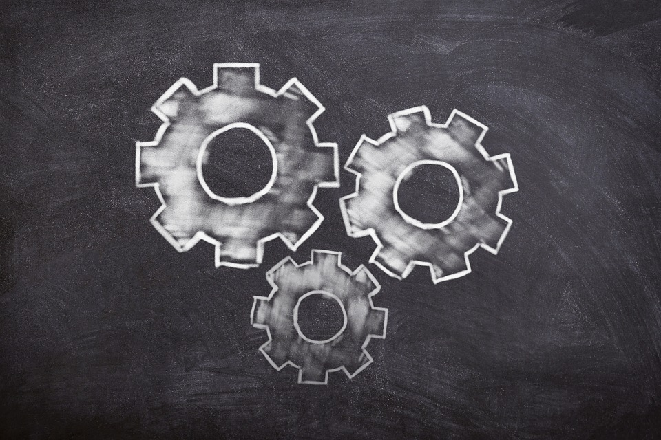

Data Science es un proceso en el cual se utilizan los datos para obtener información valiosa.

Conoce a mayor detalle qué hacen las personas dedicadas a la Data Science.

Objetivos de Data Science
Los principales objetivos que la Data Science debe cumplir, son los siguientes:

Tomar decisiones
Crear estrategias de negocio
Producir software basados en Inteligencia Artificial
Tres piñones juntos, trabajando para obtener un objetivo.

Proceso del Data Science
Las distintas actividades que se llevan a cabo en el proceso de Data Science se pueden resumir de la siguiente manera:

Obtener datos (mediciones directas, encuestas y fuentes de internet)
Transformar o limpiar datos (dar formato correcto, eliminar o marcar errores y espacios en blanco)
Explorar, analizar y visualizar datos (buscar, organizar y graficar información)
Usar modelos de Machine Learning (predecir información)
Escalar modelos de Machine Learning (poner los modelos a disposición de los usuarios)
El proceso de Data Science dependerá en gran medida del proyecto o empresa en la que se trabaje, pero algo general es que se basa en el método científico o metodología para descubrir por qué las cosas pasan como pasan. Por lo que se debe tener muy claro cuál es la pregunta y objetivo del caso de negocio. Ya que es un ciclo, es decir que se repetirá constantemente.

Áreas de conocimientos en Data Science
Es una intersección de varios conocimientos en los que se encuentran:

Matemáticas y estadística
Ciencias computacionales
Conocimiento del dominio o sector del negocio
El nivel de profundidad de cada una de estas áreas se va a determinar de acuerdo al rol que quieras aprender. Sin embargo, algunas habilidades básicas para todos los roles serían: programación, estadística descriptiva, probabilidad y mantenerse actualizado sobre lo que pasa alrededor de la industria en que se encuentra.

Construye tu camino profesional como Data Scientist
En conclusión, Data Science es un campo que se encarga de utilizar múltiples herramientas para encontrar información valiosa, dentro de los datos, tanto del presente, como del posible futuro. Construir tu carrera en Data Science es posible con perseverancia y siguiendo los cursos de Platzi.